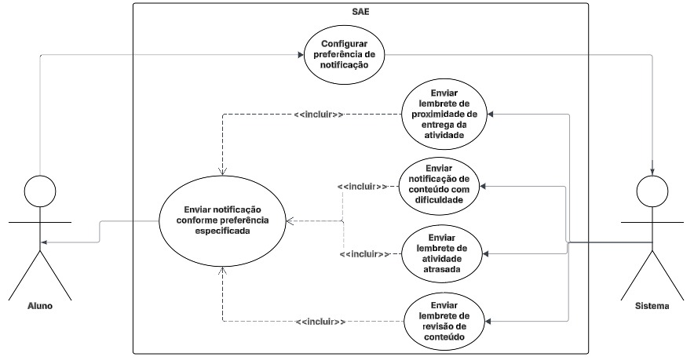
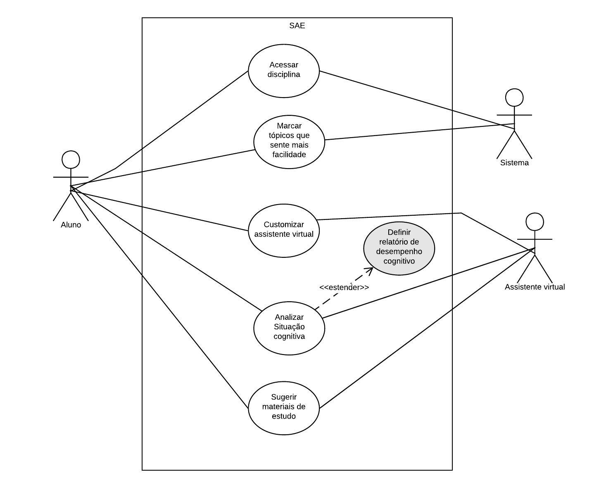

# Diagrama e Especificação de Casos de Uso

## Introdução
Um caso de uso é uma descrição detalhada de como os participantes de um sistema, neste trabalho o **SAE (Sistema de Apoio Educacional)**, interagem com ele em situações específicas. Ele apresenta passo a passo as ações realizadas pelos atores e as respostas do sistema a essas interações.
O principal objetivo dos casos de uso é apoiar o desenvolvimento do aplicativo, oferecendo uma visão clara e prática dos requisitos funcionais. Eles ajudam a definir o comportamento esperado do sistema diante das ações dos atores, garantindo que as funcionalidades realmente atendam às necessidades dos perfis de usuários.
No âmbito da disciplina, estão sendo levadas em conta as funcionalidades ainda não-implementadas para a realização do diagrama de caso de uso, assim como de suas especificações.

## Integrantes do Grupo
A Tabela 1 apresenta todos os integrantes da equipe que participaram da construção dos Casos de Uso, juntamente com a descrição das atividades que cada um desenvolveu durante o projeto.

<strong>Tabela 1: Integrantes do Grupo Envolvidos</strong>

| Nome | Quais etapas participou |
|---------------------------|---------------------------------------|
| [Arthur Guilherme](https://github.com/ArthurGuilher62) | Criou as especificações de casos de uso 07, 08 e 09, que são referentes, respectivamente, aos requisitos [RF49](https://requisitos-de-software.github.io/2025.2-Grupo03/Elicitacao/requisitos_elicitados/#RF49), [RF50](https://requisitos-de-software.github.io/2025.2-Grupo03/Elicitacao/requisitos_elicitados/#RF50) e [RF51](https://requisitos-de-software.github.io/2025.2-Grupo03/Elicitacao/requisitos_elicitados/#RF51)|
| [Arthur Henrique](https://github.com/arthurhvieira1) | Criou as especificações de casos de uso 15, 16 e 17, que são referentes, respectivamente, aos requisitos [RF16](https://requisitos-de-software.github.io/2025.2-Grupo03/Elicitacao/requisitos_elicitados/#funcionais), [RF21](https://requisitos-de-software.github.io/2025.2-Grupo03/Elicitacao/requisitos_elicitados/#funcionais) e [RF30](https://requisitos-de-software.github.io/2025.2-Grupo03/Elicitacao/requisitos_elicitados/#funcionais)                                       |
| [Felipe Guimaraes](https://github.com/felipegf1) | Criou as especificações de casos de uso 01, 02 e 03, que são referentes, respectivamente, aos requisitos [RF08](https://requisitos-de-software.github.io/2025.2-Grupo03/Elicitacao/requisitos_elicitados/#funcionais), [RF09](https://requisitos-de-software.github.io/2025.2-Grupo03/Elicitacao/requisitos_elicitados/#funcionais) e [RF10](https://requisitos-de-software.github.io/2025.2-Grupo03/Elicitacao/requisitos_elicitados/#funcionais) |
| [João Felipe](https://github.com/MrBolt2005) |                                       |
| [João Sapiência](https://github.com/JoaoSapiencia) | Criação das especificações de casos de uso 12, 13 e 14, que são referentes, respectivamente aos requisitos [RF32](https://requisitos-de-software.github.io/2025.2-Grupo03/Elicitacao/requisitos_elicitados/#funcionais), [RF34](https://requisitos-de-software.github.io/2025.2-Grupo03/Elicitacao/requisitos_elicitados/#funcionais) e [RF40](https://requisitos-de-software.github.io/2025.2-Grupo03/Elicitacao/requisitos_elicitados/#funcionais)  |
| [Tiago Lemes](https://github.com/TiagoTeixeira-2005) | Criação do documento de Casos de Uso e criação das especificações de casos de uso [04 - Lembretes de Revisão de Conteúdos](#uc04-lembretes-de-revisao-de-conteudos), [05 - Configuração da Forma de Notificação](#uc05-configuracao-da-forma-de-notificacao) e [06 - Notificação de Prazo de Entrega](#uc06-notificacao-de-prazo-de-entrega), que são referentes, respectivamente, aos requisitos [RF15](https://requisitos-de-software.github.io/2025.2-Grupo03/Elicitacao/requisitos_elicitados/#funcionais), [RF18](https://requisitos-de-software.github.io/2025.2-Grupo03/Elicitacao/requisitos_elicitados/#funcionais) e [RF19](https://requisitos-de-software.github.io/2025.2-Grupo03/Elicitacao/requisitos_elicitados/#funcionais). |
| [Vilmar José](https://github.com/VilmarFagundes) | Criou as especificações de casos de uso [10 - Exibir média geral da turma em cada atividade](https://requisitos-de-software.github.io/2025.2-Grupo03/Modelagem/casos_de_uso/#uc10-exibir-media-geral-da-turma-em-cada-atividade) e [11 - Escolher o tempo em que deseja receber alertas sobre atividades atrasadas](https://requisitos-de-software.github.io/2025.2-Grupo03/Modelagem/casos_de_uso/#uc11-escolher-o-tempo-em-que-deseja-receber-alertas-sobre-atividades-atrasadas), que são referentes, respectivamente, aos requisitos [RF11](https://requisitos-de-software.github.io/2025.2-Grupo03/Elicitacao/requisitos_elicitados/#funcionais), [RF13](https://requisitos-de-software.github.io/2025.2-Grupo03/Elicitacao/requisitos_elicitados/#funcionais) |

<strong>Autoria de <a href="https://github.com/TiagoTeixeira-2005">Tiago Lemes</a></strong>

## Metodologia
Foi utilizado o diagrama de caso de uso, que representa, por meio de atores (como alunos e docentes) e casos de uso (como escolher o melhor modo de receber notificações), as funcionalidades ainda não implementadas e os comportamentos esperados do sistema em uma hipótese de implementação.

Com base nesses conceitos, a Tabela 2 apresenta os principais elementos que compõem o diagrama de caso de uso, oferecendo uma visão organizada da estrutura de interações entre os atores e o sistema.

<strong>Tabela 2: Elementos de Caso de Uso</strong>

| Nome | Função | Representação |
|--------|------|-----------|
| Ator    | Representa os diferentes tipos de participantes externos que interagem com o sistema. Cada ator desempenha um papel específico nas interações, podendo ser uma pessoa, organização ou outro sistema. |  |
| Elipse (Caso de Uso)    | Utilizada para representar os casos de uso no diagrama. Cada elipse destaca uma funcionalidade ou ação específica que o sistema realiza em resposta às interações dos atores. |  |
| Retângulo (Sistema)    | Representa o sistema ou o componente em análise. Dentro dele são agrupados os casos de uso e os atores diretamente relacionados ao seu funcionamento. |  |
| Flecha (Relações) | As setas indicam as relações e interações entre os atores e os casos de uso. Elas podem ser: • **Normal:** representa uma interação direta entre o ator e o caso de uso. • **Incluir (`<<include>>`):** indica que um caso de uso incorpora obrigatoriamente o comportamento de outro caso de uso. • **Estender (`<<extend>>`):** representa uma relação opcional, onde um caso de uso pode estender o comportamento de outro sob determinadas condições. |  |

<strong>Autoria de <a href="https://github.com/TiagoTeixeira-2005">Tiago Lemes</a></strong>

## Diagramas de Caso de Uso

<strong>Figura 1: Caso de Uso UC04, UC05, UC06 e UC11</strong>

<strong>Autoria de <a href="https://github.com/TiagoTeixeira-2005">Tiago Lemes</a></strong>

---

<strong>Figura 2: Caso de Uso UC07, </strong>

<strong>Autoria de <a href="https://github.com/VilmarFagundes">Vilmar Fagundes</a></strong>

<strong>Figura 2: Caso de Uso UC08, UC09, UC10 </strong>

<strong>Autoria de <a href="https://github.com/ArthurGuilher62">Arthur Guilherme</a></strong>

## Especificação dos Casos de Uso

### **UC01 – Exibição do Progresso na Disciplina**
**Requisito Associado:** [RF08](https://requisitos-de-software.github.io/2025.2-Grupo03/Elicitacao/requisitos_elicitados/#funcionais) – A interface deve exibir um progresso em porcentagem do andamento da disciplina

<strong>Tabela 3: Caso de Uso UC01</strong>

| Campo   | Descrição  |
| --------------------- | -------------- |
| **UC06**              | Exibição do Progresso na Disciplina   |
| **Descrição**         | O sistema calcula e exibe, em formato percentual, o progresso do aluno em cada disciplina com base nos conteúdos concluídos.   |
| **Ator**          | - Aluno   - Sistema de acompanhamento de progresso  |
| **Pré-condições**     | 1. O aluno está logado na plataforma.  2. O aluno possui disciplinas cadastradas com conteúdos disponíveis.   |
| **Ação**          | O sistema coleta os dados de conteúdos concluídos e calcula a porcentagem de progresso para exibição na interface.|
| **Fluxo principal**   | - O aluno acessa a página da disciplina.  - O sistema verifica o número total de conteúdos e os já concluídos.  - O sistema calcula o percentual de progresso.  - A interface exibe o progresso do aluno em formato percentual (ex.: “Progresso: 75%”). |
| **Fluxo alternativo** | - O aluno ainda não iniciou nenhum conteúdo.  - O sistema exibe “Progresso: 0%”. |
| **Fluxo de exceção**  | - Erro na recuperação dos dados do aluno ou das disciplinas.  - O sistema exibe uma mensagem de erro (“Não foi possível carregar o progresso no momento”).  |
| **Pós-condições**     | O aluno visualiza corretamente seu progresso percentual em cada disciplina. |
| **Rastreabilidade**   | [RF08](https://requisitos-de-software.github.io/2025.2-Grupo03/Elicitacao/requisitos_elicitados/#funcionais)|
| **Data de criação**   | 08/10/2025       |

<strong>Autoria de <a href="https://github.com/felipegf1">Felipe Guimaraes</a></strong>

---

### **UC02 – Exibição da Porcentagem de Acertos por Conteúdo**
**Requisito Associado:** [RF09](https://requisitos-de-software.github.io/2025.2-Grupo03/Elicitacao/requisitos_elicitados/#funcionais) – A interface deve exibir como está a porcentagem de acertos das atividades de cada conteúdo

<strong>Tabela 4: Caso de Uso UC02</strong>

| Campo                 | Descrição     |
| --------------------- | ----------------------------------------------- |
| **UC07**              | Exibição da Porcentagem de Acertos por Conteúdo |
| **Descrição**         | O sistema calcula e exibe, em formato percentual, o desempenho do aluno nas atividades de cada conteúdo da disciplina. |
| **Ator**          | - Aluno   - Sistema de avaliação de desempenho  |
| **Pré-condições**     | 1. O aluno está logado na plataforma.  2. Existem atividades concluídas associadas aos conteúdos da disciplina.   |
| **Ação**  | O sistema coleta os resultados das atividades de cada conteúdo e calcula a porcentagem de acertos, exibindo o valor correspondente na interface. |
| **Fluxo principal**   | - O aluno acessa a página de um conteúdo.  - O sistema busca os resultados das atividades realizadas.  - O sistema calcula a porcentagem de acertos do aluno naquele conteúdo.  - A interface exibe o valor percentual (ex.: “Acertos: 85%”). |
| **Fluxo alternativo** | - O aluno ainda não realizou nenhuma atividade do conteúdo.  - O sistema exibe “Acertos: 0%” ou “Sem atividades concluídas”.  |
| **Fluxo de exceção**  | - Falha ao carregar os dados de desempenho.  - O sistema exibe uma mensagem de erro (“Não foi possível carregar os resultados”).  |
| **Pós-condições**     | O aluno visualiza o percentual de acertos das atividades cada conteúdo estudado. |
| **Rastreabilidade**   | [RF09](https://requisitos-de-software.github.io/2025.2-Grupo03/Elicitacao/requisitos_elicitados/#funcionais) |
| **Data de criação**   | 08/10/2025  |

<strong>Autoria de <a href="https://github.com/felipegf1">Felipe Guimaraes</a></strong>

---

### **UC03 – Exibição da Porcentagem de Erros por Conteúdo**
**Requisito Associado:** [RF10](https://requisitos-de-software.github.io/2025.2-Grupo03/Elicitacao/requisitos_elicitados/#funcionais) – A interface deve exibir como está a porcentagem de erros das atividades de cada conteúdo

<strong>Tabela 5: Caso de Uso UC03</strong>

| Campo                 | Descrição |
| --------------------- | ---------------------------------|
| **UC08**              | Exibição da Porcentagem de Erros por Conteúdo     |
| **Descrição**         | O sistema calcula e exibe, em formato percentual, o índice de erros do aluno nas atividades de cada conteúdo da disciplina.   |
| **Ator**         | - Aluno   - Sistema de avaliação de desempenho   |
| **Pré-condições**     | 1. O aluno está logado na plataforma.  2. Existem atividades concluídas associadas aos conteúdos da disciplina.  |
| **Ação**              | O sistema coleta os resultados das atividades e calcula a porcentagem de erros de cada conteúdo, exibindo o valor correspondente na interface. |
| **Fluxo principal**   | - O aluno acessa a página de um conteúdo.  - O sistema busca os resultados das atividades realizadas.  - O sistema calcula a porcentagem de erros com base nas respostas incorretas.  - A interface exibe o valor percentual (ex.: “Erros: 15%”). |
| **Fluxo alternativo** | - O aluno ainda não realizou nenhuma atividade do conteúdo.  - O sistema exibe “Erros: 0%” ou “Sem atividades concluídas”.  |
| **Fluxo de exceção**  | - Falha ao carregar os dados de desempenho.  - O sistema exibe uma mensagem de erro (“Não foi possível carregar os resultados”). |
| **Pós-condições**     | O aluno visualiza o percentual de erros das atividades de cada conteúdo estudado.  |
| **Rastreabilidade**   | [RF10](https://requisitos-de-software.github.io/2025.2-Grupo03/Elicitacao/requisitos_elicitados/#funcionais)|
| **Data de criação**   | 08/10/2025 |

<strong>Autoria de <a href="https://github.com/felipegf1">Felipe Guimaraes</a></strong>

---

### **UC04 – Lembretes de Revisão de Conteúdos**
**Requisito Associado:** [RF15](https://requisitos-de-software.github.io/2025.2-Grupo03/Elicitacao/requisitos_elicitados/#funcionais) – O sistema deve enviar notificações para lembrar o aluno de revisar conteúdos passados.

<strong>Tabela 6: Caso de Uso UC04</strong>

| Campo | Descrição |
|-------|------------|
| **UC04** | Lembretes de Revisão de Conteúdos |
| **Descrição** | O sistema identifica conteúdos já estudados e envia lembretes automáticos para revisão. |
| **Ator** | Aluno, Sistema de notificações |
| **Pré-condições** | 1. O aluno possui conteúdos concluídos no banco de dados.  2. Está logado no sistema. |
| **Ação** | O sistema agenda e envia lembretes de revisão com base na data do último acesso ao conteúdo. |
| **Fluxo principal** | - O aluno acessa a plataforma. - O sistema verifica conteúdos já estudados. - O sistema envia notificação lembrando o aluno de revisar o conteúdo. |
| **Fluxo alternativo** | - O aluno revisa o conteúdo antes do envio do lembrete. - O sistema cancela o lembrete agendado. |
| **Fluxo de exceção** | - Falha no envio da notificação. - Conteúdo revisado recentemente não gera novo lembrete. |
| **Pós-condições** | O aluno é lembrado de revisar conteúdos anteriores conforme sua configuração de notificações. |
| **Rastreabilidade** | [RF15](https://requisitos-de-software.github.io/2025.2-Grupo03/Elicitacao/requisitos_elicitados/#funcionais) |
| **Data de criação** | 08/10/2025 |

<strong>Autoria de <a href="https://github.com/TiagoTeixeira-2005">Tiago Lemes</a></strong>

---

### **UC05 – Configuração da Forma de Notificação**
**Requisito Associado:** [RF18](https://requisitos-de-software.github.io/2025.2-Grupo03/Elicitacao/requisitos_elicitados/#funcionais) – O sistema deve pedir ao participante a melhor forma de caminho de notificação.

<strong>Tabela 7: Caso de Uso UC05</strong>

| Campo | Descrição |
|-------|------------|
| **UC05** | Configuração da Forma de Notificação |
| **Descrição** | O indivíduo acessa as configurações de notificação e escolhe como deseja ser notificado. |
| **Ator(es)** | - Aluno  - Docente  - Monitor  - Coordenador  - Administrador  - Sistema de configuração de notificações |
| **Pré-condições** | 1. O indivíduo está logado.  2. O sistema possui diferentes canais de envio disponíveis. |
| **Ação** | O indivíduo seleciona o canal preferido de notificação e salva suas preferências. |
| **Fluxo principal** | - O indivíduo acessa “Preferências de Notificação”. - Escolhe o canal preferido (push, WhatsApp, e-mail, alerta no sistema). - O sistema salva a configuração. |
| **Fluxo alternativo** | - O indivíduo não escolhe nenhuma opção. - O sistema mantém o canal padrão. |
| **Fluxo de exceção** | - O canal selecionado está temporariamente indisponível. - O sistema exibe mensagem de erro e mantém o padrão. |
| **Pós-condições** | As notificações passam a ser enviadas conforme a escolha do indivíduo. |
| **Rastreabilidade** | [RF18](https://requisitos-de-software.github.io/2025.2-Grupo03/Elicitacao/requisitos_elicitados/#funcionais) |
| **Data de criação** | 08/10/2025 |

<strong>Autoria de <a href="https://github.com/TiagoTeixeira-2005">Tiago Lemes</a></strong>

---

### **UC06 – Notificação de Prazo de Entrega**
**Requisito Associado:** [RF19](https://requisitos-de-software.github.io/2025.2-Grupo03/Elicitacao/requisitos_elicitados/#funcionais) – O sistema deve enviar uma notificação quando está chegando perto da data de entrega de uma atividade.

<strong>Tabela 8: Caso de Uso UC06</strong>

| Campo | Descrição |
|-------|------------|
| **UC06** | Notificação de Prazo de Entrega |
| **Descrição** | O sistema envia alertas automáticos ao aluno quando uma atividade está próxima do prazo final. |
| **Ator** | Aluno, Sistema de notificações |
| **Pré-condições** | 1. O aluno possui atividades cadastradas com prazo de entrega.  2. Está logado no sistema. |
| **Ação** | O sistema verifica prazos e envia alertas automáticos próximos da data limite. |
| **Fluxo principal** | - O sistema verifica atividades com prazo próximo. - Gera alerta de prazo. - Envia notificação ao aluno. |
| **Fluxo alternativo** | - O aluno já entregou a atividade. - O sistema não envia mais alertas. |
| **Fluxo de exceção** | - Falha no envio da notificação. - O prazo da atividade é alterado após o envio do alerta. |
| **Pós-condições** | O aluno recebe lembrete sobre a entrega das atividades no tempo adequado. |
| **Rastreabilidade** | [RF19](https://requisitos-de-software.github.io/2025.2-Grupo03/Elicitacao/requisitos_elicitados/#funcionais) |
| **Data de criação** | 08/10/2025 |

<strong>Autoria de <a href="https://github.com/TiagoTeixeira-2005">Tiago Lemes</a></strong>

### UC07 – Análise Cognitiva e Apoio à Aprendizagem  
**Requisito Associado:** [RF49](https://requisitos-de-software.github.io/2025.2-Grupo03/Elicitacao/requisitos_elicitados/#RF49) – O sistema deve analisar documentos escolares (atividades e provas) para identificar dificuldades cognitivas e sugerir estratégias de reforço ao aluno.

<strong>Tabela 9: Caso de Uso UC07</strong>

| Campo      | Descrição |
|----------------|-----------|
|UC07 |Análise Cognitiva e Apoio à Aprendizagem|
| Descrição |O sistema analisa documentos escolares do aluno para identificar dificuldades cognitivas e sugere estratégias de reforço personalizadas.|
| Ator| - Aluno   - Professor   - Assistente Virtual|
| Pré-condições| 1. O aluno possui documentos escolares disponíveis.   2. O sistema está com acesso autorizado aos dados.|
| Ação| O sistema realiza análise cognitiva dos documentos e propõe estratégias de reforço.|
|Fluxo principal|- O sistema acessa os documentos escolares.   - Identifica padrões de dificuldade.   - Sugere conteúdos adaptados.   - Monitora evolução do aluno.|
|Fluxo alternativo|- Documentos insuficientes para análise.    - Dados corrompidos ou inconsistentes.|
|Fluxo de exceção|- Falha na análise cognitiva.    - Estratégias sugeridas não são compatíveis com o perfil do aluno.|
|*Pós-condições| O aluno recebe sugestões personalizadas para reforço de aprendizagem.|
|Rastreabilidade| RF49 |
|Data de criação| 08/10/2025 |

<strong>Autoria de <a href="https://github.com/ArthurGuilher62">Arthur Guilherme</a></strong>

---

### UC08 – Identificação de Conhecimento sobre o Conteúdo  
**Requisito Associado:** [RF50](https://requisitos-de-software.github.io/2025.2-Grupo03/Elicitacao/requisitos_elicitados/#RF50) – O sistema deve apresentar ao professor qual aluno sabe sobre o conteúdo, com base em provas e atividades.

<strong>Tabela 10: Caso de Uso UC08</strong>

| Campo      | Descrição |
|----------------|-----------|
|UC08 |Identificação de Conhecimento sobre o Conteúdo|
| Descrição |O sistema analisa provas e atividades dos alunos e apresenta ao professor o nível de domínio por conteúdo.|
| Ator|- Professor    - Sistema de Avaliação Inteligente|
| Pré-condições| 1. Os alunos realizaram provas e atividades.   2. Os dados estão disponíveis e corrigidos.|
| Ação| O sistema aplica Lógica Fuzzy para avaliar o domínio de conteúdo e apresenta os resultados ao professor.|
|Fluxo principal|- O sistema processa os resultados.   - Avalia o domínio por conteúdo.   - Exibe painel de desempenho.   - Destaca alunos com dificuldades.|
|Fluxo alternativo|- Provas não corrigidas ou com erros.   - Dados insuficientes para análise.|
|Fluxo de exceção|- Falha na aplicação da Lógica Fuzzy.   - Erro na geração do painel de desempenho.|
|*Pós-condições| O professor visualiza o nível de conhecimento dos alunos por conteúdo.|
|Rastreabilidade| RF50  |
|Data de criação| 08/10/2025 |

<strong>Autoria de <a href="https://github.com/ArthurGuilher62">Arthur Guilherme</a></strong>

---

### UC09 – Avaliação de Comportamento Escolar  
**Requisito Associado:** [RF51](https://requisitos-de-software.github.io/2025.2-Grupo03/Elicitacao/requisitos_elicitados/#RF51) – O sistema deve informar ao professor quais alunos mantêm comportamento adequado segundo critérios pedagógicos.

<strong>Tabela 11: Caso de Uso UC09</strong>

| Campo      | Descrição |
|----------------|-----------|
|UC09 |Avaliação de Comportamento Escolar|
| Descrição |O sistema monitora o comportamento dos alunos e gera relatórios para o professor com base em critérios pedagógicos.|
| Ator|- Aluno   - Professor   - Assistente Virtual|
| Pré-condições| 1. O aluno está registrado no sistema.   2. Há dados de presença, atividades e monitorias disponíveis.|
| Ação| O sistema analisa os dados comportamentais e gera relatório para o professor.|
|Fluxo principal|- Registra presença nas aulas.   - Monitora participação em monitorias.   - Verifica entrega de atividades.   - Acompanha estudo de conteúdos.   - Gera relatório de comportamento.   - Professor acessa o relatório.|
|Fluxo alternativo|- Dados incompletos ou não sincronizados.   - Aluno ausente em todas as atividades.|
|Fluxo de exceção|- Falha na geração do relatório.   - Dados corrompidos ou inconsistentes.|
|*Pós-condições| O professor recebe relatório com avaliação comportamental dos alunos.|
|Rastreabilidade| RF51  |
|Data de criação| 08/10/2025 |

<strong>Autoria de <a href="https://github.com/ArthurGuilher62">Arthur Guilherme</a></strong>

---

### UC10 – Exibir média geral da turma em cada atividade
**Requisito Associado:** [RF11](https://requisitos-de-software.github.io/2025.2-Grupo03/Elicitacao/requisitos_elicitados/#funcionais) – A interface deve exibir a média geral da turma em cada atividade

<strong>Tabela 12: Caso de Uso UC10</strong>

| Campo      | Descrição |
|----------------|-----------|
|UC10 |Exibir média geral da turma em cada atividade|
| Descrição |Permite que o Aluno e o Professor visualizem o desempenho médio de todos os estudantes em uma atividade avaliativa específica.|
| Ator|- Aluno   - Professor |
| Pré-condições| 	1. O ator deve estar autenticado no sistema e ter acesso à disciplina.  2. A atividade avaliativa deve ter sido concluída (prazo expirado ou corrigida) por uma amostra significativa de alunos da turma.|
| Ação| O sistema calcula a média geral da turma na atividade após a sua finalização. |
|Fluxo principal|1. O Ator acessa a área de visualização de desempenho da disciplina.  2. O sistema recupera e calcula a média das notas de todos os alunos que realizaram a atividade.  3. O sistema exibe o valor da média geral da turma na interface, associado à atividade correspondente.|
|Fluxo alternativo| Dados de Média Indisponíveis (Parcial): Se o cálculo da média geral não puder ser realizado (ex: poucos alunos realizaram ou atividade pendente de correção), o sistema pode exibir uma mensagem indicando "Média em processamento" ou "Média indisponível".|
|Fluxo de exceção|Falha de Cálculo Crítica: O sistema não consegue acessar o banco de dados ou a função de cálculo retorna um erro fatal (ex: divisão por zero). O sistema deve notificar o indivíduo com uma mensagem de erro genérica ("Não foi possível carregar a média da turma. Tente novamente mais tarde.") e registrar o erro no log.|
|Pós-condições|O sistema exibe a média geral da turma para a atividade na interface do indivídui.|
|Rastreabilidade| RF11  |
|Data de criação| 09/10/2025 |

<strong>Autoria de <a href="https://github.com/VilmarFagundes">Vilmar Fagundes</a></strong>

---

### UC11 – Escolher o tempo em que deseja receber alertas sobre atividades atrasadas
**Requisito Associado:** [RF13](https://requisitos-de-software.github.io/2025.2-Grupo03/Elicitacao/requisitos_elicitados/#funcionais) – O indivíduo deve escolher o tempo em que deseja receber alertas sobre atividades atrasadas

<strong>Tabela 13: Caso de Uso UC11</strong>

| Campo      | Descrição |
|----------------|-----------|
|UC11 |Escolher o tempo em que deseja receber alertas sobre atividades atrasadas|
| Descrição |Permite ao Aluno configurar o intervalo de tempo ou a frequência desejada para o recebimento de notificações automáticas sobre atividades que estão com o prazo de entrega expirado.|
| Ator| Aluno |
| Pré-condições| 	1. O aluno deve estar autenticado no sistema.  2. O sistema deve possuir uma interface de Configurações de Notificação acessível ao participante.|
| Ação| O ator seleciona a opção de frequencia desejada e o sistema salva a preferencia |
|Fluxo principal|1. O Ator acessa a área de Configurações de Notificação.  2. O sistema exibe as opções de frequência para alertas de atraso (ex: a cada 3 horas, diariamente, semanalmente).  3. O Ator seleciona a frequência desejada.  4. O Ator confirma a alteração, e o sistema salva a preferência.|
|Fluxo alternativo| Personalização da Frequência: O indivíduo opta por definir um intervalo de tempo customizado não listado nas opções pré-definidas (ex: a cada 4 horas). O sistema valida a entrada e salva a configuração.|
|Fluxo de exceção|Erro ao Salvar a Preferência: O sistema encontra um erro de conexão com o banco de dados ao tentar salvar a nova preferência. O sistema deve exibir uma mensagem de erro ("Não foi possível salvar a preferência de alerta. Verifique sua conexão.") e manter a configuração anterior.|
|Pós-condições|O sistema armazena a preferência de tempo do indivíduo, e os alertas futuros de atividades atrasadas serão disparados com base nesta nova frequência.|
|Rastreabilidade| RF13  |
|Data de criação| 09/10/2025 |

<strong>Autoria de <a href="https://github.com/VilmarFagundes">Vilmar Fagundes</a></strong>

---

### **UC12 – Organização do Banco de Questões por Conteúdo**
**Requisito Associado:** RF32 – O banco de questões deve estar separado por conteúdo.

<strong>Tabela 14: Caso de Uso UC12</strong>

| Campo | Descrição |
|-------|------------|
| **UC12** | Organização do Banco de Questões por Conteúdo |
| **Descrição** | Permite ao professor e ao aluno visualizar e filtrar as questões do banco de dados de acordo com o conteúdo específico da disciplina, facilitando a busca e a organização dos materiais de estudo e avaliação. |
| **Ator** | - Professor - Aluno - Sistema de Banco de Questões (BDQ) |
| **Pré-condições** | 1. O participante (professor ou aluno) está autenticado no sistema. 2. Existem conteúdos (tópicos, capítulos) cadastrados nas disciplinas. 3. Existem questões no Banco de Questões associadas a esses conteúdos. |
| **Ação** | O participante seleciona um filtro de conteúdo, e o sistema exibe apenas as questões relacionadas a ele. |
| **Fluxo principal** | - O participante acessa a área do "Banco de Questões". - O sistema exibe as opções de filtro por conteúdo (ex: uma lista de tópicos da disciplina). - O participante seleciona um conteúdo desejado. - O sistema atualiza a visualização e exibe apenas as questões associadas ao conteúdo selecionado. |
| **Fluxo alternativo** | - O conteúdo selecionado não possui questões cadastradas. - O sistema exibe a mensagem: "Nenhuma questão encontrada para este conteúdo". |
| **Fluxo de exceção** | - O sistema não consegue carregar os filtros de conteúdo ou as questões devido a uma falha no banco de dados. - O sistema exibe uma mensagem de erro: "Não foi possível carregar as questões. Tente novamente mais tarde." |
| **Pós-condições** | O participante visualiza uma lista de questões devidamente filtrada pelo conteúdo escolhido. |
| **Rastreabilidade** | RF32 |
| **Data de criação** | 10/10/2025 |

<strong>Autoria de <a href="https://github.com/JoaoSapiencia">João Sapiência</a></strong>

---

### **UC13 – Acesso ao Painel de Desempenho Centralizado**
**Requisito Associado:** RF34 – A integração deve reduzir o esforço de professores e monitores, centralizando informações sobre atividades e desempenho.

<strong>Tabela 15: Caso de Uso UC13</strong>

| Campo | Descrição |
|-------|------------|
| **UC13** | Acesso ao Painel de Desempenho Centralizado |
| **Descrição** | Permite que professores e monitores acessem uma tela unificada que consolida as informações de atividades, notas e progresso dos alunos, otimizando o tempo de análise e acompanhamento. |
| **Ator** | - Professor - Monitor |
| **Pré-condições** | 1. O participante (professor ou monitor) está autenticado no sistema. 2. Existem alunos vinculados às suas disciplinas ou grupos de monitoria. 3. Existem dados de desempenho e atividades dos alunos registrados no sistema. |
| **Ação** | O sistema coleta e exibe dados de diferentes módulos em um painel de controle único para o participante. |
| **Fluxo principal** | - O participante acessa a área "Desempenho da Turma" ou o perfil de um aluno específico. - O sistema busca e consolida informações de atividades, progresso nos conteúdos e notas. - A interface exibe um painel centralizado com os dados compilados (ex: média geral, atividades pendentes, últimos resultados). |
| **Fluxo alternativo** | - Um aluno específico ainda não possui dados de desempenho. - O sistema exibe no painel a mensagem: "Sem dados de desempenho para exibir". |
| **Fluxo de exceção** | - Falha na integração com um dos módulos do sistema ao buscar os dados. - O sistema exibe os dados que conseguiu carregar e uma mensagem de alerta: "Algumas informações não puderam ser carregadas". |
| **Pós-condições** | O professor ou monitor visualiza as informações de desempenho dos alunos de forma centralizada, reduzindo o esforço de busca em diferentes partes do sistema. |
| **Rastreabilidade** | RF34 |
| **Data de criação** | 10/10/2025 |

<strong>Autoria de <a href="https://github.com/JoaoSapiencia">João Sapiência</a></strong>

---

### **UC14 – Sugestão de Questões pelo Assistente Virtual**
**Requisito Associado:** RF40 – O assistente virtual deve sugerir questões com o conteúdo da vídeo aula.

<strong>Tabela 16: Caso de Uso UC14</strong>

| Campo | Descrição |
|-------|------------|
| **UC14** | Sugestão de Questões pelo Assistente Virtual |
| **Descrição** | O assistente virtual (ITA) identifica o conteúdo da vídeoaula que o aluno está assistindo e, de forma proativa, sugere questões relacionadas do banco de dados para reforçar o aprendizado. |
| **Ator** | - Aluno - Assistente Virtual (ITA) |
| **Pré-condições** | 1. O aluno está logado na plataforma SAE. 2. O aluno está na página de uma vídeoaula. 3. Existem questões no Banco de Questões (BDQ) associadas ao conteúdo da vídeoaula. |
| **Ação** | O assistente virtual analisa o conteúdo da vídeoaula e busca por questões correspondentes para sugerir ao aluno. |
| **Fluxo principal** | - O aluno inicia a reprodução de uma vídeoaula. - Durante ou após a exibição, o assistente virtual apresenta uma notificação com a sugestão de questões relacionadas. - A notificação contém um chamado como "Que tal praticar o que você aprendeu?". - O aluno clica na sugestão. - O sistema direciona o aluno para uma atividade com as questões selecionadas. |
| **Fluxo alternativo** | - O aluno opta por ignorar ou fechar a notificação de sugestão. - O assistente virtual recolhe a notificação e o aluno continua a navegar normalmente. |
| **Fluxo de exceção** | - O assistente virtual não encontra questões relevantes para o conteúdo no Banco de Questões. - Nenhuma sugestão é exibida para o aluno. - Ocorre uma falha ao tentar carregar as questões após o aluno aceitar a sugestão. - O sistema exibe uma mensagem de erro: "Não foi possível carregar as questões no momento." |
| **Pós-condições** | O aluno pratica o conteúdo da vídeoaula por meio de questões relevantes sugeridas pelo assistente virtual. |
| **Rastreabilidade** | RF40 |
| **Data de criação** | 10/10/2025 |

<strong>Autoria de <a href="https://github.com/JoaoSapiencia">João Sapiência</a></strong>

---

### **UC15 – Índice de Conteúdos Ordenado por Taxa de Erros**  
**Requisito Associado:** RF16 – O sistema deve ter um índice de conteúdos ordenado pela porcentagem de erros em cada conteúdo.

<strong>Tabela 17: Caso de Uso UC15</strong>

| Campo | Descrição |
|-------|------------|
| **UC15** | Índice de Conteúdos Ordenado por Taxa de Erros |
| **Descrição** | O sistema calcula a porcentagem de erros por conteúdo e exibe um índice ordenado (do maior para o menor percentual), permitindo que o aluno identifique rapidamente os tópicos com maior dificuldade. |
| **Ator** | - Aluno - Sistema de análise de desempenho |
| **Pré-condições** | 1. O aluno está logado na plataforma. 2. Existem conteúdos com tentativas registradas (acertos/erros). |
| **Ação** | O sistema consolida as tentativas por conteúdo, calcula a taxa de erros e ordena a lista para exibição. |
| **Fluxo principal** | - O aluno acessa o índice de conteúdos. - O sistema coleta as estatísticas de desempenho por conteúdo. - O sistema calcula a porcentagem de erros por conteúdo. - O sistema ordena o índice do maior para o menor percentual de erros. - A interface exibe o índice ordenado, destacando conteúdos com maior taxa de erros. |
| **Fluxo alternativo** | - Não há tentativas registradas para um ou mais conteúdos. - O sistema exibe “Sem dados suficientes” para esses conteúdos e os posiciona após os conteúdos com dados. |
| **Fluxo de exceção** | - Erro na recuperação dos dados do aluno ou dos conteúdos. - O sistema exibe uma mensagem de erro: “Não foi possível carregar o índice no momento.” |
| **Pós-condições** | O aluno visualiza corretamente o índice de conteúdos ordenado pela porcentagem de erros. |
| **Rastreabilidade** | RF16 |
| **Data de criação** | 12/10/2025 |

<strong>Autoria de <a href="https://github.com/arthurhvieira1">Arthur Henrique</a></strong>

---

### **UC16 – Configuração de Aviso de Proximidade de Entrega**  
**Requisito Associado:** RF21 – O aluno escolhe quando ele recebe a notificação de proximidade da data de entrega de atividade.

<strong>Tabela 18: Caso de Uso UC16</strong>

| Campo | Descrição |
|-------|------------|
| **UC16** | Configuração de Aviso de Proximidade de Entrega |
| **Descrição** | O sistema permite que o aluno defina quando deseja receber notificações de proximidade da data de entrega de atividades (por exemplo, 7, 3 ou 1 dia antes). |
| **Ator** | - Aluno - Sistema de notificações |
| **Pré-condições** | 1. O aluno está logado na plataforma. 2. Existem atividades com datas de entrega cadastradas. 3. O aluno autorizou o recebimento de notificações (push ou e-mail). |
| **Ação** | O aluno acessa as preferências de notificação, escolhe a antecedência desejada e salva. O sistema agenda os avisos de acordo com as preferências. |
| **Fluxo principal** | - O aluno acessa **Configurações → Notificações**. - O aluno seleciona a antecedência do aviso (ex.: 7, 3 e/ou 1 dia). - O aluno confirma e salva as preferências. - O sistema registra a preferência e agenda as notificações para cada atividade com data de entrega. - Na antecedência definida, o sistema envia a notificação ao aluno. |
| **Fluxo alternativo** | - O aluno desativa as notificações de proximidade. - O sistema cancela os agendamentos futuros relacionados a essas notificações.  - Uma atividade não possui data de entrega. - O sistema não agenda notificação para essa atividade e informa “Atividade sem data de entrega.” |
| **Fluxo de exceção** | - Falha ao salvar as preferências ou ausência de permissão de notificação no dispositivo. - O sistema exibe uma mensagem de erro: “Não foi possível salvar as preferências” ou “Permissão de notificação negada.” |
| **Pós-condições** | As preferências de antecedência ficam salvas e as notificações são agendadas de acordo com a escolha do aluno. |
| **Rastreabilidade** | RF21 |
| **Data de criação** | 12/10/2025 |

<strong>Autoria de <a href="https://github.com/arthurhvieira1">Arthur Henrique</a></strong>

---

### **UC17 – Importação de Questões de Outras Origens para o Banco de Questões**  
**Requisito Associado:** RF30 – O banco de questões do sistema deve conter questões de outras origens.

<strong>Tabela 19: Caso de Uso UC17</strong>

| Campo | Descrição |
|-------|------------|
| **UC17** | Importação de Questões de Outras Origens para o Banco de Questões |
| **Descrição** | O sistema permite inserir questões provenientes de outras origens (arquivos, bancos externos ou APIs), incorporando-as ao banco de questões do sistema com metadados de origem. |
| **Ator** | - Professor - Sistema do Banco de Questões - Fonte externa (arquivo CSV/JSON, repositório, API) |
| **Pré-condições** | 1. O professor está logado e possui permissão para gerenciar o banco de questões. 2. A fonte externa está disponível (arquivo válido ou integração configurada). |
| **Ação** | O professor seleciona a origem, realiza o upload ou inicia a integração, mapeia campos obrigatórios e confirma a importação. O sistema valida e registra as novas questões. |
| **Fluxo principal** | - O professor acessa **Banco de Questões → Importar**. - O professor escolhe a origem (arquivo ou integração). - O professor envia o arquivo ou autentica na integração. - O sistema valida o formato e os campos obrigatórios (enunciado, alternativas e gabarito). - O professor confirma a importação. - O sistema salva as questões, registrando a origem e status. - A interface confirma a importação concluída e lista as novas questões. |
| **Fluxo alternativo** | - Questões duplicadas detectadas. - O sistema pergunta se deseja ignorar, mesclar metadados ou criar nova versão; o professor escolhe e o sistema aplica a regra.  - Campos opcionais ausentes. - O sistema importa as questões e marca os campos ausentes como “não informado.” |
| **Fluxo de exceção** | - Formato inválido, erro de leitura ou falha na integração. - O sistema interrompe a importação e exibe um relatório de erros (linhas afetadas, causa e orientação de correção). |
| **Pós-condições** | As questões externas são adicionadas ao banco com referência de origem e ficam disponíveis para uso nas avaliações. |
| **Rastreabilidade** | RF30 |
| **Data de criação** | 12/10/2025 |

<strong>Autoria de <a href="https://github.com/arthurhvieira1">Arthur Henrique</a></strong>

---

## Gravação da validação do documento
### Usuário entrevistado

Vale ressaltar que a pessoa entrevistada se enquadra no nosso perfil de usuário.

<strong>Tabela 20: Usuário Real e Informações da Gravação</strong>

| Nome | Data | Hora | Local|
|-------------------------|-----------------|-----------------|------------------|
| Nicollas Gabriel | 10/10/2025 | 15:00 | Faculdade de Ciências e Tecnologias em Engenharia – FCTE/UnB |

<strong>Autoria de <a href="https://github.com/felipegf1">Felipe Guimarães</a></strong>

Além disso, a gravação da validação pode ser visualizada em: [https://youtu.be/C0O24DxxID4](https://youtu.be/C0O24DxxID4)

## Agradecimentos
O Grupo 03 agradece o apoio das ferramentas de Inteligência Artificial Generativa — **ChatGPT, Google Gemini e DeepSeek** — na revisão gramatical e de estilo deste artigo. As tecnologias foram utilizadas para tornar o texto mais claro, objetivo e fácil de ler. Todo o conteúdo, assim como a precisão técnica e as ideias apresentadas, permanecem de responsabilidade dos autores.

## Referências
Lucid Software Português. Tutorial de Caso de Uso UML. Youtube, 25 abr. 2019. Disponível em: [https://youtu.be/ab6eDdwS3rA?si=geKJuyxRkgBXmeJE](https://youtu.be/ab6eDdwS3rA?si=geKJuyxRkgBXmeJE). Acesso em: 10 outubro 2025.

## Histórico de versão

| Versão | Data | Descrição | Autor(es) | Revisor |
|--------|------|-----------|-----------|---------|
| 1.0    | 05/10/2025 | Criação do documento dos Casos de Uso | [Tiago Lemes](https://github.com/TiagoTeixeira-2005) | [Vilmar José](https://github.com/VilmarFagundes) |
| 1.1    | 08/10/2025 | Criação das especificações de casos de uso 04, 05 e 06 | [Tiago Lemes](https://github.com/TiagoTeixeira-2005) | [João Felipe](https://github.com/MrBolt2005) |
| 1.2    | 08/10/2025 | Criação das especificações de casos de uso 07, 08 e 09 | [Arthur Guilherme](https://github.com/ArthurGuilher62) | [João Sapiência](https://github.com/JoaoSapiencia) |
| 1.3    | 08/10/2025 | Criação das especificações de casos de uso 01, 02 e 03 | [Felipe Guimaraes](https://github.com/felipegf1) | [Tiago Lemes](https://github.com/TiagoTeixeira-2005) |
| 1.4    | 08/10/2025 | Criação das especificações de casos de uso 10 e 11 | [Vilmar José](https://github.com/VilmarFagundes) | [Tiago Lemes](https://github.com/TiagoTeixeira-2005) |
| 1.5    | 10/10/2025 | Criação das especificações de casos de uso 12, 13 e 14 | [João Sapiência](https://github.com/JoaoSapiencia) | [Tiago Lemes](https://github.com/TiagoTeixeira-2005) |
| 1.6    | 10/10/2025 | Gravação da Validação | [Felipe Guimaraes](https://github.com/felipegf1) e [Arthur Henrique](https://github.com/arthurhvieira1) | [Tiago Lemes](https://github.com/TiagoTeixeira-2005) |
| 1.7    | 12/10/2025 | Atualização do documento | [Tiago Lemes](https://github.com/TiagoTeixeira-2005) | [Arthur Henrique](https://github.com/arthurhvieira1) |
| 1.8    | 12/10/2025 | Atualização do documento | [Arthur Henrique](https://github.com/arthurhvieira1) | [Tiago Lemes](https://github.com/TiagoTeixeira-2005) |
| 1.9    | 07/11/2025 | Atualização do documento | [Arthur Guilherme](https://github.com/ArthurGuilher62) | [Tiago Lemes](https://github.com/TiagoTeixeira-2005) |
