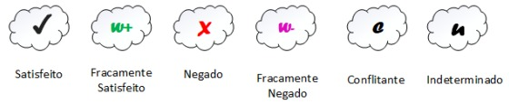
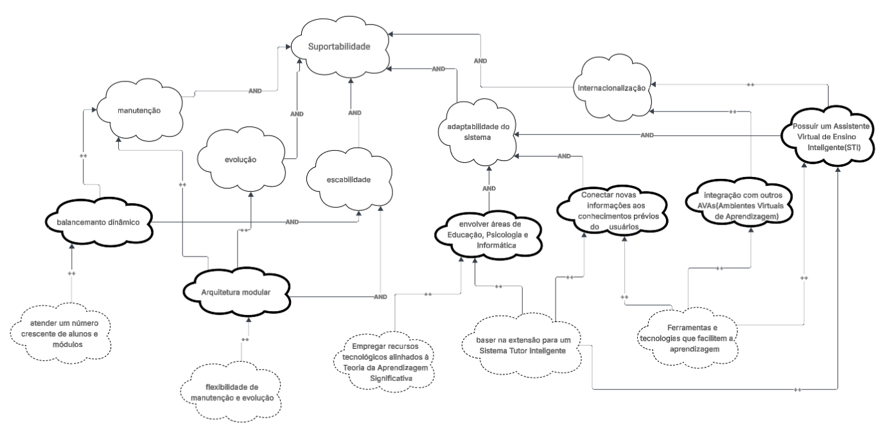

## Introdução
Diferente dos requisitos funcionais, que dizem o que o sistema deve fazer, os **requisitos não funcionais (RNF)** explicam como o sistema deve se comportar em certas situações.

Como esses requisitos costumam ser mais complexos e subjetivos, o NFR Framework ajuda a organizá-los de forma clara e estruturada. Ele permite representar, analisar e decidir sobre os RNFs usando **softgoals**, que são objetivos sem critérios de satisfação totalmente definidos.
Neste trabalho, o NFR Framework foi usado para representar os Requisitos Não Funcionais, mostrando suas relações e possíveis conflitos por meio de um gráfico de interdependência de softgoals (SIG).

## Integrantes do Grupo
A Tabela 1 apresenta todos os integrantes da equipe que participaram da etapa de NFR, juntamente com a descrição das atividades que cada um desenvolveu durante o projeto.

<strong>Tabela 1: Integrantes do Grupo Envolvidos</strong>

| Nome | Quais etapas participou |
|---------------------------|---------------------------------------|
| [Arthur Guilherme](https://github.com/ArthurGuilher62) | auxílio na criação do [NFR 03 - Suportabilidade](https://requisitos-de-software.github.io/2025.2-Grupo03/Modelagem/nfr_framework/#nfr-03-suportabilidade) |
| [Arthur Henrique](https://github.com/arthurhvieira1) |   |
| [Felipe Guimaraes](https://github.com/felipegf1) |   |
| [João Felipe](https://github.com/MrBolt2005) |   |
| [João Sapiência](https://github.com/JoaoSapiencia) |   |
| [Tiago Lemes](https://github.com/TiagoTeixeira-2005) | Criação da documentação e auxílio na criação do [NFR 01 - Usabilidade](https://requisitos-de-software.github.io/2025.2-Grupo03/Modelagem/nfr_framework/#nfr-01-usabilidade) |
| [Vilmar José](https://github.com/VilmarFagundes) | Auxílio na criação do [NFR 02 - Confiabilidade](https://requisitos-de-software.github.io/2025.2-Grupo03/Modelagem/nfr_framework/#nfr-02-confiabilidade) e [NFR 04 - Performance](https://requisitos-de-software.github.io/2025.2-Grupo03/Modelagem/nfr_framework/#nfr-04-performance) |

<strong>Autoria de <a href="https://github.com/TiagoTeixeira-2005">Tiago Lemes</a></strong>

## Gráfico de Interdependência de Softgoals (SIG)
O Gráfico de Interdependência de Softgoals **(Softgoal Interdependency Graph — SIG)** é uma ferramenta do NFR Framework usada para mostrar de forma visual os **Requisitos Não Funcionais (NFR)** e como eles se relacionam entre si.

Esse gráfico apresenta, de maneira clara e resumida, as decisões de desenvolvimento, as alternativas consideradas e as justificativas de cada escolha. Sendo possível entender como diferentes softgoals se influenciam e verificar se os objetivos de nível mais alto foram alcançados.

### Tipos de Softgoals
Os softgoals no NFR Framework são divididos em três tipos principais:

- **Softgoals NFR:** representam os próprios Requisitos Não Funcionais, podendo ser organizados de forma hierárquica e relacionados entre si.

- **Softgoals de Operacionalização:** indicam as soluções práticas ou técnicas usadas para atender aos softgoals NFR, como processos, estruturas de dados ou restrições do sistema.

- **Softgoals de Afirmação:** descrevem características do domínio, como prioridades, carga de trabalho e critérios de decisão, ajudando a justificar escolhas e a rastrear as decisões tomadas durante o desenvolvimento.

<strong>Figura 1: Tipos de Softgoals</strong>

<strong>Fonte: CHUNG et al., 2000</strong>

## Refinamentos no NFR Framework

Os refinamentos mostram uma relação de **dependência hierárquica**, que acontece de cima para baixo. Nela, um **softgoal principal (pai)** dá origem a outros **softgoals mais específicos (filhos)**, que se relacionam diretamente com ele.  

O objetivo dos refinamentos é **detalhar e especializar os softgoals**, tornando-os mais claros e aplicáveis ao projeto.  
Os principais tipos de refinamento no **NFR Framework** podem ser observados na Figura 2 e são:

- **Decomposição de Softgoal NFR:** Divide um *softgoal* NFR em outros mais específicos, ajudando a esclarecer e priorizar requisitos complexos.  
- **Decomposição de Operacionalização:** Subdivide um *softgoal* de operacionalização em outros *softgoals* de operacionalização mais específicos. Transforma uma solução geral em soluções mais detalhadas e práticas.  
- **Decomposição de Afirmação (Claims):** Refina um *softgoal* de afirmação em outros *softgoals* do mesmo tipo . Serve para apoiar ou questionar justificativas de projeto.  
- **Priorização:** Refina um *softgoal* em outro do mesmo tipo, mas com diferentes níveis de importância.  

<strong>Figura 2: Refinamentos no NFR Framework</strong>

<strong>Fonte: CHUNG et al., 2000</strong>

## Contribuições no NFR Framework

No **NFR Framework**, existem diferentes tipos de **contribuições** que mostram como a satisfação (ou não) de um softgoal descendente influencia a satisfação do *softgoal* ascendente.  
A seguir, são apresentados os principais tipos de contribuição definidos por **Chung et al. (2000)**:

- **AND:** todos os *softgoals* descendentes precisam ser satisfeitos para que o *softgoal* ascendente também seja satisfeito.  
- **OR:** basta que um dos *softgoals* descendentes seja satisfeito para que o *softgoal* ascendente também seja satisfeito.  
- **MAKE (++)**: contribuição totalmente positiva — se o descendente for satisfeito, o ascendente também será satisfeito no nível máximo.  
- **BREAK (--)**: contribuição totalmente negativa — se o descendente for satisfeito, o ascendente será negado.  
- **HELP (+)**: contribuição parcialmente positiva — se o descendente for parcialmente satisfeito, o ascendente também será parcialmente satisfeito.  
- **HURT (-)**: contribuição parcialmente negativa — se o descendente for satisfeito, o ascendente será parcialmente negado.  
- **UNKNOWN (?)**: contribuição desconhecida, podendo ser positiva ou negativa, dependendo do contexto.  
- **EQUALS:** o descendente só será satisfeito se o ascendente for satisfeito; da mesma forma, será negado se o ascendente for negado.  
- **SOME:** usada quando se conhece o tipo da contribuição (positiva ou negativa), mas não sua intensidade (parcial ou total).  
- **SOME+:** indica certeza de que a contribuição é positiva, mas incerteza quanto ao grau.  
- **SOME-:** indica certeza de que a contribuição é negativa, mas incerteza quanto ao grau.

## Procedimento de Avaliação no NFR Framework

O **procedimento de avaliação** define o grau em que os requisitos não funcionais são atendidos por um conjunto de decisões do projeto. Ele verifica se cada *softgoal* ou interdependência do SIG foi suficientemente satisfeito.  Para isso, são atribuídos **rótulos** aos *softgoals*, indicando seu nível de satisfação, que podem ser observados na Figura 3.  

- **(✓) Satisfeito**
- **(𝒲+) Fracamente Satisfeito**
- **( X) Negado**
- **(𝒲-) Fracamente Negado**
- **(🗲) Conflitante**
- **(u) Indeterminado**

<strong>Figura 3: Avaliação no NFR Framework</strong>

<strong>Fonte: CHUNG et al., 2000</strong>

A avaliação começa pelos *softgoals* de nível mais baixo na hierarquia, onde são tomadas decisões sobre aceitar ou rejeitar alternativas de projeto. Essas decisões geram os primeiros rótulos, que são então usados para calcular o impacto nos *softgoals* de níveis superiores.  

Esse processo continua de forma hierárquica até chegar aos *softgoals* de nível mais alto do **SIG**, permitindo entender como as decisões locais afetam os objetivos globais do sistema.  

## Metodologia

Para a construção do NFR Framework, selecionamos todos os [requisitos não-funcionais](https://requisitos-de-software.github.io/2025.2-Grupo03/Elicitacao/requisitos_elicitados/#requisitos-nao-funcionais) elicitados no projeto e os classificamos em temas como **usabilidade, confiabilidade, suportabilidade** e **performance**. 

Cada requisito foi detalhado em um **cartão de especificação**, contendo o índice e o nome do requisito não-funcional, classifciação , descrição, justificativa, origem, critérios de aceitação, dependências, prioridade possíveis conflitos.  

Em seguida, organizamos os requisitos em um **Gráfico de Interdependência de Softgoals (SIG)**, que representa visualmente as relações de contribuição entre os softgoals e o refinamento hierárquico entre eles. Para a construção do SIG, utilizamos como ferramenta o [Lucidchart](https://www.lucidchart.com/).  

A avaliação dos softgoals foi realizada aplicando os **rótulos do NFR Framework**, propagando as decisões dos níveis mais baixos até o topo da hierarquia.

### Cartões de Especificação

Um cartão de especificação é uma forma de registrar de maneira estruturada os detalhes de um requisito de software, focando em fornecer uma visão clara, padronizada e completa de cada requisito. Nesse tópico, os cartões de especificação foram voltados para os requisitos não-funcionais e organizados conforme o padrão apresentado na Tabela 2:

<strong>Tabela 2: Modelo Cartão de Especificação</strong>

| Índice e Título do Requisito |
|---------------------------|
| **Classificação:** Em qual classe de requisito não-funcional se adequa |
**Descrição:** Breve descrição do requisito |
**Justificativa:** Explica por que o requisito é necessário e qual benefício traz ao sistema ou ao usuário |
**Origem do Requisito:** De qual técnica(s) de elicitação ele se origina  |
**Critério de Aceitação:** Como será verificado que o requisito foi atendido |
**Dependências:** Requisitos, módulos ou condições que devem existir para que este requisito seja implementado |
**Prioridade:** Indica a importância do requisito (ex.: alta, média, baixa) |
**Conflitos:** Possíveis conflitos ou restrições com outros requisitos |

<strong>Autoria de <a href="https://github.com/TiagoTeixeira-2005">Tiago Lemes</a></strong>

---

<strong>Tabela 3: Cartão de Especificação 1</strong>

|  [RNF01](https://requisitos-de-software.github.io/2025.2-Grupo03/Elicitacao/requisitos_elicitados/#requisitos-nao-funcionais) – Adaptabilidade ao Perfil|
|---------------------------|
| **Classificação:** Usabilidade  |
**Descrição:** A interface deve se adaptar automaticamente ao perfil de cada indivíduo (aluno, monitor, professor, etc.), exibindo apenas as funcionalidades e informações relevantes a cada papel.  |
**Justificativa:** Personalizar a experiência do usuário, tornando a navegação mais intuitiva e reduzindo a complexidade de uso para diferentes perfis.  |
**Origem do Requisito:** [Análise de Documento](https://requisitos-de-software.github.io/2025.2-Grupo03/Elicitacao/analise_de_documentos/#requisitos-nao-funcionais) |
**Critério de Aceitação:** O sistema ajusta automaticamente o conteúdo e as permissões de acordo com o perfil do usuário no momento do login.  |
**Dependências:** Cadastro e autenticação de perfis de usuário.  |
**Prioridade:** Alta  |
**Conflitos:** Nenhum  |

<strong>Autoria de <a href="https://github.com/TiagoTeixeira-2005">Tiago Lemes</a></strong>

---

<strong>Tabela 4: Cartão de Especificação 2</strong>

|  [RNF05](https://requisitos-de-software.github.io/2025.2-Grupo03/Elicitacao/requisitos_elicitados/#requisitos-nao-funcionais) – Recursos Alinhados à TAS|
|---------------------------|
| **Classificação:** Suportabilidade | 
**Descrição:** O sistema deve empregar recursos tecnológicos alinhados à Teoria da Aprendizagem Significativa (TAS). Isso significa que o sistema deve utilizar ferramentas e tecnologias que facilitem a aprendizagem ativa, conectando novas informações aos conhecimentos prévios do usuário, promovendo compreensão profunda e retenção duradoura. |
**Justificativa:** Garantir que a plataforma ofereça suporte pedagógico adequado, reforçando a aprendizagem ativa e contextualizada de acordo com a Teoria da Aprendizagem Significativa.  |
**Origem do Requisito:** [Análise de Documento](https://requisitos-de-software.github.io/2025.2-Grupo03/Elicitacao/analise_de_documentos/#requisitos-nao-funcionais)   |
**Critério de Aceitação:** O sistema incorpora mecanismos (como mapas conceituais, recomendações de conteúdo e feedback contextual) que relacionam novos conceitos aos conhecimentos prévios do usuário. | 
**Dependências:** Modelagem dos conteúdos educacionais com base na TAS.  |
**Prioridade:** Média  |
**Conflitos:** Nenhum  |

<strong>Autoria de <a href="https://github.com/TiagoTeixeira-2005">Tiago Lemes</a></strong>

---

<strong>Tabela 5: Cartão de Especificação 3</strong>

| **Índice e Título do Requisito** |
|---------------------------|
| **RNF08 – Armazenamento seguro e criptografado** |
**Classificação:** Confiabilidade |
**Descrição:** O sistema deve garantir que os dados dos estudantes sejam armazenados de forma segura e criptografada.  |
**Justificativa:** Protege informações sensíveis dos usuários contra acessos indevidos, vazamentos e ataques cibernéticos, promovendo confiança no uso da plataforma.  |
**Origem do Requisito:** [Entrevista](https://requisitos-de-software.github.io/2025.2-Grupo03/Elicitacao/analise_de_documentos/#requisitos-nao-funcionais) .  |
**Critério de Aceitação:** Os dados devem ser armazenados com criptografia AES-128 e acesso restrito mediante autenticação segura.  |
**Dependências:** Implementação de módulo de segurança, autenticação de usuários e infraestrutura de banco de dados compatível. | 
**Prioridade:** Alta  |
**Conflitos:** Pode impactar o tempo de resposta exigido por [RNF03](https://requisitos-de-software.github.io/2025.2-Grupo03/Elicitacao/analise_de_documentos/#requisitos-nao-funcionais) e [RNF10](https://requisitos-de-software.github.io/2025.2-Grupo03/Elicitacao/analise_de_documentos/#requisitos-nao-funcionais).|

<strong>Autoria de <a href="https://github.com/ArthurGuilher62">Arthur Guilherme</a></strong>

---

<strong>Tabela 6: Cartão de Especificação 4</strong>

| **Índice e Título do Requisito** |
|---------------------------|
| **RNF09 – Disponibilidade 24/7** |
**Classificação:** Confiabilidade |
**Descrição:** O sistema deve estar disponível 24 horas por dia, 7 dias por semana, com tempo de indisponibilidade máximo de 1% ao mês. |
**Justificativa:** Garantir que os usuários possam acessar a plataforma a qualquer momento, adaptando-se a diferentes rotinas de estudo e trabalho. |
**Origem do Requisito:** [Entrevista](https://requisitos-de-software.github.io/2025.2-Grupo03/Elicitacao/entrevista/) |
**Critério de Aceitação:** O tempo de funcionamento do sistema, medido mensalmente por ferramentas de monitoramento, deve ser de no mínimo 99%. |
**Dependências:** Infraestrutura de servidor robusta (ex: nuvem com redundância), plano de contingência e monitoramento de serviços. |
**Prioridade:** Alta |
**Conflitos:** Pode exigir custos de infraestrutura elevados e limitar janelas de manutenção necessárias para atualizações (Suportabilidade). |

<strong>Autoria de <a href="https://github.com/VilmarFagundes">Vilmar Fagundes</a></strong>

---

<strong>Tabela 7: Cartão de Especificação 5</strong>

| **Índice e Título do Requisito** |
|---------------------------|
| **RNF10 – Tempo de Resposta de Dashboards** |
**Classificação:** Performance |
**Descrição:** O tempo de resposta para carregamento de dashboards e gráficos deve ser inferior a 3 segundos. |
**Justificativa:** Assegurar uma experiência de usuário fluida e ágil ao consultar dados analíticos, evitando frustração e abandono da ferramenta. |
**Origem do Requisito:** [Entrevista](https://requisitos-de-software.github.io/2025.2-Grupo03/Elicitacao/entrevista/) |
**Critério de Aceitação:** O tempo médio de carregamento completo (renderização de todos os elementos) dos dashboards e gráficos deve ser inferior a 3 segundos, medido em 95% das requisições. |
**Dependências:** Otimização de consultas ao banco de dados e da renderização dos componentes gráficos no *frontend*. |
**Prioridade:** Alta |
**Conflitos:** Pode conflitar com [RNF08](https://requisitos-de-software.github.io/2025.2-Grupo03/Elicitacao/requisitos_elicitados/#requisitos-nao-funcionais) (criptografia de dados) e [RNF15](https://requisitos-de-software.github.io/2025.2-Grupo03/Elicitacao/requisitos_elicitados/#requisitos-nao-funcionais) (auditoria de acesso), que adicionam sobrecarga ao processamento e consulta de dados. |

<strong>Autoria de <a href="https://github.com/VilmarFagundes">Vilmar Fagundes</a></strong>

---

| **Índice e Título do Requisito** |
|---------------------------|
| **RNF14 – Escalabilidade** |
**Classificação:** Suportabilidade  |
**Descrição:** O sistema deve permitir escalabilidade para atender um número crescente de alunos e módulos sem perda de desempenho.  |
**Justificativa:** Garante que o sistema continue funcional e eficiente mesmo com o crescimento da base de usuários e funcionalidades, evitando gargalos.  |
**Origem do Requisito:** [Entrevista](https://requisitos-de-software.github.io/2025.2-Grupo03/Elicitacao/entrevista/).  |
**Critério de Aceitação:** O sistema deve suportar ao menos 5.000 usuários simultâneos com tempo de resposta inferior a 2 segundos.  |
**Dependências:** Arquitetura escalável (ex.: microserviços), infraestrutura em nuvem e balanceamento de carga.  |
**Prioridade:** Alta  |
**Conflitos:** Pode entrar em conflito com [RNF08](https://requisitos-de-software.github.io/2025.2-Grupo03/Elicitacao/requisitos_elicitados/#requisitos-nao-funcionais).|

<strong>Autoria de <a href="https://github.com/ArthurGuilher62">Arthur Guilherme</a></strong>

---

<strong>Tabela 8: Cartão de Especificação 6</strong>

| **Índice e Título do Requisito** |
|---------------------------|
| **RNF15 – Conformidade com LGPD** |
**Classificação:** Confiabilidade |
**Descrição:** O sistema deve garantir a privacidade dos dados dos estudantes em conformidade com a LGPD (Lei Geral de Proteção de Dados). |
**Justificativa:** Atender às exigências legais, protegendo os dados pessoais dos usuários contra acessos indevidos e evitando sanções. Gera confiança na plataforma. |
**Origem do Requisito:** [Entrevista](https://requisitos-de-software.github.io/2025.2-Grupo03/Elicitacao/entrevista/) |
**Critério de Aceitação:** O sistema deve possuir mecanismos de consentimento de uso de dados, permitir a anonimização ou exclusão de dados pessoais sob demanda, e ter políticas de privacidade claras. Acesso aos dados deve ser restrito e auditado. |
**Dependências:** Implementação de [RNF08](https://requisitos-de-software.github.io/2025.2-Grupo03/Elicitacao/requisitos_elicitados/#requisitos-nao-funcionais) (Armazenamento seguro) e módulos de controle de acesso e auditoria. |
**Prioridade:** Alta |
**Conflitos:** A implementação de logs de auditoria detalhados pode impactar a performance do sistema, especialmente em consultas ([RNF10](https://requisitos-de-software.github.io/2025.2-Grupo03/Elicitacao/requisitos_elicitados/#requisitos-nao-funcionais)). |

<strong>Autoria de <a href="https://github.com/VilmarFagundes">Vilmar Fagundes</a></strong>

---

## Gráfico de Interdependência de Softgoals (SIG)
A Figura 4 apresenta o Gráfico de Interdependência de Softgoals (SIG) dos Requisitos Não Funcionais do projeto.
Esse gráfico mostra como os softgoals se relacionam entre si e de que forma cada requisito contribui para atingir os objetivos gerais do sistema.

<strong>Figura 4: Gráfico de Interdependência de Softgoals (SIG) - Requisitos Não-Funcionais</strong>

<strong>Autoria de <a href="https://github.com/TiagoTeixeira-2005">Tiago Lemes</a></strong>

### NFR 01 - Usabilidade

Os requisitos utilizados para o **NFR 01 (Usabilidade)** estão apresentados na página de [Requisitos Elicitados](https://requisitos-de-software.github.io/2025.2-Grupo03/Elicitacao/requisitos_elicitados/) e são os seguintes:  

- [RNF01](https://requisitos-de-software.github.io/2025.2-Grupo03/Elicitacao/requisitos_elicitados/#requisitos-nao-funcionais): A interface deve se adaptar automaticamente ao perfil de cada usuário (aluno, monitor, professor etc.).  
- [RNF02](https://requisitos-de-software.github.io/2025.2-Grupo03/Elicitacao/requisitos_elicitados/#requisitos-nao-funcionais): O sistema deve ser acessível pela internet, permitindo o uso tanto presencial quanto a distância.  
- [RNF11](https://requisitos-de-software.github.io/2025.2-Grupo03/Elicitacao/requisitos_elicitados/#requisitos-nao-funcionais) O sistema deve ser totalmente compatível com dispositivos móveis, garantindo responsividade e adaptação automática a diferentes tamanhos e orientações de tela (smartphones, tablets e notebooks).  
- [RNF12](https://requisitos-de-software.github.io/2025.2-Grupo03/Elicitacao/requisitos_elicitados/#requisitos-nao-funcionais) O sistema deve seguir padrões de acessibilidade para garantir a usabilidade a todos os usuários, incluindo pessoas com deficiência.  

A **Figura 5** apresenta o **Gráfico de Interdependência de Softgoals (SIG)** referente ao NFR 01, destacando as relações de contribuição entre os requisitos de Usabilidade.  

<strong>Figura 5: Gráfico de Interdependência de Softgoals (SIG) - Usabilidade</strong>

    <strong>
        Autoria de 
        <a href="https://github.com/felipegf1">Felipe Guimaraes</a>,
        <a href="https://github.com/MrBolt2005">João Felipe</a>,
        <a href="https://github.com/JoaoSapiencia">João Sapiência</a> e
        <a href="https://github.com/TiagoTeixeira-2005">Tiago Lemes</a> 
    </strong>

**Avaliação dos softgoals de usabilidade:**

- [RNF01 (Adaptabilidade de Perfil)](https://requisitos-de-software.github.io/2025.2-Grupo03/Elicitacao/requisitos_elicitados/#requisitos-nao-funcionais): **Satisfeito (✓)** – A interface adapta-se automaticamente ao perfil do usuário (aluno, monitor, professor etc.), oferecendo conteúdo e funcionalidades condizentes com cada papel.  
- [RNF02 (Acessibilidade Remota)](https://requisitos-de-software.github.io/2025.2-Grupo03/Elicitacao/requisitos_elicitados/#requisitos-nao-funcionais): **Satisfeito (✓)** – O sistema é acessível pela internet, permitindo uso tanto presencial quanto a distância, sem restrições significativas.  
- [RNF11 (Compatibilidade com Dispositivos Móveis)](https://requisitos-de-software.github.io/2025.2-Grupo03/Elicitacao/requisitos_elicitados/#requisitos-nao-funcionais): **Negado (X)** – O sistema não possui versão mobile nem apresenta responsividade adequada, impossibilitando o uso em diferentes tamanhos e orientações de tela.
- [RNF12 (Acessibilidade)](https://requisitos-de-software.github.io/2025.2-Grupo03/Elicitacao/requisitos_elicitados/#requisitos-nao-funcionais): **Negado (X)** – O sistema não segue integralmente os padrões de acessibilidade, pois não oferece recursos adequados para usuários com deficiência visual, como suporte a leitores de tela, design claro com bom contraste e opção para daltonismo.

### NFR 02 - Confiabilidade

Os requisitos utilizados para o **NFR 02 (Confiabilidade)** estão apresentados na página de [Requisitos Elicitados](https://requisitos-de-software.github.io/2025.2-Grupo03/Elicitacao/requisitos_elicitados/) e são os seguintes: 

- [RNF09](https://requisitos-de-software.github.io/2025.2-Grupo03/Elicitacao/requisitos_elicitados/#requisitos-nao-funcionais): O sistema deve estar disponível 24 horas por dia, 7 dias por semana, com tempo de indisponibilidade máximo de 1% ao mês.
- [RNF15](https://requisitos-de-software.github.io/2025.2-Grupo03/Elicitacao/requisitos_elicitados/#requisitos-nao-funcionais): O sistema deve garantir a privacidade dos dados dos estudantes em conformidade com a LGPD.

### NFR 03 - Suportabilidade

Os requisitos utilizados para o **NFR 03 (Suportabilidade)** estão apresentados na página de [Requisitos Elicitados](https://requisitos-de-software.github.io/2025.2-Grupo03/Elicitacao/requisitos_elicitados/) e são os seguintes:  

- [RNF04](https://requisitos-de-software.github.io/2025.2-Grupo03/Elicitacao/requisitos_elicitados/#requisitos-nao-funcionais): Deve se basear na extensão de um Sistema Tutor Inteligente (STI) para um Assistente Virtual de Ensino Inteligente (ITA).
- [RNF05](https://requisitos-de-software.github.io/2025.2-Grupo03/Elicitacao/requisitos_elicitados/#requisitos-nao-funcionais): Deve empregar recursos tecnológicos alinhados à Teoria da Aprendizagem Significativa (TAS).
- [RNF06](https://requisitos-de-software.github.io/2025.2-Grupo03/Elicitacao/requisitos_elicitados/#requisitos-nao-funcionais): Projeto multidisciplinar envolvendo Educação, Psicologia e Informática.
- [RNF14](https://requisitos-de-software.github.io/2025.2-Grupo03/Elicitacao/requisitos_elicitados/#requisitos-nao-funcionais): O sistema deve permitir escalabilidade para atender um número crescente de alunos e módulos sem perda de desempenho.

A **Figura 7** apresenta o **Gráfico de Interdependência de Softgoals (SIG)** referente ao NFR 03, destacando as relações de contribuição entre os requisitos de Usabilidade. 

<strong>Figura 7: Gráfico de Interdependência de Softgoals (SIG) - Suportabilidade</strong>

    <strong>
        Autoria de 
        <a href="https://github.com/ArthurGuilher62">Arthur Guilherme</a>,
        <a href="https://github.com/arthurhvieira1">Arthur Henrique</a>,
        <a href="https://github.com/MrBolt2005">João Felipe</a>,
        <a href="https://github.com/JoaoSapiencia">João Sapiência</a> e
        <a href="https://github.com/TiagoTeixeira-2005">Tiago Lemes</a> 
    </strong>

**Avaliação dos softgoals de usabilidade:**

- [RNF04 (Extensão de STI para ITA)](https://requisitos-de-software.github.io/2025.2-Grupo03/Elicitacao/requisitos_elicitados/#requisitos-nao-funcionais): **Satisfeito (✓)** – O sistema se baseia na extensão de um Sistema Tutor Inteligente (STI) para um Assistente Virtual de Ensino Inteligente (ITA), promovendo suporte personalizado ao aprendizado.
- [RNF05 (Tecnologia alinhada à TAS)](https://requisitos-de-software.github.io/2025.2-Grupo03/Elicitacao/requisitos_elicitados/#requisitos-nao-funcionais): **Satisfeito (✓)** – Emprega recursos tecnológicos que favorecem a Teoria da Aprendizagem Significativa (TAS), como contextualização, interação e construção ativa do conhecimento.
- [RNF06 (Projeto Multidisciplinar)](https://requisitos-de-software.github.io/2025.2-Grupo03/Elicitacao/requisitos_elicitados/#requisitos-nao-funcionais): **Satisfeito (✓)** – multidisciplinar, envolvendo as áreas de Educação, Psicologia e Informática, o que implica em flexibilidade de manutenção e evolução do sistema para atender diferentes perspectivas e áreas de conhecimento.
- [RNF14 (Escalabilidade)](https://requisitos-de-software.github.io/2025.2-Grupo03/Elicitacao/requisitos_elicitados/#requisitos-nao-funcionais): **Indeterminado (u)** – O sistema permite escalabilidade, atendendo a um número crescente de alunos e módulos sem comprometer o desempenho.

### NFR 04 - Performance

Os requisitos utilizados para o **NFR 04 (Perfomance)** estão apresentados na página de [Requisitos Elicitados](https://requisitos-de-software.github.io/2025.2-Grupo03/Elicitacao/requisitos_elicitados/) e são os seguintes:

- [RNF10](https://requisitos-de-software.github.io/2025.2-Grupo03/Elicitacao/requisitos_elicitados/#requisitos-nao-funcionais): O tempo de resposta para carregamento de dashboards e gráficos deve ser inferior a 3 segundos.

## Gravação da validação do documento

## Agradecimentos
O Grupo 03 agradece o apoio das ferramentas de Inteligência Artificial Generativa — **ChatGPT, Google Gemini e DeepSeek** — na revisão gramatical e de estilo deste artigo. As tecnologias foram utilizadas para tornar o texto mais claro, objetivo e fácil de ler. Todo o conteúdo, assim como a precisão técnica e as ideias apresentadas, permanecem de responsabilidade dos autores.

## Referências

## Históricos de versão

| Versão | Data       | Descrição                                   | Autor(es)                                                   | Revisor       |
|--------|------------|---------------------------------------------|------------------------------------------------------------|---------------|
| 1.0    | 16/10/2025 | Criação do documento de NFR           | [Tiago Lemes](https://github.com/TiagoTeixeira-2005)       | [Vilmar José](https://github.com/VilmarFagundes) |
| 1.1    | 18/10/2025 | Auxílio na criação do NFR 01 - Usabilidade           | [Tiago Lemes](https://github.com/TiagoTeixeira-2005)       | [Vilmar José](https://github.com/VilmarFagundes) |
| 1.2    | 20/10/2025 | Auxílio na criação do NFR 03- suportabilidade          | [Arthur Guilherme](https://github.com/ArthurGuilher62)       | [Tiago Lemes](https://github.com/TiagoTeixeira-2005) |
| 1.3    | 21/10/2025 | Auxílio na criação do [NFR 02 - Confiabilidade](https://requisitos-de-software.github.io/2025.2-Grupo03/Modelagem/nfr_framework/#nfr-02-confiabilidade) e [NFR 04 - Performance](https://requisitos-de-software.github.io/2025.2-Grupo03/Modelagem/nfr_framework/#nfr-04-performance) | [Vilmar José](https://github.com/VilmarFagundes) | [Arthur Guilherme](https://github.com/ArthurGuilher62) |