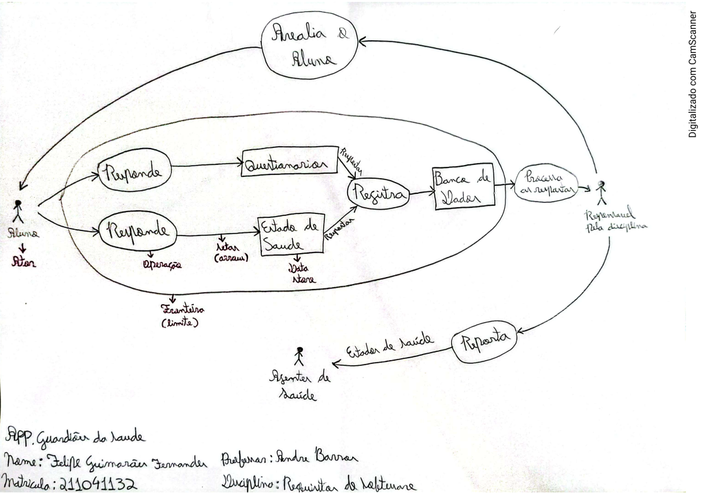
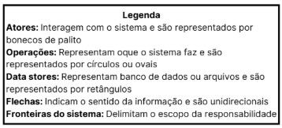

## Introdução

No início do projeto, em determinada atividade, cada integrante do grupo escolheu um aplicativo, fez uma análise crítica e representou sua compreensão por meio de uma Rich Picture. Este documento reúne essas análises e representações visuais feitas pelos membros do grupo, com o objetivo de mostrar como cada um percebeu os sistemas avaliados.

A **Tabela 1** específica o integrante e o respectivo aplicativo avaliado:  

| Integrante | Aplicativo Avaliado |
| ---- | ----- | 
| Arthur Guilherme | Jornada do Estudante |
| Arthur Henrique |  |
| Felipe Guimarães | Guardiões da Saúde |
| João Felipe| Mercado Livre |
| João Sapiência |  |
| Tiago Lemes | SAE |
| Vilmar José | Caixa Lotérica |

## Jornada do Estudante
O integrante Arthur Guilherme optou pelo aplicativo Jornada do Estudante, com foco na análise das funcionalidades voltadas ao acompanhamento da vida acadêmica do usuário. O Rich Picture destaca as operações principais, como **cadastros, acompanhamento de atividades, envio de tarefas, consultas de notas e comunicados**. 
O resultado do Rich Picture pode ser visualizado na Figura 1 e sua legenda na Figura 2.

**Figura 1 – Rich Picture Caixa Lotérica**

**Figura 2 – Legenda do Rich Picture Caixa Lotérica**

## 

## Guardiões da Saúde

O integrante Felipe Guimarães escolheu o aplicativo Guardiões da Saúde para realizar o Rich Picture. O aplicativo consiste em uma forma de vigilância participativa, no qual cada usuário reporta a condição de saúde cotidianamente. Como podemos observar no Rich Picture, o Guardiões da Saúde também envolve uma parte pedagógica, já que existem instituições, como a UnB, que valorizam a iniciativo. Dessa forma, fica claro como a dinâmica funciona, os estudantes respondem a questionários  e perguntas sobre o estado de saúde e posteriormente são avaliados pela disciplina. Apesar de ser um aplicativo interessante.

**Figura 3 - Rich Picture Guardiões da Saúde**

## Mercado Livre

O integrante João Felipe escolheu o aplicativo Mercado Livre para realizar sua análise. Como mostra o Rich Picture, o aplicativo possui uma grande variedade de funcionalidades, incluindo compra e venda de produtos, gerenciamento de anúncios, comunicação entre usuários, acompanhamento de entregas e opções de pagamento. Essa diversidade de operações torna o sistema bastante completo, mas também pode dificultar a avaliação detalhada de todos os seus recursos em uma única atividade. O Rich Picture busca destacar as principais interações e fluxos do aplicativo, facilitando a compreensão dos elementos mais relevantes.

**Figura 4 - Rich Picture Mercado Livre**

## SAE
O integrante Tiago Lemes analisou o aplicativo SAE (Sistema de Apoio Educacional), usado na UnB para **oferecer aprendizagem personalizada e acompanhamento acadêmico**. O Rich Picture destaca a relação entre alunos, professores, monitores e os principais módulos do sistema. A representação mostra como o SAE **organiza o aprendizado, fornece orientações personalizadas e recomenda materiais e atividades de acordo com o desempenho dos alunos**. 
O resultado pode ser visualizado na Figura 9 e sua legenda na Figura 10.

**Figura 9 – Rich Picture SAE**

**Figura 10 – Legenda do Rich Picture Caixa Lotérica**

## Caixa Lotérica
O integrante Vilmar José fez o Rich Picture com o objetivo de representar os aspectos gerais do aplicativo da Caixa Lotérica de forma simplificada. Embora o sistema ofereça uma ampla variedade de funcionalidades, não foi possível retratar todas as operações disponíveis. Por isso, o foco foi direcionado às principais ações realizadas pelos usuários, como **cadastros, pagamentos, apostas e recebimento de prêmios**. 
O resultado pode ser observado na Figura 11.

**Figura 11 – Rich Picture Caixa Lotérica**

## Histórico de versões

| Versão | Data | Descrição | Autor | Revisor |
| ---- | ----- | ----- | ---- | ----- | 
| 1.0 | 10/09/2025 | Criação da página de Aplicativos Avaliados | [Tiago Lemes](https://github.com/TiagoTeixeira-2005) e [João Sapiência](https://github.com/JoaoSapiencia) |  |