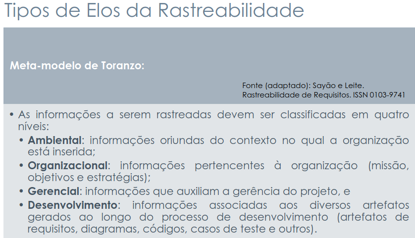

# Forward-From

## Introdução

A rastreabilidade **Forward-From (ou rastreabilidade para frente)** é uma abordagem que permite acompanhar o destino de cada requisito ao longo do desenvolvimento do projeto. Ela responde à pergunta **“o que acontece com este requisito?”**, mostrando como ele é transformado em artefatos de design, código, testes e documentação.

Em outras palavras, a rastreabilidade Forward-From garante que cada requisito seja devidamente implementado e testado, permitindo verificar se todas as necessidades levantadas foram atendidas e facilitando o controle de progresso e validação do sistema.

## Integrantes do Grupo
A Tabela 1 apresenta todos os integrantes da equipe que participaram da etapa da Histórias de Usuário, juntamente com a descrição das atividades que cada um desenvolveu durante o projeto.

<strong>Tabela 1: Integrantes do Grupo Envolvidos</strong>

| Nome | Quais etapas participou |
|---------------------------|---------------------------------------|
| [Arthur Guilherme](https://github.com/ArthurGuilher62) | Adição dos Forward-From: [FF43](#FF43), [FF44](#FF44), [FF45](#FF45), [FF46](#FF46), [FF49](#FF49), [FF50](#FF50), [FF51](#FF51), [FF59](#FF59) e [FF64](#FF64) |
| [Arthur Henrique](https://github.com/arthurhvieira1) |  |
| [Felipe Guimaraes](https://github.com/felipegf1) | Adição dos Forward-From: [FF07](#FF07), [FF08](#FF08), [FF09](#FF09), [FF10](#FF10), [FF12](#FF12), [FF17](#FF17) e [FF27](#FF27) |
| [João Felipe](https://github.com/MrBolt2005) | Adição dos *forward-from*: [FF14](#FF14), [FF23](#FF23), [FF30](#FF30), [FF37](#FF37), [FF41](#FF41), [FF42](#FF42), [FF47](#FF47), [FF53](#FF53) e [FF55](#FF55). |
| [João Sapiência](https://github.com/JoaoSapiencia) |  |
| [Tiago Lemes](https://github.com/TiagoTeixeira-2005) | Criação do documento de Forward-From e adição dos Forward-From: [FF06](#FF06), [FF15](#FF15), [FF18](#FF18), [FF19](#FF19), [FF21](#FF21), [FF22](#FF22), [FF34](#FF34), [FF35](#FF35), [FF52](#FF52) e [FF56](#FF56) |
| [Vilmar José](https://github.com/VilmarFagundes) |  Adição dos Forward-From: [FF01](#FF01), [FF02](#FF02), [FF11](#FF11), [FF13](#FF13), [FF28](#FF28), [FF38](#FF38), [FF40](#FF40), [FF60](#FF60), [FF61](#FF61), [FF65](#FF65). |

<strong>Autoria de <a href="https://github.com/TiagoTeixeira-2005">Tiago Lemes</a> e <a href="https://github.com/MrBolt2005">João Felipe</a></strong>

## Metodologia

A metodologia adotada para esta análise baseia-se no **Meta-modelo de Toranzo**, conforme apresentado nos slides da aula *“Requisitos – Aula 26”*, de Milene Serrano e Maurício Serrano, disponíveis [clicando aqui](../arquivos/Requisitos%20-%20aula26-milene-modelagem.pdf).  

Esse modelo organiza as informações rastreáveis em **níveis hierárquicos** e define **elos** que representam as relações entre os artefatos envolvidos no desenvolvimento de sistemas.

### Níveis de Informação

Nesta análise, o foco está no **nível de Desenvolvimento**, um dos quatro níveis principais do modelo, conforme apresentado na Figura 1:  

- **Ambiental**  
- **Organizacional**  
- **Gerencial**  
- **Desenvolvimento**  

<strong>Figura 1: Níveis de Desenvolvimento</strong>

<strong>Fonte: SERRANO, Milene; SERRANO, Maurício. Requisitos - Aula 26</strong>

No contexto da **rastreabilidade Forward-From**, o objetivo é **conectar os requisitos documentados aos artefatos de design e implementação**, permitindo rastrear **como os requisitos são transformados em componentes técnicos**.

### Elos de Rastreabilidade

Para modelar as conexões entre os requisitos e os artefatos técnicos, foram utilizados os **elos de rastreabilidade** definidos no modelo de Toranzo, conforme apresentado na Figura 2:  

- **Satisfação:** Conecta um requisito (artefato de origem) a qualquer outro artefato de destino (como outro requisito, história de usuário, componente ou módulo) que seja necessário para cumprir, implementar ou atender a esse requisito.
- **Recurso:** Conecta um requisito a um dado, serviço ou funcionalidade da qual ele precisa para funcionar corretamente.  
- **Responsabilidade:** Conecta um requisito ao ator, componente ou módulo que será responsável por realizá-lo.  
- **Representação:** Conecta um requisito à sua forma de modelagem ou descrição em outro artefato.  
- **Alocado:** Conecta um requisito a um artefato de planejamento que indica onde e como ele será desenvolvido.  
- **Agregação:** Conecta um requisito a outro com o qual se combina para formar uma funcionalidade maior.

<strong>Figura 2: Tipos de Elos de Rastreabilidade</strong>

<strong>Fonte: SERRANO, Milene; SERRANO, Maurício. Requisitos - Aula 26</strong>

Cada elo é aplicado conforme a **natureza da relação** entre os requisitos e os elementos de implementação.  

A aplicação prática dessa metodologia é apresentada em uma **tabela de mapeamento**, que relaciona os requisitos aos artefatos de design e implementação correspondentes, indicando o tipo de elo utilizado em cada caso.  
Essa abordagem permite **verificar se os requisitos estão sendo corretamente contemplados** nas etapas subsequentes do desenvolvimento e **facilita a gestão da conformidade** ao longo de todo o ciclo de vida do sistema.

## Legenda

## Forward-From

### Requisitos Funcionais

Na tabela 2 encontra-se a rastreabilidade Forward-From dos Requisitos Funcionais.

<strong>Tabela 2: Requisitos Funcionais</strong>

| ID   | Requisito | Descrição | Implementado | Elo Relacionado | Casos de Uso | Cenários | Léxicos | Histórias de Usuário | Backlog | Protótipo |
|------|-----------|-----------|--------------|-----------------|--------------|----------|---------|--------------------|---------|-----------|
| FF01 | [RF01](https://requisitos-de-software.github.io/2025.2-Grupo03/Elicitacao/requisitos_elicitados/#RF01) | O sistema deve identificar cada indivíduo (aluno, monitor, professor, coordenador, diretor, administrador) | Sim | [ELOFF01](#ELOFF01) | | | [Aluno](https://requisitos-de-software.github.io/2025.2-Grupo03/Modelagem/lexico/#lexico-1-aluno), [Professor](https://requisitos-de-software.github.io/2025.2-Grupo03/Modelagem/lexico/#lexico-2-professor), [Monitor](https://requisitos-de-software.github.io/2025.2-Grupo03/Modelagem/lexico/#lexico-3-monitor), [Coordenador](https://requisitos-de-software.github.io/2025.2-Grupo03/Modelagem/lexico/#lexico-4-coordenador), [Administrador](https://requisitos-de-software.github.io/2025.2-Grupo03/Modelagem/lexico/#lexico-5-administrador), [Perfil](https://requisitos-de-software.github.io/2025.2-Grupo03/Modelagem/lexico/#lexico-23-perfil) | [US01 - Identificação e Autenticação de Usuários](https://requisitos-de-software.github.io/2025.2-Grupo03/Modelagem/historias_de_usuario/#us01-identificacao-e-autenticacao-de-usuarios) | [EP01 – Gerenciar Perfis de Usuários](https://requisitos-de-software.github.io/2025.2-Grupo03/Modelagem/backlog_do_produto/#ep01-gerenciar-perfis-de-usuarios) e [TM01 - Identificação e Perfis de Usuário](https://requisitos-de-software.github.io/2025.2-Grupo03/Modelagem/backlog_do_produto/#tm01-identificacao-e-perfis-de-usuario) |  |
| FF02 | [RF02](https://requisitos-de-software.github.io/2025.2-Grupo03/Elicitacao/requisitos_elicitados/#RF02) | O sistema deve ter perfil individual | Sim | [ELOFF02](#ELOFF02) |  |  | [Aluno](https://requisitos-de-software.github.io/2025.2-Grupo03/Modelagem/lexico/#lexico-1-aluno), [Professor](https://requisitos-de-software.github.io/2025.2-Grupo03/Modelagem/lexico/#lexico-2-professor), [Monitor](https://requisitos-de-software.github.io/2025.2-Grupo03/Modelagem/lexico/#lexico-3-monitor), [Coordenador](https://requisitos-de-software.github.io/2025.2-Grupo03/Modelagem/lexico/#lexico-4-coordenador), [Administrador](https://requisitos-de-software.github.io/2025.2-Grupo03/Modelagem/lexico/#lexico-5-administrador), [Perfil](https://requisitos-de-software.github.io/2025.2-Grupo03/Modelagem/lexico/#lexico-23-perfil) | [US02 - Visualizar e Gerenciar Perfil Individual](https://requisitos-de-software.github.io/2025.2-Grupo03/Modelagem/historias_de_usuario/#us02-visualizar-e-gerenciar-perfil-individual) | [EP01 – Gerenciar Perfis de Usuários](https://requisitos-de-software.github.io/2025.2-Grupo03/Modelagem/backlog_do_produto/#ep01-gerenciar-perfis-de-usuarios) e [TM01 - Identificação e Perfis de Usuário](https://requisitos-de-software.github.io/2025.2-Grupo03/Modelagem/backlog_do_produto/#tm01-identificacao-e-perfis-de-usuario) |  |
| FF06 | [RF06](https://requisitos-de-software.github.io/2025.2-Grupo03/Elicitacao/requisitos_elicitados/#RF06) | O assistente virtual deve combinar resultados formais com inferências Fuzzy. | Sim | [ELOFF06](#ELOFF06) |  |  | [Assistente Virtual](https://requisitos-de-software.github.io/2025.2-Grupo03/Modelagem/lexico/#lexico-27-assistente-virtual), [Desempenho](https://requisitos-de-software.github.io/2025.2-Grupo03/Modelagem/lexico/#lexico-28-desempenho), [Fornecer Estatísticas](https://requisitos-de-software.github.io/2025.2-Grupo03/Modelagem/lexico/#lexico-13-fornecer-estatisticas) | [US06 - Combinar Resultados Formais com Inferências Fuzzy](https://requisitos-de-software.github.io/2025.2-Grupo03/Modelagem/historias_de_usuario/#us06-combinar-resultados-formais-com-inferencias-fuzzy) | [EP06 – Utilizar Lógica Fuzzy para Apoiar Decisões Pedagógicas](https://requisitos-de-software.github.io/2025.2-Grupo03/Modelagem/backlog_do_produto/#ep06-utilizar-logica-fuzzy-para-apoiar-decisoes-pedagogicas) e [TM04 - Assistente Virtual Inteligente](https://requisitos-de-software.github.io/2025.2-Grupo03/Modelagem/backlog_do_produto/#tm04-assistente-virtual-inteligente) |  |
| FF07 | [RF07](https://requisitos-de-software.github.io/2025.2-Grupo03/Elicitacao/requisitos_elicitados/#RF07) | A interface deve conter o progresso do aluno na disciplina toda | Sim | [ELOFF07](#ELOFF07) | | | [Aluno](https://requisitos-de-software.github.io/2025.2-Grupo03/Modelagem/lexico/#lexico-1-aluno), [Consultar Desempenho](https://requisitos-de-software.github.io/2025.2-Grupo03/Modelagem/lexico/#lexico-12-consultar-desempenho), [Desempenho](https://requisitos-de-software.github.io/2025.2-Grupo03/Modelagem/lexico/#lexico-28-desempenho) | [US07 - Visualizar Progresso do Aluno na Disciplina](https://requisitos-de-software.github.io/2025.2-Grupo03/Modelagem/historias_de_usuario/#us07-visualizar-progresso-do-aluno-na-disciplina) | [EP16 – Exibir Progresso Completo e Percentual do Aluno](https://requisitos-de-software.github.io/2025.2-Grupo03/Modelagem/backlog_do_produto/#ep16-exibir-progresso-completo-e-percentual-do-aluno) e [TM06 - Progresso e Engajamento do Aluno](https://requisitos-de-software.github.io/2025.2-Grupo03/Modelagem/backlog_do_produto/#tm06-progresso-e-engajamento-do-aluno) | |
| FF08 | [RF08](https://requisitos-de-software.github.io/2025.2-Grupo03/Elicitacao/requisitos_elicitados/#RF08) | A interface deve exibir um progresso em porcentagem do andamento da disciplina | Não | [ELOFF08](#ELOFF08) | [UC01 - Exibição do Progresso na Disciplina](https://requisitos-de-software.github.io/2025.2-Grupo03/Modelagem/casos_de_uso/#uc01) | [CE01 - Progresso Geral da Disciplina](https://requisitos-de-software.github.io/2025.2-Grupo03/Modelagem/cenario/#cenario-01-progresso-geral-da-disciplina) | [Aluno](https://requisitos-de-software.github.io/2025.2-Grupo03/Modelagem/lexico/#lexico-1-aluno), [Consultar Desempenho](https://requisitos-de-software.github.io/2025.2-Grupo03/Modelagem/lexico/#lexico-12-consultar-desempenho), [Estatísticas](https://requisitos-de-software.github.io/2025.2-Grupo03/Modelagem/lexico/#lexico-26-estatisticas), [Desempenho](https://requisitos-de-software.github.io/2025.2-Grupo03/Modelagem/lexico/#lexico-28-desempenho) | [US08 - Exibir Progresso da Disciplina em Porcentagem](https://requisitos-de-software.github.io/2025.2-Grupo03/Modelagem/historias_de_usuario/#us08-exibir-progresso-da-disciplina-em-porcentagem) | [EP16 – Exibir Progresso Completo e Percentual do Aluno](https://requisitos-de-software.github.io/2025.2-Grupo03/Modelagem/backlog_do_produto/#ep16-exibir-progresso-completo-e-percentual-do-aluno) e [TM06 - Progresso e Engajamento do Aluno](https://requisitos-de-software.github.io/2025.2-Grupo03/Modelagem/backlog_do_produto/#tm06-progresso-e-engajamento-do-aluno) | |
| FF09 | [RF09](https://requisitos-de-software.github.io/2025.2-Grupo03/Elicitacao/requisitos_elicitados/#RF09) | A interface deve exibir como está a porcentagem de acertos das atividades de cada conteúdo | Não | [ELOFF09](#ELOFF09) | [UC02 - Exibição da Porcentagem de Acertos por Conteúdo](https://requisitos-de-software.github.io/2025.2-Grupo03/Modelagem/casos_de_uso/#uc02) | [CE02 - Desempenho de Acertos por Conteúdo](https://requisitos-de-software.github.io/2025.2-Grupo03/Modelagem/cenario/#cenario-02-desempenho-de-acertos-por-conteudo) | [Aluno](https://requisitos-de-software.github.io/2025.2-Grupo03/Modelagem/lexico/#lexico-1-aluno), [Consultar Desempenho](https://requisitos-de-software.github.io/2025.2-Grupo03/Modelagem/lexico/#lexico-12-consultar-desempenho), [Atividade Concluída](https://requisitos-de-software.github.io/2025.2-Grupo03/Modelagem/lexico/#lexico-14-atividade-concluida), [Conteúdo Dominado](https://requisitos-de-software.github.io/2025.2-Grupo03/Modelagem/lexico/#lexico-18-conteudo-dominado), [Estatísticas](https://requisitos-de-software.github.io/2025.2-Grupo03/Modelagem/lexico/#lexico-26-estatisticas) | [US09 - Visualizar Porcentagem de Acertos por Conteúdo](https://requisitos-de-software.github.io/2025.2-Grupo03/Modelagem/historias_de_usuario/#us09-visualizar-porcentagem-de-acertos-por-conteudo) | [EP14 – Exibir Médias e Porcentagens por Conteúdo e Usuário](https://requisitos-de-software.github.io/2025.2-Grupo03/Modelagem/backlog_do_produto/#ep14-exibir-medias-e-porcentagens-por-conteudo-e-usuario) e [TM05 - Análise e Visualização de Desempenho](https://requisitos-de-software.github.io/2025.2-Grupo03/Modelagem/backlog_do_produto/#tm05-analise-e-visualizacao-de-desempenho) | |
| FF10 | [RF10](https://requisitos-de-software.github.io/2025.2-Grupo03/Elicitacao/requisitos_elicitados/#RF10) | A interface deve exibir como está a porcentagem de erros das atividades de cada conteúdo | Não | [ELOFF10](#ELOFF10) | [UC03 - Exibição da Porcentagem de Erros por Conteúdo](https://requisitos-de-software.github.io/2025.2-Grupo03/Modelagem/casos_de_uso/#uc03) | [CE03 - Desempenho de Erros por Conteúdo](https://requisitos-de-software.github.io/2025.2-Grupo03/Modelagem/cenario/#cenario-03-desempenho-de-erros-por-conteudo) | [Aluno](https://requisitos-de-software.github.io/2025.2-Grupo03/Modelagem/lexico/#lexico-1-aluno), [Consultar Desempenho](https://requisitos-de-software.github.io/2025.2-Grupo03/Modelagem/lexico/#lexico-12-consultar-desempenho), [Conteúdo em Dificuldade](https://requisitos-de-software.github.io/2025.2-Grupo03/Modelagem/lexico/#lexico-19-conteudo-em-dificuldade), [Estatísticas](https://requisitos-de-software.github.io/2025.2-Grupo03/Modelagem/lexico/#lexico-26-estatisticas) | [US10 - Visualizar Porcentagem de Erros por Conteúdo](https://requisitos-de-software.github.io/2025.2-Grupo03/Modelagem/historias_de_usuario/#us10-visualizar-porcentagem-de-erros-por-conteudo) | [EP14 – Exibir Médias e Porcentagens por Conteúdo e Usuário](https://requisitos-de-software.github.io/2025.2-Grupo03/Modelagem/backlog_do_produto/#ep14-exibir-medias-e-porcentagens-por-conteudo-e-usuario) e [TM05 - Análise e Visualização de Desempenho](https://requisitos-de-software.github.io/2025.2-Grupo03/Modelagem/backlog_do_produto/#tm05-analise-e-visualizacao-de-desempenho) | |
| FF11 | [RF11](https://requisitos-de-software.github.io/2025.2-Grupo03/Elicitacao/requisitos_elicitados/#RF11) | A interface deve exibir a média geral da turma em cada atividade | Não | [ELOFF11](#ELOFF11) | [UC10 – Exibir média geral da turma em cada atividade](https://requisitos-de-software.github.io/2025.2-Grupo03/Modelagem/casos_de_uso/#uc10-exibir-media-geral-da-turma-em-cada-atividade) | [CE10 - Visualização da Média Geral da Turma por Atividade](https://requisitos-de-software.github.io/2025.2-Grupo03/Modelagem/cenario/#cenario-10-visualizacao-da-media-geral-da-turma-por-atividade) | [Estatísticas](https://requisitos-de-software.github.io/2025.2-Grupo03/Modelagem/lexico/#lexico-26-estatisticas), [Desempenho](https://requisitos-de-software.github.io/2025.2-Grupo03/Modelagem/lexico/#lexico-28-desempenho), [Fornecer Estatísticas](https://requisitos-de-software.github.io/2025.2-Grupo03/Modelagem/lexico/#lexico-13-fornecer-estatisticas), [Professor](https://requisitos-de-software.github.io/2025.2-Grupo03/Modelagem/lexico/#lexico-2-professor), [Aluno](https://requisitos-de-software.github.io/2025.2-Grupo03/Modelagem/lexico/#lexico-1-aluno) | [US11 - Exibir Média Geral da Turma](https://requisitos-de-software.github.io/2025.2-Grupo03/Modelagem/historias_de_usuario/#us11-exibir-media-geral-da-turma) | [EP13 – Gerar Análises em Tempo Real com Gráficos e Indicadores](https://requisitos-de-software.github.io/2025.2-Grupo03/Modelagem/backlog_do_produto/#ep13-gerar-analises-em-tempo-real-com-graficos-e-indicadores) e [TM05 - Análise e Visualização de Desempenho](https://requisitos-de-software.github.io/2025.2-Grupo03/Modelagem/backlog_do_produto/#tm05-analise-e-visualizacao-de-desempenho) | |
| FF12 | [RF12](https://requisitos-de-software.github.io/2025.2-Grupo03/Elicitacao/requisitos_elicitados/#RF12) | A interface deve exibir a média do usuário após a atividade | Sim | [ELOFF12](#ELOFF12) | | | [Aluno](https://requisitos-de-software.github.io/2025.2-Grupo03/Modelagem/lexico/#lexico-1-aluno), [Realizar Atividade](https://requisitos-de-software.github.io/2025.2-Grupo03/Modelagem/lexico/#lexico-11-realizar-atividade), [Consultar Desempenho](https://requisitos-de-software.github.io/2025.2-Grupo03/Modelagem/lexico/#lexico-12-consultar-desempenho), [Atividade Concluída](https://requisitos-de-software.github.io/2025.2-Grupo03/Modelagem/lexico/#lexico-14-atividade-concluida) | [US12 - Exibir Média do Usuário Após Atividade](https://requisitos-de-software.github.io/2025.2-Grupo03/Modelagem/historias_de_usuario/#us12-exibir-media-do-usuario-apos-atividade) | [EP14 – Exibir Médias e Porcentagens por Conteúdo e Usuário](https://requisitos-de-software.github.io/2025.2-Grupo03/Modelagem/backlog_do_produto/#ep14-exibir-medias-e-porcentagens-por-conteudo-e-usuario) e [TM05 - Análise e Visualização de Desempenho](https://requisitos-de-software.github.io/2025.2-Grupo03/Modelagem/backlog_do_produto/#tm05-analise-e-visualizacao-de-desempenho) | |
| FF13 | [RF13](https://requisitos-de-software.github.io/2025.2-Grupo03/Elicitacao/requisitos_elicitados/#RF13) | O usuário deve escolher o tempo em que deseja receber alertas sobre atividades atrasadas | Não | [UC11 – Escolher o tempo em que deseja receber alertas sobre atividades atrasadas](https://requisitos-de-software.github.io/2025.2-Grupo03/Modelagem/casos_de_uso/#uc11-escolher-o-tempo-em-que-deseja-receber-alertas-sobre-atividades-atrasadas) | [CE11 - Personalização da Frequência de Alertas de Atividades Atrasadas](https://requisitos-de-software.github.io/2025.2-Grupo03/Modelagem/cenario/#cenario-11-personalizacao-da-frequencia-de-alertas-de-atividades-atrasadas) | [Configurar Aviso](https://requisitos-de-software.github.io/2025.2-Grupo03/Modelagem/lexico/#lexico-29-configurar-aviso), [Receber Notificação](https://requisitos-de-software.github.io/2025.2-Grupo03/Modelagem/lexico/#lexico-8-receber-notificacao), [Atividade Atrasada](https://requisitos-de-software.github.io/2025.2-Grupo03/Modelagem/lexico/#lexico-17-atividade-atrasada), [Aluno](https://requisitos-de-software.github.io/2025.2-Grupo03/Modelagem/lexico/#lexico-1-aluno) | [US13 - Configurar Alertas de Atividades Atrasadas](https://requisitos-de-software.github.io/2025.2-Grupo03/Modelagem/historias_de_usuario/#us13-configurar-alertas-de-atividades-atrasadas) | [EP18 – Configurar Preferências de Tempo e Forma de Notificação](https://requisitos-de-software.github.io/2025.2-Grupo03/Modelagem/backlog_do_produto/#ep18-configurar-preferencias-de-tempo-e-forma-de-notificacao) e [TM07 - Alertas e Notificações Inteligentes](https://requisitos-de-software.github.io/2025.2-Grupo03/Modelagem/backlog_do_produto/#tm07-alertas-e-notificacoes-inteligentes) |  |
| FF14 | [RF14](https://requisitos-de-software.github.io/2025.2-Grupo03/Elicitacao/requisitos_elicitados/#RF14) | O usuário pode marcar os tópicos da disciplina no qual ele sente mais facilidade | Não | [ELOFF14](#ELOfF14) | UC | CE | Aluno, Receber Notificação, Consultar Conteúdo, Fornecer Estatísticas, Conteúdo Dominado, Perfil, Estatísticas, Desempenho, Configurar Aviso |
| FF15 | [RF15](https://requisitos-de-software.github.io/2025.2-Grupo03/Elicitacao/requisitos_elicitados/#RF15) | O sistema deve enviar notificações para lembrar o usuário de revisar conteúdos passados. | Não | [ELOFF15](#ELOFF15) | [UC04 - Lembretes de Revisão de Conteúdos](https://requisitos-de-software.github.io/2025.2-Grupo03/Modelagem/casos_de_uso/#uc04-lembretes-de-revisao-de-conteudos) | [CE04 - Lembretes de Revisão de Conteúdos](https://requisitos-de-software.github.io/2025.2-Grupo03/Modelagem/cenario/#cenario-04-lembretes-de-revisao-de-conteudos) | [Aluno](https://requisitos-de-software.github.io/2025.2-Grupo03/Modelagem/lexico/#lexico-1-aluno), [Receber Notificação](https://requisitos-de-software.github.io/2025.2-Grupo03/Modelagem/lexico/#lexico-8-receber-notificacao), [Consultar Conteúdo](https://requisitos-de-software.github.io/2025.2-Grupo03/Modelagem/lexico/#lexico-10-consultar-conteudo), [Conteúdo Dominado](https://requisitos-de-software.github.io/2025.2-Grupo03/Modelagem/lexico/#lexico-18-conteudo-dominado), [Conteúdo em Dificuldade](https://requisitos-de-software.github.io/2025.2-Grupo03/Modelagem/lexico/#lexico-19-conteudo-em-dificuldade) | [US15 - Enviar Notificações para Revisão de Conteúdos](https://requisitos-de-software.github.io/2025.2-Grupo03/Modelagem/historias_de_usuario/#us15-enviar-notificacoes-para-revisao-de-conteudos) | [EP19 – Enviar Alertas sobre Prazos e Revisões de Conteúdo](https://requisitos-de-software.github.io/2025.2-Grupo03/Modelagem/backlog_do_produto/#ep19-enviar-alertas-sobre-prazos-e-revisoes-de-conteudo) e [TM07 - Alertas e Notificações Inteligentes](https://requisitos-de-software.github.io/2025.2-Grupo03/Modelagem/backlog_do_produto/#tm07-alertas-e-notificacoes-inteligentes) |  |
| FF17 | [RF17](https://requisitos-de-software.github.io/2025.2-Grupo03/Elicitacao/requisitos_elicitados/#RF17) | O sistema deve possuir vídeo aula | Sim | [ELOFF17](#ELOFF17) | | | [Aluno](https://requisitos-de-software.github.io/2025.2-Grupo03/Modelagem/lexico/#lexico-1-aluno), [Consultar Conteúdo](https://requisitos-de-software.github.io/2025.2-Grupo03/Modelagem/lexico/#lexico-10-consultar-conteudo) | [US17 - Assistir a uma Videoaula do Conteúdo](https://requisitos-de-software.github.io/2025.2-Grupo03/Modelagem/historias_de_usuario/#us17-assistir-a-uma-videoaula-do-conteudo) | [EP20 – Disponibilizar Vídeo Aulas como Recurso Complementar](https://requisitos-de-software.github.io/2025.2-Grupo03/Modelagem/backlog_do_produto/#ep20-disponibilizar-video-aulas-como-recurso-complementar) e [TM08 - Recursos Multimídia e Materiais Didáticos](https://requisitos-de-software.github.io/2025.2-Grupo03/Modelagem/backlog_do_produto/#tm08-recursos-multimidia-e-materiais-didaticos) | |
| FF18 | [RF18](https://requisitos-de-software.github.io/2025.2-Grupo03/Elicitacao/requisitos_elicitados/#RF18) | O sistema deve pedir ao usuário a melhor forma de caminho de notificação. | Não | [ELOFF18](#ELOFF18) | [UC05 - Configuração da Forma de Notificação](https://requisitos-de-software.github.io/2025.2-Grupo03/Modelagem/casos_de_uso/#uc05-configuracao-da-forma-de-notificacao) | [CE05 - Configuração da Forma de Notificação](https://requisitos-de-software.github.io/2025.2-Grupo03/Modelagem/cenario/#cenario-05-configuracao-da-forma-de-notificacao) | [Aluno](https://requisitos-de-software.github.io/2025.2-Grupo03/Modelagem/lexico/#lexico-1-aluno), [Receber Notificação](https://requisitos-de-software.github.io/2025.2-Grupo03/Modelagem/lexico/#lexico-8-receber-notificacao), [Configurar Aviso](https://requisitos-de-software.github.io/2025.2-Grupo03/Modelagem/lexico/#lexico-29-configurar-aviso) | [US18 - Definir Forma Preferida de Notificação](https://requisitos-de-software.github.io/2025.2-Grupo03/Modelagem/historias_de_usuario/#us18-definir-forma-preferida-de-notificacao) | [EP18 – Configurar Preferências de Tempo e Forma de Notificação](https://requisitos-de-software.github.io/2025.2-Grupo03/Modelagem/backlog_do_produto/#ep18-configurar-preferencias-de-tempo-e-forma-de-notificacao) e [TM07 - Alertas e Notificações Inteligentes](https://requisitos-de-software.github.io/2025.2-Grupo03/Modelagem/backlog_do_produto/#tm07-alertas-e-notificacoes-inteligentes) |  |
| FF19 | [RF19](https://requisitos-de-software.github.io/2025.2-Grupo03/Elicitacao/requisitos_elicitados/#RF19) | O sistema deve enviar uma notificação quando está chegando perto da data de entrega de uma atividade. | Não | [ELOFF19](#ELOFF19) | [UC06 - Notificação de Prazo de Entrega](https://requisitos-de-software.github.io/2025.2-Grupo03/Modelagem/casos_de_uso/#uc06-notificacao-de-prazo-de-entrega) | [CE06 - Notificação de Prazo de Entrega](https://requisitos-de-software.github.io/2025.2-Grupo03/Modelagem/cenario/#cenario-06-notificacao-de-prazo-de-entrega)  | [Aluno](https://requisitos-de-software.github.io/2025.2-Grupo03/Modelagem/lexico/#lexico-1-aluno), [Receber Notificação](https://requisitos-de-software.github.io/2025.2-Grupo03/Modelagem/lexico/#lexico-8-receber-notificacao), [Atividade Concluída](https://requisitos-de-software.github.io/2025.2-Grupo03/Modelagem/lexico/#lexico-14-atividade-concluida), [Atividade Pendente](https://requisitos-de-software.github.io/2025.2-Grupo03/Modelagem/lexico/#lexico-15-atividade-pendente), [Atividade em Andamento](https://requisitos-de-software.github.io/2025.2-Grupo03/Modelagem/lexico/#lexico-16-atividade-em-andamento), [Atividade Atrasada](https://requisitos-de-software.github.io/2025.2-Grupo03/Modelagem/lexico/#lexico-17-atividade-atrasada), [Configurar Aviso](https://requisitos-de-software.github.io/2025.2-Grupo03/Modelagem/lexico/#lexico-29-configurar-aviso) | [US19 - Enviar Notificação sobre Prazo de Entrega de Atividade](https://requisitos-de-software.github.io/2025.2-Grupo03/Modelagem/historias_de_usuario/#us19-enviar-notificacao-sobre-prazo-de-entrega-de-atividade) | [EP19 – Enviar Alertas sobre Prazos e Revisões de Conteúdo](https://requisitos-de-software.github.io/2025.2-Grupo03/Modelagem/backlog_do_produto/#ep19-enviar-alertas-sobre-prazos-e-revisoes-de-conteudo) e [TM07 - Alertas e Notificações Inteligentes](https://requisitos-de-software.github.io/2025.2-Grupo03/Modelagem/backlog_do_produto/#tm07-alertas-e-notificacoes-inteligentes) |  |
| FF21 | [RF21](https://requisitos-de-software.github.io/2025.2-Grupo03/Elicitacao/requisitos_elicitados/#RF21) | O sistema deve fornecer dados e informações analíticas em diferentes níveis (individual, turma, entre turmas). | Sim | [ELOFF21](#ELOFF21) |  |  | [Professor](https://requisitos-de-software.github.io/2025.2-Grupo03/Modelagem/lexico/#lexico-2-professor), [Monitor](https://requisitos-de-software.github.io/2025.2-Grupo03/Modelagem/lexico/#lexico-3-monitor), [Consultar Desempenho](https://requisitos-de-software.github.io/2025.2-Grupo03/Modelagem/lexico/#lexico-12-consultar-desempenho), [Fornecer Estatísticas](https://requisitos-de-software.github.io/2025.2-Grupo03/Modelagem/lexico/#lexico-13-fornecer-estatisticas), [Analisar Desempenho](https://requisitos-de-software.github.io/2025.2-Grupo03/Modelagem/lexico/#lexico-24-analisar-desempenho) | [US21 - Exibir Dados e Informações Analíticas](https://requisitos-de-software.github.io/2025.2-Grupo03/Modelagem/historias_de_usuario/#us21-exibir-dados-e-informacoes-analiticas) | [EP13 – Gerar Análises em Tempo Real com Gráficos e Indicadores](https://requisitos-de-software.github.io/2025.2-Grupo03/Modelagem/backlog_do_produto/#ep13-gerar-analises-em-tempo-real-com-graficos-e-indicadores) e [TM05 - Análise e Visualização de Desempenho](https://requisitos-de-software.github.io/2025.2-Grupo03/Modelagem/backlog_do_produto/#tm05-analise-e-visualizacao-de-desempenho) |  |
| FF22 | [RF22](https://requisitos-de-software.github.io/2025.2-Grupo03/Elicitacao/requisitos_elicitados/#RF22) | As análises devem ser em tempo real e apresentadas em gráficos (barra, coluna, linha, pizza). | Sim | [ELOFF22](#ELOFF22) |  |  | [Professor](https://requisitos-de-software.github.io/2025.2-Grupo03/Modelagem/lexico/#lexico-2-professor), [Monitor](https://requisitos-de-software.github.io/2025.2-Grupo03/Modelagem/lexico/#lexico-3-monitor), [Consultar Desempenho](https://requisitos-de-software.github.io/2025.2-Grupo03/Modelagem/lexico/#lexico-12-consultar-desempenho), [Fornecer Estatísticas](https://requisitos-de-software.github.io/2025.2-Grupo03/Modelagem/lexico/#lexico-13-fornecer-estatisticas), [Estatísticas](https://requisitos-de-software.github.io/2025.2-Grupo03/Modelagem/lexico/#lexico-26-estatisticas), [Analisar Desempenho](https://requisitos-de-software.github.io/2025.2-Grupo03/Modelagem/lexico/#lexico-24-analisar-desempenho) | [US22 - Gerar Análises em Tempo Real com Gráficos](https://requisitos-de-software.github.io/2025.2-Grupo03/Modelagem/historias_de_usuario/#us22-gerar-analises-em-tempo-real-com-graficos) | [EP13 – Gerar Análises em Tempo Real com Gráficos e Indicadores](https://requisitos-de-software.github.io/2025.2-Grupo03/Modelagem/backlog_do_produto/#ep13-gerar-analises-em-tempo-real-com-graficos-e-indicadores) e [TM05 - Análise e Visualização de Desempenho](https://requisitos-de-software.github.io/2025.2-Grupo03/Modelagem/backlog_do_produto/#tm05-analise-e-visualizacao-de-desempenho) |  |
| FF27 | [RF27](https://requisitos-de-software.github.io/2025.2-Grupo03/Elicitacao/requisitos_elicitados/#RF27) | O SAE deve fornecer assistência para alunos neste módulo. | Sim | [ELOFF27](#ELOFF27) | | | [Aluno](https://requisitos-de-software.github.io/2025.2-Grupo03/Modelagem/lexico/#lexico-1-aluno), [Assistente Virtual](https://requisitos-de-software.github.io/2025.2-Grupo03/Modelagem/lexico/#lexico-27-assistente-virtual) | | | |
| FF28 | [RF28](https://requisitos-de-software.github.io/2025.2-Grupo03/Elicitacao/requisitos_elicitados/#RF28) | O sistema deve conter um banco de questões geradas pelo professor | Sim | [ELOFF28](#ELOFF28) |  |  | [Banco de Questoões](https://requisitos-de-software.github.io/2025.2-Grupo03/Modelagem/lexico/#lexico-20-banco-de-questoes), [Professor](https://requisitos-de-software.github.io/2025.2-Grupo03/Modelagem/lexico/#lexico-2-professor) | [US28 - Gerenciar Banco de Questões do Professor](https://requisitos-de-software.github.io/2025.2-Grupo03/Modelagem/historias_de_usuario/#us28-gerenciar-banco-de-questoes-do-professor) | [EP23 – Gerenciar Banco de Questões de Professores e Outras Fontes](https://requisitos-de-software.github.io/2025.2-Grupo03/Modelagem/backlog_do_produto/#ep23-gerenciar-banco-de-questoes-de-professores-e-outras-fontes) e [TM09 - Banco de Questões e Atividades](https://requisitos-de-software.github.io/2025.2-Grupo03/Modelagem/backlog_do_produto/#tm09-banco-de-questoes-e-atividades) |  |
| FF34 | [RF34](https://requisitos-de-software.github.io/2025.2-Grupo03/Elicitacao/requisitos_elicitados/#RF34) | A integração deve reduzir o esforço de professores e monitores, centralizando informações sobre atividades e desempenho. | Sim | [ELOFF34](#ELOFF34) |  |  | [Professor](https://requisitos-de-software.github.io/2025.2-Grupo03/Modelagem/lexico/#lexico-2-professor), [Monitor](https://requisitos-de-software.github.io/2025.2-Grupo03/Modelagem/lexico/#lexico-3-monitor), [Consultar Desempenho](https://requisitos-de-software.github.io/2025.2-Grupo03/Modelagem/lexico/#lexico-12-consultar-desempenho), [Analisar Desempenho](https://requisitos-de-software.github.io/2025.2-Grupo03/Modelagem/lexico/#lexico-24-analisar-desempenho), [Estatísticas](https://requisitos-de-software.github.io/2025.2-Grupo03/Modelagem/lexico/#lexico-26-estatisticas) | [US34 - Centralizar Informações de Atividades e Desempenho](https://requisitos-de-software.github.io/2025.2-Grupo03/Modelagem/historias_de_usuario/#us34-centralizar-informacoes-de-atividades-e-desempenho) | [EP25 – Centralizar Informações Educacionais](https://requisitos-de-software.github.io/2025.2-Grupo03/Modelagem/backlog_do_produto/#ep25-centralizar-informacoes-educacionais) e [TM10 - Integração e Centralização de Sistemas](https://requisitos-de-software.github.io/2025.2-Grupo03/Modelagem/backlog_do_produto/#tm10-integracao-e-centralizacao-de-sistemas) |  |
| FF35 | [RF35](httpsa://requisitos-de-software.github.io/2025.2-Grupo03/Elicitacao/requisitos_elicitados/#RF35) | O sistema deve criar um personagem antropomórfico para interação direta com o estudante. | Sim | [ELOFF35](#ELOFF35) |  |  | [Aluno](https://requisitos-de-software.github.io/2025.2-Grupo03/Modelagem/lexico/#lexico-1-aluno), [Assistente Virtual](https://requisitos-de-software.github.io/2025.2-Grupo03/Modelagem/lexico/#lexico-27-assistente-virtual), [Perfil](https://requisitos-de-software.github.io/2025.2-Grupo03/Modelagem/lexico/#lexico-23-perfil) | [US35 - Criar Personagem Antropomórfico para Interação Direta](https://requisitos-de-software.github.io/2025.2-Grupo03/Modelagem/historias_de_usuario/#us35-criar-personagem-antropomorfico-para-interacao-direta) | [EP09 – Criar Personagem Interativo Customizável](https://requisitos-de-software.github.io/2025.2-Grupo03/Modelagem/backlog_do_produto/#ep09-criar-personagem-interativo-customizavel) e [TM04 - Assistente Virtual Inteligente](https://requisitos-de-software.github.io/2025.2-Grupo03/Modelagem/backlog_do_produto/#tm04-assistente-virtual-inteligente) |  |
| FF38 | [RF38](https://requisitos-de-software.github.io/2025.2-Grupo03/Elicitacao/requisitos_elicitados/#RF38) | O assistente virtual deve ser visível na interface | Sim | [ELOFF38](#ELOFF38) |  |  | [Assistente Virtual](https://requisitos-de-software.github.io/2025.2-Grupo03/Modelagem/lexico/#lexico-27-assistente-virtual), [MinA](https://requisitos-de-software.github.io/2025.2-Grupo03/Modelagem/lexico/#lexico-7-mina) | [US38 - Visualizar Personagem do Assistente Virtual](https://requisitos-de-software.github.io/2025.2-Grupo03/Modelagem/historias_de_usuario/#us38-visualizar-personagem-do-assistente-virtual) | [EP09 – Criar Personagem Interativo Customizável](https://requisitos-de-software.github.io/2025.2-Grupo03/Modelagem/backlog_do_produto/#ep09-criar-personagem-interativo-customizavel) e [TM04 - Assistente Virtual Inteligente](https://requisitos-de-software.github.io/2025.2-Grupo03/Modelagem/backlog_do_produto/#tm04-assistente-virtual-inteligente) |  | 
| FF40 | [RF40](https://requisitos-de-software.github.io/2025.2-Grupo03/Elicitacao/requisitos_elicitados/#RF40) | O assistente virtual deve sugerir questões com o conteúdo da vídeo aula | Sim | [ELOFF40](#ELOFF40) |  |  | [Assistente Virtual](https://requisitos-de-software.github.io/2025.2-Grupo03/Modelagem/lexico/#lexico-27-assistente-virtual), [Banco de Questoões](https://requisitos-de-software.github.io/2025.2-Grupo03/Modelagem/lexico/#lexico-20-banco-de-questoes) | [US40 – Sugerir Questões Pós-Videoaula](https://requisitos-de-software.github.io/2025.2-Grupo03/Modelagem/historias_de_usuario/#us40-sugerir-questoes-pos-videoaula) | [EP21 – Gerar Questões Baseadas em Vídeo Aulas](https://requisitos-de-software.github.io/2025.2-Grupo03/Modelagem/backlog_do_produto/#ep21-gerar-questoes-baseadas-em-video-aulas) e [TM08 - Recursos Multimídia e Materiais Didáticos](https://requisitos-de-software.github.io/2025.2-Grupo03/Modelagem/backlog_do_produto/#tm08-recursos-multimidia-e-materiais-didaticos) |  |
| FF43 | [RF43](httpshttps://requisitos-de-software.github.io/2025.2-Grupo03/Elicitacao/requisitos_elicitados/#RF43) | O sistema deve facilitar a interação entre monitores, professores e alunos. | Sim | [ELOFF43](#ELOFF43) |  |  | [Aluno](https://requisitos-de-software.github.io/2025.2-Grupo03/Modelagem/lexico/#lexico-1-aluno), [Monitor](https://requisitos-de-software.github.io/2025.2-Grupo03/Modelagem/lexico/#lexico-3-monitor), [Professor](https://requisitos-de-software.github.io/2025.2-Grupo03/Modelagem/lexico/#lexico-2-professor) | [US43 – Facilitar Interação entre Monitores, Professores e Alunos](https://requisitos-de-software.github.io/2025.2-Grupo03/Modelagem/historias_de_usuario/#us43-facilitar-interacao-entre-monitores-professores-e-alunos) | [EP26 – Facilitar Comunicação via Chat e Monitoria](https://requisitos-de-software.github.io/2025.2-Grupo03/Modelagem/backlog_do_produto/#ep26-facilitar-comunicacao-via-chat-e-monitoria) e [TM11 - Comunicação e Colaboração Acadêmica](https://requisitos-de-software.github.io/2025.2-Grupo03/Modelagem/backlog_do_produto/#tm11-comunicacao-e-colaboracao-academica).|  |
| FF44 | [RF44](https://requisitos-de-software.github.io/2025.2-Grupo03/Elicitacao/requisitos_elicitados/#RF44) | Deve fornecer chat síncrono para interação a distância. | Sim | [ELOFF44](#ELOFF44) |  |  | [Chat](https://requisitos-de-software.github.io/2025.2-Grupo03/Modelagem/lexico/#lexico-18-chat), [Interação](https://requisitos-de-software.github.io/2025.2-Grupo03/Modelagem/lexico/#lexico-19-interacao) | [US44 – Chat Síncrono para Interação a Distância](https://requisitos-de-software.github.io/2025.2-Grupo03/Modelagem/historias_de_usuario/#us44-chat-sincrono-para-interacao-a-distancia)  | [EP26 – Facilitar Comunicação via Chat e Monitoria](https://requisitos-de-software.github.io/2025.2-Grupo03/Modelagem/backlog_do_produto/#ep26-facilitar-comunicacao-via-chat-e-monitoria) e [TM11 - Comunicação e Colaboração Acadêmica](https://requisitos-de-software.github.io/2025.2-Grupo03/Modelagem/backlog_do_produto/#tm11-comunicacao-e-colaboracao-academica). |  |
| FF45 | [RF45](https://requisitos-de-software.github.io/2025.2-Grupo03/Elicitacao/requisitos_elicitados/#RF45) | O assistente virtual deve acompanhar interações | Sim | [ELOFF45](#ELOFF45) |  |  | [Assistente Virtual](https://requisitos-de-software.github.io/2025.2-Grupo03/Modelagem/lexico/#lexico-27-assistente-virtual), [Interação](https://requisitos-de-software.github.io/2025.2-Grupo03/Modelagem/lexico/#lexico-19-interacao) | [US45 – Acompanhar Interações do Usuário com o Assistente Virtual](https://requisitos-de-software.github.io/2025.2-Grupo03/Modelagem/historias_de_usuario/#us45-acompanhar-interacoes-do-usuario-com-o-assistente-virtual) | [EP11 – Acompanhar Interações e Progresso do Usuário](https://requisitos-de-software.github.io/2025.2-Grupo03/Modelagem/backlog_do_produto/#ep11-acompanhar-interacoes-e-progresso-do-usuario) e [TM04 - Assistente Virtual Inteligente](https://requisitos-de-software.github.io/2025.2-Grupo03/Modelagem/backlog_do_produto/#tm04-assistente-virtual-inteligente). |  |
| FF46 | [RF46](https://requisitos-de-software.github.io/2025.2-Grupo03/Elicitacao/requisitos_elicitados/#RF46) | O assistente virtual deve fornecer dados relevantes ao usuário (progresso do aluno) | Sim | [ELOFF46](#ELOFF46) |  |  | [Assistente Virtual](https://requisitos-de-software.github.io/2025.2-Grupo03/Modelagem/lexico/#lexico-27-assistente-virtual), [Progresso](https://requisitos-de-software.github.io/2025.2-Grupo03/Modelagem/lexico/#lexico-12-consultar-desempenho), [Aluno](https://requisitos-de-software.github.io/2025.2-Grupo03/Modelagem/lexico/#lexico-1-aluno) | [US46 – Exibir Progresso do Aluno](https://requisitos-de-software.github.io/2025.2-Grupo03/Modelagem/historias_de_usuario/#us46-exibir-progresso-do-aluno) | [EP11 – Acompanhar Interações e Progresso do Usuário](https://requisitos-de-software.github.io/2025.2-Grupo03/Modelagem/backlog_do_produto/#ep11-acompanhar-interacoes-e-progresso-do-usuario) e [TM04 - Assistente Virtual Inteligente](https://requisitos-de-software.github.io/2025.2-Grupo03/Modelagem/backlog_do_produto/#tm04-assistente-virtual-inteligente) |  |
| FF49 | [RF49](https://requisitos-de-software.github.io/2025.2-Grupo03/Elicitacao/requisitos_elicitados/#RF49) | O assistente virtual deve analisar a situação cognitiva de cada aluno e atuar como agente colaborativo na aprendizagem. | Não | [ELOFF49](#ELOFF49) | [UC07 – Análise Cognitiva e Apoio à Aprendizagem](https://requisitos-de-software.github.io/2025.2-Grupo03/Modelagem/casos_de_uso/#uc07-analise-cognitiva-e-apoio-a-aprendizagem) | [Cenário 07: Análise Cognitiva e Apoio à Aprendizagem](https://requisitos-de-software.github.io/2025.2-Grupo03/Modelagem/cenarios/#cenario-07-analise-cognitiva-e-apoio-a-aprendizagem) | [Assistente Virtual](https://requisitos-de-software.github.io/2025.2-Grupo03/Modelagem/lexico/#lexico-27-assistente-virtual), [Aluno](https://requisitos-de-software.github.io/2025.2-Grupo03/Modelagem/lexico/#lexico-1-aluno), [Aprendizagem](https://requisitos-de-software.github.io/2025.2-Grupo03/Modelagem/lexico/#lexico-13-aprendizagem) | [US49 – Análise Cognitiva e Apoio à Aprendizagem](https://requisitos-de-software.github.io/2025.2-Grupo03/Modelagem/historias_de_usuario/#us49-analise-cognitiva-e-apoio-a-aprendizagem) | [EP10 – Analisar Dificuldades Cognitivas e Sugerir Conteúdos](https://requisitos-de-software.github.io/2025.2-Grupo03/Modelagem/backlog_do_produto/#ep10-analisar-dificuldades-cognitivas-e-sugerir-conteudos) e [TM04 - Assistente Virtual Inteligente](https://requisitos-de-software.github.io/2025.2-Grupo03/Modelagem/backlog_do_produto/#tm04-assistente-virtual-inteligente). |  |
| FF50 | [RF50](https://requisitos-de-software.github.io/2025.2-Grupo03/Elicitacao/requisitos_elicitados/#RF50) | O sistema deve apresentar ao professor qual aluno sabe sobre o conteúdo | Não | [ELOFF50](#ELOFF50) | [UC08 – Identificação de Conhecimento sobre o Conteúdo](https://requisitos-de-software.github.io/2025.2-Grupo03/Modelagem/casos_de_uso/#uc08-identificacao-de-conhecimento-sobre-o-conteudo) | [Cenário 08: Identificação de Conhecimento sobre o Conteúdo](https://requisitos-de-software.github.io/2025.2-Grupo03/Modelagem/cenarios/#cenario-08-identificacao-de-conhecimento-sobre-o-conteudo) | [Professor](https://requisitos-de-software.github.io/2025.2-Grupo03/Modelagem/lexico/#lexico-2-professor), [Aluno](https://requisitos-de-software.github.io/2025.2-Grupo03/Modelagem/lexico/#lexico-1-aluno), [Conteúdo](https://requisitos-de-software.github.io/2025.2-Grupo03/Modelagem/lexico/#lexico-11-consultar-conteudo) | [US50 – Identificar Conhecimento do Aluno](httpsDhttps://requisitos-de-software.github.io/2025.2-Grupo03/Modelagem/historias_de_usuario/#us50-identificar-conhecimento-do-aluno) | [EP27 – Fornecer Dados ao Professor sobre Domínio e Comportamento](https://requisitos-de-software.github.io/2025.2-Grupo03/Modelagem/backlog_do_produto/#ep27-fornecer-dados-ao-professor-sobre-dominio-e-comportamento) e [TM11 - Comunicação e Colaboração Acadêmica](https://requisitos-de-software.github.io/2025.2-Grupo03/Modelagem/backlog_do_produto/#tm11-comunicacao-e-colaboracao-academica). |  |
| FF51 | [RF51](https://requisitos-de-software.github.io/2025.2-Grupo03/Elicitacao/requisitos_elicitados/#RF51) | O sistema deve apresentar ao professor qual aluno possui um comportamento adequado (entrega de atividades, presença na aula) | Não | [ELOFF51](#ELOFF51) | [UC09 – Avaliação de Comportamento Escolar](https://requisitos-de-software.github.io/2025.2-Grupo03/Modelagem/casos_de_uso/#uc09-avaliacao-de-comportamento-escolar)  | [Cenário 09: Avaliação de Comportamento Escolar](https://requisitos-de-software.github.io/2025.2-Grupo03/Modelagem/cenarios/#cenario-09-avaliacao-de-comportamento-escolar) | [Professor](https://requisitos-de-software.github.io/2025.2-Grupo03/Modelagem/lexico/#lexico-2-professor), [Aluno](https://requisitos-de-software.github.io/2025.2-Grupo03/Modelagem/lexico/#lexico-1-aluno), [Comportamento](https://requisitos-de-software.github.io/2025.2-Grupo03/Modelagem/lexico/#lexico-14-atividade-concluida) | [US51 – Identificar Comportamento Adequado do Aluno](httpshttps://requisitos-de-software.github.io/2025.2-Grupo03/Modelagem/historias_de_usuario/#us51-identificar-comportamento-adequado-do-aluno)|[EP27 – Fornecer Dados ao Professor sobre Domínio e Comportamento](https://requisitos-de-software.github.io/2025.2-Grupo03/Modelagem/backlog_do_produto/#ep27-fornecer-dados-ao-professor-sobre-dominio-e-comportamento) e [TM11 - Comunicação e Colaboração Acadêmica](https://requisitos-de-software.github.io/2025.2-Grupo03/Modelagem/backlog_do_produto/#tm11-comunicacao-e-colaboracao-academica).||

<strong> Autoria de <a href="https://github.com/ArthurGuilher62"> Arthur Guilherme</a>, <a href="https://github.com/TiagoTeixeira-2005">Tiago Lemes</a>, <a href="https://github.com/felipegf1">Felipe Guimaraes</a>, <a href="https://github.com/VilmarFagundes">Vilmar Fagundes</a> </strong>
 

---

### Requisitos Não-Funcionais

Na tabela 3 encontra-se a rastreabilidade Forward-From dos Requisitos Não-Funcionais.

<strong>Tabela 3: Requisitos Não-Funcionais</strong>

| ID   | Requisito | Descrição | Implementado | Elo Relacionado | Léxicos | Especificação Suplementar | NFR Framework |
|------|-----------|-----------|--------------|-----------------|---------|---------------------------|---------------|
| FF52  | [RNF01](https://requisitos-de-software.github.io/2025.2-Grupo03/Elicitacao/requisitos_elicitados/#RNF01) | A interface deve se adaptar automaticamente ao perfil de cada indivíduo (aluno, monitor, professor, etc.). | Sim | [ELOFF52](#ELOFF52) | [Aluno](https://requisitos-de-software.github.io/2025.2-Grupo03/Modelagem/lexico/#lexico-1-aluno), [Monitor](https://requisitos-de-software.github.io/2025.2-Grupo03/Modelagem/lexico/#lexico-3-monitor), [Professor](https://requisitos-de-software.github.io/2025.2-Grupo03/Modelagem/lexico/#lexico-2-professor), [Perfil](https://requisitos-de-software.github.io/2025.2-Grupo03/Modelagem/lexico/#lexico-23-perfil) | [Usabilidade](https://requisitos-de-software.github.io/2025.2-Grupo03/Modelagem/especificacao_suplementar/#2-usabilidade) | [NFR 01 - Usabilidade](https://requisitos-de-software.github.io/2025.2-Grupo03/Modelagem/nfr_framework/#nfr-01-usabilidade) |
| FF54 | [RNF03](https://requisitos-de-software.github.io/2025.2-Grupo03/Elicitacao/requisitos_elicitados/#RNF03) | O ambiente deve ter tempo de resposta de até 1 segundo para todos os perfis de usuários. | Não | [ELOFF54](#ELOFF54) | [Aluno](https://requisitos-de-software.github.io/2025.2-Grupo03/Modelagem/lexico/#lexico-1-aluno), [Professor](https://requisitos-de-software.github.io/2025.2-Grupo03/Modelagem/lexico/#lexico-2-professor), [Monitor](https://requisitos-de-software.github.io/2025.2-Grupo03/Modelagem/lexico/#lexico-3-monitor), [Coordenador](https://requisitos-de-software.github.io/2025.2-Grupo03/Modelagem/lexico/#lexico-4-coordenador), [Administrador](https://requisitos-de-software.github.io/2025.2-Grupo03/Modelagem/lexico/#lexico-5-administrador), [Desempenho](https://requisitos-de-software.github.io/2025.2-Grupo03/Modelagem/lexico/#lexico-28-desempenho) | [Performance](https://requisitos-de-software.github.io/2025.2-Grupo03/Modelagem/especificacao_suplementar/#1-performance) | [NFR 04 - Performance](https://requisitos-de-software.github.io/2025.2-Grupo03/Modelagem/nfr_framework/#nfr-04-performance) |
| FF56  | [RNF05](https://requisitos-de-software.github.io/2025.2-Grupo03/Elicitacao/requisitos_elicitados/#RNF05) | Deve empregar recursos tecnológicos alinhados à Teoria da Aprendizagem Significativa (TAS). | Sim | [ELOFF56](#ELOFF56) | [Aluno](https://requisitos-de-software.github.io/2025.2-Grupo03/Modelagem/lexico/#lexico-1-aluno), [Professor](https://requisitos-de-software.github.io/2025.2-Grupo03/Modelagem/lexico/#lexico-2-professor), [Analisar Desempenho](https://requisitos-de-software.github.io/2025.2-Grupo03/Modelagem/lexico/#lexico-24-analisar-desempenho) | [Suportabilidade](httpsf://requisitos-de-software.github.io/2025.2-Grupo03/Modelagem/especificacao_suplementar/#4-suportabilidade) | [NFR 03 - Suportabilidade](https://requisitos-de-software.github.io/2025.2-Grupo03/Modelagem/nfr_framework/#nfr-03-suportabilidade) |
| FF59 | [RNF08](httpss://requisitos-de-software.github.io/2025.2-Grupo03/Elicitacao/requisitos_elicitados/#RNF08) | O sistema deve garantir que os dados dos estudantes sejam armazenados de forma segura e criptografada. | Sim | [ELOFF59](#ELOFF59) | [Aluno](https://requisitos-de-software.github.io/2025.2-Grupo03/Modelagem/lexico/#lexico-1-aluno), [Administrador](https://requisitos-de-software.github.io/2025.2-Grupo03/Modelagem/lexico/#lexico-5-administrador) | [3. Confiabilidade](https://requisitos-de-software.github.io/2025.2-Grupo03/Modelagem/especificacao_suplementar/#3-confiabilidade) | [NFR 02 – Confiabilidade](https://requisitos-de-software.github.io/2025.2-Grupo03/Modelagem/nfr_framework/#nfr-02-confiabilidade) |
| FF60 | [RNF09](https://requisitos-de-software.github.io/2025.2-Grupo03/Elicitacao/requisitos_elicitados/#RNF09) | O sistema deve estar disponível 24 horas por dia, 7 dias por semana, com tempo de indisponibilidade máximo de 1% ao mês. | Sim | [ELOFF60](#ELOFF60) | [Aluno](https://requisitos-de-software.github.io/2025.2-Grupo03/Modelagem/lexico/#lexico-1-aluno), [Professor](https://requisitos-de-software.github.io/2025.2-Grupo03/Modelagem/lexico/#lexico-2-professor), [Administrador](https://requisitos-de-software.github.io/2025.2-Grupo03/Modelagem/lexico/#lexico-5-administrador) | [3. Confiabilidade](https://requisitos-de-software.github.io/2025.2-Grupo03/Modelagem/especificacao_suplementar/#3-confiabilidade) | [NFR 02 – Confiabilidade](https://requisitos-de-software.github.io/2025.2-Grupo03/Modelagem/nfr_framework/#nfr-02-confiabilidade) |
| FF61 | [RNF10](https://requisitos-de-software.github.io/2025.2-Grupo03/Elicitacao/requisitos_elicitados/#RNF10) | O tempo de resposta para carregamento de dashboards e gráficos deve ser inferior a 3 segundos. | Não | [ELOFF61](#ELOFF61) | [Professor](https://requisitos-de-software.github.io/2025.2-Grupo03/Modelagem/lexico/#lexico-2-professor), [Monitor](https://requisitos-de-software.github.io/2025.2-Grupo03/Modelagem/lexico/#lexico-3-monitor), [Consultar Desempenho](https://requisitos-de-software.github.io/2025.2-Grupo03/Modelagem/lexico/#lexico-12-consultar-desempenho), [Estatísticas](https://requisitos-de-software.github.io/2025.2-Grupo03/Modelagem/lexico/#lexico-26-estatisticas), [Desempenho](https://requisitos-de-software.github.io/2025.2-Grupo03/Modelagem/lexico/#lexico-28-desempenho) | [5. Performance](https://requisitos-de-software.github.io/2025.2-Grupo03/Modelagem/especificacao_suplementar/#5-performance) | [NFR 04 – Performance](https://requisitos-de-software.github.io/2025.2-Grupo03/Modelagem/nfr_framework/#nfr-04-performance) |
| FF62 | [RNF11](https://requisitos-de-software.github.io/2025.2-Grupo03/Elicitacao/requisitos_elicitados/#RNF11) | O sistema deve ser compatível com dispositivos móveis (responsividade). | Não | [ELOFF62](#ELOFF62) | [Aluno](https://requisitos-de-software.github.io/2025.2-Grupo03/Modelagem/lexico/#lexico-1-aluno), [Professor](https://requisitos-de-software.github.io/2025.2-Grupo03/Modelagem/lexico/#lexico-2-professor), [Monitor](https://requisitos-de-software.github.io/2025.2-Grupo03/Modelagem/lexico/#lexico-3-monitor), [Coordenador](https://requisitos-de-software.github.io/2025.2-Grupo03/Modelagem/lexico/#lexico-4-coordenador), [Administrador](https://requisitos-de-software.github.io/2025.2-Grupo03/Modelagem/lexico/#lexico-5-administrador) | [Usabilidade](https://requisitos-de-software.github.io/2025.2-Grupo03/Modelagem/especificacao_suplementar/#2-usabilidade) | [NFR 01 - Usabilidade](https://requisitos-de-software.github.io/2025.2-Grupo03/Modelagem/nfr_framework/#nfr-01-usabilidade) |
| FF64 | [RNF14](httpsa://requisitos-de-software.github.io/2025.2-Grupo03/Elicitacao/requisitos_elicitados/#RNF14) | O sistema deve permitir escalabilidade para atender um número crescente de alunos e módulos sem perda de desempenho. | Sim | [ELOFF64](#ELOFF64) | [Aluno](httpsa://requisitos-de-software.github.io/2025.2-Grupo03/Modelagem/lexico/#lexico-1-aluno), [Desempenho](https://requisitos-de-software.github.io/2025.2-Grupo03/Modelagem/lexico/#lexico-28-desempenho) | [4. Suportabilidade](https://requisitos-de-software.github.io/2025.2-Grupo03/Modelagem/especificacao_suplementar/#4-suportabilidade) | [NFR 03 – Suportabilidade](https://requisitos-de-software.github.io/2025.2-Grupo03/Modelagem/nfr_framework/#nfr-03-suportabilidade) |
| FF65 | [RNF15](https://requisitos-de-software.github.io/2025.2-Grupo03/Elicitacao/requisitos_elicitados/#RNF15) | O sistema deve garantir a privacidade dos dados dos estudantes em conformidade com a LGPD. | Sim | [ELOFF65](#ELOFF65) | [Aluno](https://requisitos-de-software.github.io/2025.2-Grupo03/Modelagem/lexico/#lexico-1-aluno), [Administrador](https://requisitos-de-software.github.io/2025.2-Grupo03/Modelagem/lexico/#lexico-5-administrador), [Perfil](https://requisitos-de-software.github.io/2025.2-Grupo03/Modelagem/lexico/#lexico-23-perfil) | [3. Confiabilidade](https://requisitos-de-software.github.io/2025.2-Grupo03/Modelagem/especificacao_suplementar/#3-confiabilidade) | [NFR 02 – Confiabilidade](https://requisitos-de-software.github.io/2025.2-Grupo03/Modelagem/nfr_framework/#nfr-02-confiabilidade) |

<strong> Autoria de <a href="https://github.com/ArthurGuilher62"> Arthur Guilherme</a>, <a href="https://github.com/TiagoTeixeira-2005">Tiago Lemes</a>, <a href="https://github.com/felipegf1">Felipe Guimaraes</a>, <a href="https://github.com/VilmarFagundes">Vilmar Fagundes</a></strong>

---

### Elos de Rastreabilidade (Forward-From)

A tabela 4 detalha os **elos de rastreabilidade Forward-From** para os requisitos selecionados.  
A descrição de cada elo mostra como o requisito é **rastreado para frente**, conectando-se aos **artefatos de modelagem e planejamento** que orientam sua implementação.

<strong>Tabela 4: Elos de Rastreabilidade Forward-From</strong>

| ID - Elo | ID - Forward-From | Tipo de Vínculo | Descrição do Elo |
|-----------|------------------|-----------------|------------------|
| ELOFF01 | [FF01](#FF01) | **Representação** | O requisito [RF01](https://requisitos-de-software.github.io/2025.2-Grupo03/Elicitacao/requisitos_elicitados/#RF01), que define a identificação de indivíduos, é representado pela História de Usuário [US01](https://requisitos-de-software.github.io/2025.2-Grupo03/Modelagem/historias_de_usuario/#us01-identificacao-e-autenticacao-de-usuarios) e modelado conceitualmente nos léxicos [Aluno](https://requisitos-de-software.github.io/2025.2-Grupo03/Modelagem/lexico/#lexico-1-aluno), [Professor](https://requisitos-de-software.github.io/2025.2-Grupo03/Modelagem/lexico/#lexico-2-professor), [Monitor](https://requisitos-de-software.github.io/2025.2-Grupo03/Modelagem/lexico/#lexico-3-monitor), [Coordenador](https://requisitos-de-software.github.io/2025.2-Grupo03/Modelagem/lexico/#lexico-4-coordenador), [Administrador](https://requisitos-de-software.github.io/2025.2-Grupo03/Modelagem/lexico/#lexico-5-administrador), [Perfil](https://requisitos-de-software.github.io/2025.2-Grupo03/Modelagem/lexico/#lexico-23-perfil). Está alocado ao Épico [EP01 – Gerenciar Perfis de Usuários](https://requisitos-de-software.github.io/2025.2-Grupo03/Modelagem/backlog_do_produto/#ep01-gerenciar-perfis-de-usuarios) e ao Tema [TM01 - Identificação e Perfis de Usuário](https://requisitos-de-software.github.io/2025.2-Grupo03/Modelagem/backlog_do_produto/#tm01-identificacao-e-perfis-de-usuario).
| ELOFF02 | [FF02](#FF02) | **Satisfação** | O requisito [RF02](https://requisitos-de-software.github.io/2025.2-Grupo03/Elicitacao/requisitos_elicitados/#RF02), que define o perfil individual, é satisfeito pela História de Usuário [US02](https://requisitos-de-software.github.io/2025.2-Grupo03/Modelagem/historias_de_usuario/#us02-visualizar-e-gerenciar-perfil-individual) e modelado conceitualmente nos léxicos [Aluno](https://requisitos-de-software.github.io/2025.2-Grupo03/Modelagem/lexico/#lexico-1-aluno), [Professor](https://requisitos-de-software.github.io/2025.2-Grupo03/Modelagem/lexico/#lexico-2-professor), [Monitor](https://requisitos-de-software.github.io/2025.2-Grupo03/Modelagem/lexico/#lexico-3-monitor), [Coordenador](https://requisitos-de-software.github.io/2025.2-Grupo03/Modelagem/lexico/#lexico-4-coordenador), [Administrador](https://requisitos-de-software.github.io/2025.2-Grupo03/Modelagem/lexico/#lexico-5-administrador), [Perfil](https://requisitos-de-software.github.io/2025.2-Grupo03/Modelagem/lexico/#lexico-23-perfil). Está alocado ao Épico [EP01 – Gerenciar Perfis de Usuários](https://requisitos-de-software.github.io/2025.2-Grupo03/Modelagem/backlog_do_produto/#ep01-gerenciar-perfis-de-usuarios) e ao Tema [TM01 - Identificação e Perfis de Usuário](https://requisitos-de-software.github.io/2025.2-Grupo03/Modelagem/backlog_do_produto/#tm01-identificacao-e-perfis-de-usuario).
| ELOFF06 | [FF06](#FF06) | **Representação** | O requisito [RF06](https://requisitos-de-software.github.io/2025.2-Grupo03/Elicitacao/requisitos_elicitados/#RF06), que define que o assistente virtual deve combinar resultados formais com inferências Fuzzy, é **representado** pela História de Usuário [US06](https://requisitos-de-software.github.io/2025.2-Grupo03/Modelagem/historias_de_usuario/#us06-combinar-resultados-formais-com-inferencias-fuzzy) e modelado conceitualmente nos léxicos [Assistente Virtual](https://requisitos-de-software.github.io/2025.2-Grupo03/Modelagem/lexico/#lexico-27-assistente-virtual), [Desempenho](https://requisitos-de-software.github.io/2025.2-Grupo03/Modelagem/lexico/#lexico-28-desempenho) e [Fornecer Estatísticas](https://requisitos-de-software.github.io/2025.2-Grupo03/Modelagem/lexico/#lexico-13-fornecer-estatisticas). Está alocado ao Épico [EP06 – Utilizar Lógica Fuzzy para Apoiar Decisões Pedagógicas](https://requisitos-de-software.github.io/2025.2-Grupo03/Modelagem/backlog_do_produto/#ep06-utilizar-logica-fuzzy-para-apoiar-decisoes-pedagogicas) e ao Tema [TM04 – Assistente Virtual Inteligente](https://requisitos-de-software.github.io/2025.2-Grupo03/Modelagem/backlog_do_produto/#tm04-assistente-virtual-inteligente). |
| ELOFF07 | [FF07](#FF07) | **Satisfação** | O requisito [RF07](https://requisitos-de-software.github.io/2025.2-Grupo03/Elicitacao/requisitos_elicitados/#RF07), que define que a interface deve conter o progresso do aluno na disciplina toda, é **satisfeito** pela História de Usuário [US07](https://requisitos-de-software.github.io/2025.2-Grupo03/Modelagem/historias_de_usuario/#us07-visualizar-progresso-do-aluno-na-disciplina) e modelado conceitualmente nos léxicos [Aluno](https://requisitos-de-software.github.io/2025.2-Grupo03/Modelagem/lexico/#lexico-1-aluno), [Consultar Desempenho](https://requisitos-de-software.github.io/2025.2-Grupo03/Modelagem/lexico/#lexico-12-consultar-desempenho) e [Desempenho](https://requisitos-de-software.github.io/2025.2-Grupo03/Modelagem/lexico/#lexico-28-desempenho). Está alocado ao Épico [EP16 – Exibir Progresso Completo e Percentual do Aluno](https://requisitos-de-software.github.io/2025.2-Grupo03/Modelagem/backlog_do_produto/#ep16-exibir-progresso-completo-e-percentual-do-aluno) e ao Tema [TM06 – Progresso e Engajamento do Aluno](https://requisitos-de-software.github.io/2025.2-Grupo03/Modelagem/backlog_do_produto/#tm06-progresso-e-engajamento-do-aluno). |
| ELOFF08 | [FF08](#FF08) | **Representação** | O requisito [RF08](https://requisitos-de-software.github.io/2025.2-Grupo03/Elicitacao/requisitos_elicitados/#RF08), que especifica a exibição do progresso da disciplina em porcentagem, é **representado** pelo Caso de Uso [UC01](https://requisitos-de-software.github.io/2025.2-Grupo03/Modelagem/casos_de_uso/#uc01), pelo Cenário [CE01](https://requisitos-de-software.github.io/2025.2-Grupo03/Modelagem/cenario/#cenario-01-progresso-geral-da-disciplina) e pela História de Usuário [US08](https://requisitos-de-software.github.io/2025.2-Grupo03/Modelagem/historias_de_usuario/#us08-exibir-progresso-da-disciplina-em-porcentagem). É modelado conceitualmente nos léxicos [Aluno](https://requisitos-de-software.github.io/2025.2-Grupo03/Modelagem/lexico/#lexico-1-aluno), [Consultar Desempenho](https://requisitos-de-software.github.io/2025.2-Grupo03/Modelagem/lexico/#lexico-12-consultar-desempenho), [Estatísticas](https://requisitos-de-software.github.io/2025.2-Grupo03/Modelagem/lexico/#lexico-26-estatisticas) e [Desempenho](https://requisitos-de-software.github.io/2025.2-Grupo03/Modelagem/lexico/#lexico-28-desempenho). Está alocado ao Épico [EP16 – Exibir Progresso Completo e Percentual do Aluno](https://requisitos-de-software.github.io/2025.2-Grupo03/Modelagem/backlog_do_produto/#ep16-exibir-progresso-completo-e-percentual-do-aluno) e ao Tema [TM06 – Progresso e Engajamento do Aluno](https://requisitos-de-software.github.io/2025.2-Grupo03/Modelagem/backlog_do_produto/#tm06-progresso-e-engajamento-do-aluno). |
| ELOFF09 | [FF09](#FF09) | **Representação** | O requisito [RF09](https://requisitos-de-software.github.io/2025.2-Grupo03/Elicitacao/requisitos_elicitados/#RF09), referente à exibição da porcentagem de acertos por conteúdo, é **representado** pelo Caso de Uso [UC02](https://requisitos-de-software.github.io/2025.2-Grupo03/Modelagem/casos_de_uso/#uc02), pelo Cenário [CE02](https://requisitos-de-software.github.io/2025.2-Grupo03/Modelagem/cenario/#cenario-02-desempenho-de-acertos-por-conteudo) e pela História de Usuário [US09](https://requisitos-de-software.github.io/2025.2-Grupo03/Modelagem/historias_de_usuario/#us09-visualizar-porcentagem-de-acertos-por-conteudo). É modelado conceitualmente nos léxicos [Aluno](https://requisitos-de-software.github.io/2025.2-Grupo03/Modelagem/lexico/#lexico-1-aluno), [Consultar Desempenho](https://requisitos-de-software.github.io/2025.2-Grupo03/Modelagem/lexico/#lexico-12-consultar-desempenho), [Atividade Concluída](https://requisitos-de-software.github.io/2025.2-Grupo03/Modelagem/lexico/#lexico-14-atividade-concluida), [Conteúdo Dominado](https://requisitos-de-software.github.io/2025.2-Grupo03/Modelagem/lexico/#lexico-18-conteudo-dominado) e [Estatísticas](https://requisitos-de-software.github.io/2025.2-Grupo03/Modelagem/lexico/#lexico-26-estatisticas). Está alocado ao Épico [EP14 – Exibir Médias e Porcentagens por Conteúdo e Usuário](https://requisitos-de-software.github.io/2025.2-Grupo03/Modelagem/backlog_do_produto/#ep14-exibir-medias-e-porcentagens-por-conteudo-e-usuario) e ao Tema [TM05 – Análise e Visualização de Desempenho](https://requisitos-de-software.github.io/2025.2-Grupo03/Modelagem/backlog_do_produto/#tm05-analise-e-visualizacao-de-desempenho). |
| ELOFF10 | [FF10](#FF10) | **Representação** | O requisito [RF10](https://requisitos-de-software.github.io/2025.2-Grupo03/Elicitacao/requisitos_elicitados/#RF10), referente à exibição da porcentagem de erros por conteúdo, é **representado** pelo Caso de Uso [UC03](https://requisitos-de-software.github.io/2025.2-Grupo03/Modelagem/casos_de_uso/#uc03), pelo Cenário [CE03](https://requisitos-de-software.github.io/2025.2-Grupo03/Modelagem/cenario/#cenario-03-desempenho-de-erros-por-conteudo) e pela História de Usuário [US10](https://requisitos-de-software.github.io/2025.2-Grupo03/Modelagem/historias_de_usuario/#us10-visualizar-porcentagem-de-erros-por-conteudo). É modelado conceitualmente nos léxicos [Aluno](https://requisitos-de-software.github.io/2025.2-Grupo03/Modelagem/lexico/#lexico-1-aluno), [Consultar Desempenho](https://requisitos-de-software.github.io/2025.2-Grupo03/Modelagem/lexico/#lexico-12-consultar-desempenho), [Conteúdo em Dificuldade](https://requisitos-de-software.github.io/2025.2-Grupo03/Modelagem/lexico/#lexico-19-conteudo-em-dificuldade) e [Estatísticas](https://requisitos-de-software.github.io/2025.2-Grupo03/Modelagem/lexico/#lexico-26-estatisticas). Está alocado ao Épico [EP14 – Exibir Médias e Porcentagens por Conteúdo e Usuário](https://requisitos-de-software.github.io/2025.2-Grupo03/Modelagem/backlog_do_produto/#ep14-exibir-medias-e-porcentagens-por-conteudo-e-usuario) e ao Tema [TM05 – Análise e Visualização de Desempenho](https://requisitos-de-software.github.io/2025.2-Grupo03/Modelagem/backlog_do_produto/#tm05-analise-e-visualizacao-de-desempenho). |
| ELOFF11 | [FF11](#FF11) | **Representação** | O requisito [RF11](https://requisitos-de-software.github.io/2025.2-Grupo03/Elicitacao/requisitos_elicitados/#RF11), sobre exibir a média geral da turma, é **representado** pela História de Usuário [US11](https://requisitos-de-software.github.io/2025.2-Grupo03/Modelagem/historias_de_usuario/#us11-exibir-media-geral-da-turma), pelo Caso de Uso [UC10](https://requisitos-de-software.github.io/2025.2-Grupo03/Modelagem/casos_de_uso/#uc10-exibir-media-geral-da-turma-em-cada-atividade), pelo Cenário [CE10](https://requisitos-de-software.github.io/2025.2-Grupo03/Modelagem/cenario/#cenario-10-visualizacao-da-media-geral-da-turma-por-atividade) e pelos léxicos [Estatísticas](https://requisitos-de-software.github.io/2025.2-Grupo03/Modelagem/lexico/#lexico-26-estatisticas), [Desempenho](https://requisitos-de-software.github.io/2025.2-Grupo03/Modelagem/lexico/#lexico-28-desempenho), [Fornecer Estatísticas](https://requisitos-de-software.github.io/2025.2-Grupo03/Modelagem/lexico/#lexico-13-fornecer-estatisticas), [Professor](https://requisitos-de-software.github.io/2025.2-Grupo03/Modelagem/lexico/#lexico-2-professor) e [Aluno](https://requisitos-de-software.github.io/2025.2-Grupo03/Modelagem/lexico/#lexico-1-aluno). Está alocado ao Épico [EP13 – Gerar Análises em Tempo Real com Gráficos e Indicadores](https://requisitos-de-software.github.io/2025.2-Grupo03/Modelagem/backlog_do_produto/#ep13-gerar-analises-em-tempo-real-com-graficos-e-indicadores) e ao Tema [TM05 - Análise e Visualização de Desempenho](https://requisitos-de-software.github.io/2025.2-Grupo03/Modelagem/backlog_do_produto/#tm05-analise-e-visualizacao-de-desempenho). |
| ELOFF12 | [FF12](#FF12) | **Satisfação** | O requisito [RF12](https://requisitos-de-software.github.io/2025.2-Grupo03/Elicitacao/requisitos_elicitados/#RF12), que especifica a exibição da média do usuário após uma atividade, é **satisfeito** pela História de Usuário [US12](https://requisitos-de-software.github.io/2025.2-Grupo03/Modelagem/historias_de_usuario/#us12-exibir-media-do-usuario-apos-atividade) e modelado conceitualmente nos léxicos [Aluno](https://requisitos-de-software.github.io/2025.2-Grupo03/Modelagem/lexico/#lexico-1-aluno), [Realizar Atividade](https://requisitos-de-software.github.io/2025.2-Grupo03/Modelagem/lexico/#lexico-11-realizar-atividade), [Consultar Desempenho](https://requisitos-de-software.github.io/2025.2-Grupo03/Modelagem/lexico/#lexico-12-consultar-desempenho) e [Atividade Concluída](https://requisitos-de-software.github.io/2025.2-Grupo03/Modelagem/lexico/#lexico-14-atividade-concluida). Está alocado ao Épico [EP14 – Exibir Médias e Porcentagens por Conteúdo e Usuário](https://requisitos-de-software.github.io/2025.2-Grupo03/Modelagem/backlog_do_produto/#ep14-exibir-medias-e-porcentagens-por-conteudo-e-usuario) e ao Tema [TM05 – Análise e Visualização de Desempenho](https://requisitos-de-software.github.io/2025.2-Grupo03/Modelagem/backlog_do_produto/#tm05-analise-e-visualizacao-de-desempenho). |
| ELOFF13 | [FF13](#FF13) | **Recurso** | O requisito [RF13](https://requisitos-de-software.github.io/2025.2-Grupo03/Elicitacao/requisitos_elicitados/#RF13), que permite ao usuário configurar alertas de atividades atrasadas, utiliza o **recurso** de notificações. É representado pela História de Usuário [US13](https://requisitos-de-software.github.io/2025.2-Grupo03/Modelagem/historias_de_usuario/#us13-configurar-alertas-de-atividades-atrasadas), pelo Caso de Uso [UC11](https://requisitos-de-software.github.io/2025.2-Grupo03/Modelagem/casos_de_uso/#uc11-escolher-o-tempo-em-que-deseja-receber-alertas-sobre-atividades-atrasadas), pelo Cenário [CE11](https://requisitos-de-software.github.io/2025.2-Grupo03/Modelagem/cenario/#cenario-11-personalizacao-da-frequencia-de-alertas-de-atividades-atrasadas) e modelado nos léxicos [Configurar Aviso](https://requisitos-de-software.github.io/2025.2-Grupo03/Modelagem/lexico/#lexico-29-configurar-aviso), [Receber Notificação](https://requisitos-de-software.github.io/2025.2-Grupo03/Modelagem/lexico/#lexico-8-receber-notificacao) e [Atividade Atrasada](https://requisitos-de-software.github.io/2025.2-Grupo03/Modelagem/lexico/#lexico-17-atividade-atrasada). Está alocado ao Épico [EP18 – Configurar Preferências de Tempo e Forma de Notificação](https://requisitos-de-software.github.io/2025.2-Grupo03/Modelagem/backlog_do_produto/#ep18-configurar-preferencias-de-tempo-e-forma-de-notificacao) e ao Tema [TM07 – Alertas e Notificações Inteligentes](https://requisitos-de-software.github.io/2025.2-Grupo03/Modelagem/backlog_do_produto/#tm07-alertas-e-notificacoes-inteligentes). |
| ELOFF14 | [FF14](#BF14) |  | Este elo formaliza que o requisito [RF14](https://requisitos-de-software.github.io/2025.2-Grupo03/Elicitacao/requisitos_elicitados/#RF14), responsável pelo aluno poder indicar que disciplinas percebe como mais fáceis, |
| ELOFF15 | [FF15](#FF15) | **Recurso** | O requisito [RF15](https://requisitos-de-software.github.io/2025.2-Grupo03/Elicitacao/requisitos_elicitados/#RF15), que trata do envio de notificações para revisão de conteúdos, depende do recurso de **notificações** para sua implementação. É representado pelo Caso de Uso [UC04 – Lembretes de Revisão de Conteúdos](https://requisitos-de-software.github.io/2025.2-Grupo03/Modelagem/casos_de_uso/#uc04-lembretes-de-revisao-de-conteudos) e pelo Cenário [CE04 – Lembretes de Revisão de Conteúdos](https://requisitos-de-software.github.io/2025.2-Grupo03/Modelagem/cenario/#cenario-04-lembretes-de-revisao-de-conteudos), sendo detalhado pela História de Usuário [US15](https://requisitos-de-software.github.io/2025.2-Grupo03/Modelagem/historias_de_usuario/#us15-enviar-notificacoes-para-revisao-de-conteudos). Está alocado ao Épico [EP19 – Enviar Alertas sobre Prazos e Revisões de Conteúdo](https://requisitos-de-software.github.io/2025.2-Grupo03/Modelagem/backlog_do_produto/#ep19-enviar-alertas-sobre-prazos-e-revisoes-de-conteudo) e ao Tema [TM07 – Alertas e Notificações Inteligentes](https://requisitos-de-software.github.io/2025.2-Grupo03/Modelagem/backlog_do_produto/#tm07-alertas-e-notificacoes-inteligentes). |
| ELOFF17 | [FF17](#FF17) | **Satisfação** | O requisito [RF17](https://requisitos-de-software.github.io/2025.2-Grupo03/Elicitacao/requisitos_elicitados/#RF17), que estabelece que o sistema deve possuir vídeo aula, é **satisfeito** pela História de Usuário [US17](https://requisitos-de-software.github.io/2025.2-Grupo03/Modelagem/historias_de_usuario/#us17-assistir-a-uma-videoaula-do-conteudo) e modelado conceitualmente nos léxicos [Aluno](https://requisitos-de-software.github.io/2025.2-Grupo03/Modelagem/lexico/#lexico-1-aluno) e [Consultar Conteúdo](https://requisitos-de-software.github.io/2025.2-Grupo03/Modelagem/lexico/#lexico-10-consultar-conteudo). Está alocado ao Épico [EP20 – Disponibilizar Vídeo Aulas como Recurso Complementar](https://requisitos-de-software.github.io/2025.2-Grupo03/Modelagem/backlog_do_produto/#ep20-disponibilizar-video-aulas-como-recurso-complementar) e ao Tema [TM08 – Recursos Multimídia e Materiais Didáticos](https://requisitos-de-software.github.io/2025.2-Grupo03/Modelagem/backlog_do_produto/#tm08-recursos-multimidia-e-materiais-didaticos). |
| ELOFF18 | [FF18](#FF18) | **Recurso** | O requisito [RF18](https://requisitos-de-software.github.io/2025.2-Grupo03/Elicitacao/requisitos_elicitados/#RF18), referente à escolha da forma de notificação preferida pelo usuário, configura o **recurso de notificações** ao permitir personalizar seu comportamento. É representado pelo Caso de Uso [UC05 – Configuração da Forma de Notificação](https://requisitos-de-software.github.io/2025.2-Grupo03/Modelagem/casos_de_uso/#uc05-configuracao-da-forma-de-notificacao) e pelo Cenário [CE05 – Configuração da Forma de Notificação](https://requisitos-de-software.github.io/2025.2-Grupo03/Modelagem/cenario/#cenario-05-configuracao-da-forma-de-notificacao), estando descrito na História de Usuário [US18](https://requisitos-de-software.github.io/2025.2-Grupo03/Modelagem/historias_de_usuario/#us18-definir-forma-preferida-de-notificacao). Sua implementação é prevista no Épico [EP18 – Configurar Preferências de Tempo e Forma de Notificação](https://requisitos-de-software.github.io/2025.2-Grupo03/Modelagem/backlog_do_produto/#ep18-configurar-preferencias-de-tempo-e-forma-de-notificacao) e no Tema [TM07 – Alertas e Notificações Inteligentes](https://requisitos-de-software.github.io/2025.2-Grupo03/Modelagem/backlog_do_produto/#tm07-alertas-e-notificacoes-inteligentes). |
| ELOFF19 | [FF19](#FF19) | **Recurso** | O requisito [RF19](https://requisitos-de-software.github.io/2025.2-Grupo03/Elicitacao/requisitos_elicitados/#RF19), que especifica o envio de notificações sobre o prazo de entrega de atividades, também depende do **recurso de notificações**. É representado pelo Caso de Uso [UC06 – Notificação de Prazo de Entrega](https://requisitos-de-software.github.io/2025.2-Grupo03/Modelagem/casos_de_uso/#uc06-notificacao-de-prazo-de-entrega) e pelo Cenário [CE06 – Notificação de Prazo de Entrega](https://requisitos-de-software.github.io/2025.2-Grupo03/Modelagem/cenario/#cenario-06-notificacao-de-prazo-de-entrega). Está detalhado pela História de Usuário [US19](https://requisitos-de-software.github.io/2025.2-Grupo03/Modelagem/historias_de_usuario/#us19-enviar-notificacao-sobre-prazo-de-entrega-de-atividade), vinculada ao Épico [EP19 – Enviar Alertas sobre Prazos e Revisões de Conteúdo](https://requisitos-de-software.github.io/2025.2-Grupo03/Modelagem/backlog_do_produto/#ep19-enviar-alertas-sobre-prazos-e-revisoes-de-conteudo) e ao Tema [TM07 – Alertas e Notificações Inteligentes](https://requisitos-de-software.github.io/2025.2-Grupo03/Modelagem/backlog_do_produto/#tm07-alertas-e-notificacoes-inteligentes). |
| ELOFF21 | [FF21](#FF21) | **Satisfação** | O requisito [RF21](https://requisitos-de-software.github.io/2025.2-Grupo03/Elicitacao/requisitos_elicitados/#RF21), que define o fornecimento de dados e informações analíticas em diferentes níveis, é **satisfeito** pela História de Usuário [US21](https://requisitos-de-software.github.io/2025.2-Grupo03/Modelagem/historias_de_usuario/#us21-exibir-dados-e-informacoes-analiticas) e representado nos léxicos [Professor](https://requisitos-de-software.github.io/2025.2-Grupo03/Modelagem/lexico/#lexico-2-professor), [Monitor](https://requisitos-de-software.github.io/2025.2-Grupo03/Modelagem/lexico/#lexico-3-monitor), [Consultar Desempenho](https://requisitos-de-software.github.io/2025.2-Grupo03/Modelagem/lexico/#lexico-12-consultar-desempenho) e [Fornecer Estatísticas](https://requisitos-de-software.github.io/2025.2-Grupo03/Modelagem/lexico/#lexico-13-fornecer-estatisticas). Está alocado ao Épico [EP13 – Gerar Análises em Tempo Real com Gráficos e Indicadores](https://requisitos-de-software.github.io/2025.2-Grupo03/Modelagem/backlog_do_produto/#ep13-gerar-analises-em-tempo-real-com-graficos-e-indicadores) e ao Tema [TM05 – Análise e Visualização de Desempenho](https://requisitos-de-software.github.io/2025.2-Grupo03/Modelagem/backlog_do_produto/#tm05-analise-e-visualizacao-de-desempenho). |
| ELOFF22 | [FF22](#FF22) | **Satisfação** | O requisito [RF22](https://requisitos-de-software.github.io/2025.2-Grupo03/Elicitacao/requisitos_elicitados/#rf22), que especifica análises em tempo real apresentadas em gráficos, é **satisfeito** pela História de Usuário [US22](https://requisitos-de-software.github.io/2025.2-Grupo03/Modelagem/historias_de_usuario/#us22-gerar-analises-em-tempo-real-com-graficos) e descrito nos léxicos [Professor](https://requisitos-de-software.github.io/2025.2-Grupo03/Modelagem/lexico/#lexico-2-professor), [Monitor](https://requisitos-de-software.github.io/2025.2-Grupo03/Modelagem/lexico/#lexico-3-monitor) e [Analisar Desempenho](https://requisitos-de-software.github.io/2025.2-Grupo03/Modelagem/lexico/#lexico-24-analisar-desempenho). Está alocado ao Épico [EP13 – Gerar Análises em Tempo Real com Gráficos e Indicadores](https://requisitos-de-software.github.io/2025.2-Grupo03/Modelagem/backlog_do_produto/#ep13-gerar-analises-em-tempo-real-com-graficos-e-indicadores) e ao Tema [TM05 – Análise e Visualização de Desempenho](https://requisitos-de-software.github.io/2025.2-Grupo03/Modelagem/backlog_do_produto/#tm05-analise-e-visualizacao-de-desempenho). |
| ELOFF27 | [FF27](#FF27) | **Representação** | O requisito [RF27](https://requisitos-de-software.github.io/2025.2-Grupo03/Elicitacao/requisitos_elicitados/#RF27), que define que o SAE deve fornecer assistência para alunos, é **representado** conceitualmente pelos léxicos [Aluno](https://requisitos-de-software.github.io/2025.2-Grupo03/Modelagem/lexico/#lexico-1-aluno) e [Assistente Virtual](https://requisitos-de-software.github.io/2025.2-Grupo03/Modelagem/lexico/#lexico-27-assistente-virtual). |
| ELOFF28 | [FF28](#FF28) | **Satisfação** | O requisito [RF28](https://requisitos-de-software.github.io/2025.2-Grupo03/Elicitacao/requisitos_elicitados/#RF28), que define o banco de questões do professor, é **satisfeito** pela História de Usuário [US28](https://requisitos-de-software.github.io/2025.2-Grupo03/Modelagem/historias_de_usuario/#us28-gerenciar-banco-de-questoes-do-professor) e modelado nos léxicos [Banco de Questoões](https://requisitos-de-software.github.io/2025.2-Grupo03/Modelagem/lexico/#lexico-20-banco-de-questoes) e [Professor](https://requisitos-de-software.github.io/2025.2-Grupo03/Modelagem/lexico/#lexico-2-professor). Está alocado ao Épico [EP23 – Gerenciar Banco de Questões de Professores e Outras Fontes](https://requisitos-de-software.github.io/2025.2-Grupo03/Modelagem/backlog_do_produto/#ep23-gerenciar-banco-de-questoes-de-professores-e-outras-fontes) e ao Tema [TM09 – Banco de Questões e Atividades](https://requisitos-de-software.github.io/2025.2-Grupo03/Modelagem/backlog_do_produto/#tm09-banco-de-questoes-e-atividades). |
| ELOFF34 | [FF34](#FF34) | **Agregação** | O requisito [RF34](https://requisitos-de-software.github.io/2025.2-Grupo03/Elicitacao/requisitos_elicitados/#RF34), que visa reduzir o esforço de professores e monitores por meio da centralização de informações, agrega funcionalidades relacionadas ao **desempenho** ([RF07](https://requisitos-de-software.github.io/2025.2-Grupo03/Elicitacao/requisitos_elicitados/#RF07), [RF08](https://requisitos-de-software.github.io/2025.2-Grupo03/Elicitacao/requisitos_elicitados/#RF08), [RF09](https://requisitos-de-software.github.io/2025.2-Grupo03/Elicitacao/requisitos_elicitados/#RF09), [RF10](https://requisitos-de-software.github.io/2025.2-Grupo03/Elicitacao/requisitos_elicitados/#RF10), [RF11](https://requisitos-de-software.github.io/2025.2-Grupo03/Elicitacao/requisitos_elicitados/#RF11), [RF12](https://requisitos-de-software.github.io/2025.2-Grupo03/Elicitacao/requisitos_elicitados/#RF12), [RF21](https://requisitos-de-software.github.io/2025.2-Grupo03/Elicitacao/requisitos_elicitados/#RF21), [RF22](https://requisitos-de-software.github.io/2025.2-Grupo03/Elicitacao/requisitos_elicitados/#RF22), [RF23](https://requisitos-de-software.github.io/2025.2-Grupo03/Elicitacao/requisitos_elicitados/#RF23), [RF46](https://requisitos-de-software.github.io/2025.2-Grupo03/Elicitacao/requisitos_elicitados/#RF46), [RF50](https://requisitos-de-software.github.io/2025.2-Grupo03/Elicitacao/requisitos_elicitados/#RF50), [RF51](https://requisitos-de-software.github.io/2025.2-Grupo03/Elicitacao/requisitos_elicitados/#RF51)) e às **atividades** ([RF04](https://requisitos-de-software.github.io/2025.2-Grupo03/Elicitacao/requisitos_elicitados/#RF04), [RF24](https://requisitos-de-software.github.io/2025.2-Grupo03/Elicitacao/requisitos_elicitados/#RF24), [RF25](https://requisitos-de-software.github.io/2025.2-Grupo03/Elicitacao/requisitos_elicitados/#RF25), [RF26](https://requisitos-de-software.github.io/2025.2-Grupo03/Elicitacao/requisitos_elicitados/#RF26), [RF27](https://requisitos-de-software.github.io/2025.2-Grupo03/Elicitacao/requisitos_elicitados/#RF27), [RF28](https://requisitos-de-software.github.io/2025.2-Grupo03/Elicitacao/requisitos_elicitados/#RF28), [RF29](https://requisitos-de-software.github.io/2025.2-Grupo03/Elicitacao/requisitos_elicitados/#RF29), [RF30](https://requisitos-de-software.github.io/2025.2-Grupo03/Elicitacao/requisitos_elicitados/#RF30), [RF32](https://requisitos-de-software.github.io/2025.2-Grupo03/Elicitacao/requisitos_elicitados/#RF32), [RF43](https://requisitos-de-software.github.io/2025.2-Grupo03/Elicitacao/requisitos_elicitados/#RF43), [RF44](https://requisitos-de-software.github.io/2025.2-Grupo03/Elicitacao/requisitos_elicitados/#RF44)). É detalhado pela História de Usuário [US34](https://requisitos-de-software.github.io/2025.2-Grupo03/Modelagem/historias_de_usuario/#US34-centralizar-informacoes-de-atividades-e-desempenho), pertencente ao Épico [EP25 – Centralizar Informações Educacionais](https://requisitos-de-software.github.io/2025.2-Grupo03/Modelagem/backlog_do_produto/#EP25-centralizar-informacoes-educacionais) e ao Tema [TM10 – Integração e Centralização de Sistemas](https://requisitos-de-software.github.io/2025.2-Grupo03/Modelagem/backlog_do_produto/#TM10-integracao-e-centralizacao-de-sistemas). |
| ELOFF35 | [FF35](#FF35) | **Representação** | O requisito [RF35](https://requisitos-de-software.github.io/2025.2-Grupo03/Elicitacao/requisitos_elicitados/#RF35), que define a criação de um personagem antropomórfico para interação direta com o estudante, é **representado** pela História de Usuário [US35](https://requisitos-de-software.github.io/2025.2-Grupo03/Modelagem/historias_de_usuario/#us35-criar-personagem-antropomorfico-para-interacao-direta) e pelos léxicos [Aluno](https://requisitos-de-software.github.io/2025.2-Grupo03/Modelagem/lexico/#lexico-1-aluno), [Assistente Virtual](https://requisitos-de-software.github.io/2025.2-Grupo03/Modelagem/lexico/#lexico-27-assistente-virtual) e [Perfil](https://requisitos-de-software.github.io/2025.2-Grupo03/Modelagem/lexico/#lexico-23-perfil). Está alocado ao Épico [EP09 – Criar Personagem Interativo Customizável](https://requisitos-de-software.github.io/2025.2-Grupo03/Modelagem/backlog_do_produto/#ep09-criar-personagem-interativo-customizavel) e ao Tema [TM04 – Assistente Virtual Inteligente](https://requisitos-de-software.github.io/2025.2-Grupo03/Modelagem/backlog_do_produto/#tm04-assistente-virtual-inteligente). |
| ELOFF38 | [FF38](#FF38) | **Representação** | O requisito [RF38](https://requisitos-de-software.github.io/2025.2-Grupo03/Elicitacao/requisitos_elicitados/#RF38), que define que o assistente virtual deve ser visível, é **representado** pela História de Usuário [US38](https://requisitos-de-software.github.io/2025.2-Grupo03/Modelagem/historias_de_usuario/#us38-visualizar-personagem-do-assistente-virtual) e pelos léxicos [Assistente Virtual](https://requisitos-de-software.github.io/2025.2-Grupo03/Modelagem/lexico/#lexico-27-assistente-virtual) e [MinA](https://requisitos-de-software.github.io/2025.2-Grupo03/Modelagem/lexico/#lexico-7-mina). Está alocado ao Épico [EP09 – Criar Personagem Interativo Customizável](https://requisitos-de-software.github.io/2025.2-Grupo03/Modelagem/backlog_do_produto/#ep09-criar-personagem-interativo-customizavel) e ao Tema [TM04 – Assistente Virtual Inteligente](https://requisitos-de-software.github.io/2025.2-Grupo03/Modelagem/backlog_do_produto/#tm04-assistente-virtual-inteligente). |
| ELOFF40 | [FF40](#FF40) | **Responsabilidade** | O requisito [RF40](https://requisitos-de-software.github.io/2025.2-Grupo03/Elicitacao/requisitos_elicitados/#RF40), que define a sugestão de questões pós-videoaula, é de **responsabilidade** do [Assistente Virtual](https://requisitos-de-software.github.io/2025.2-Grupo03/Modelagem/lexico/#lexico-27-assistente-virtual). É representado pela História de Usuário [US40](https://requisitos-de-software.github.io/2025.2-Grupo03/Modelagem/historias_de_usuario/#us40-sugerir-questoes-pos-videoaula), e está alocado ao Épico [EP21 – Gerar Questões Baseadas em Vídeo Aulas](https://requisitos-de-software.github.io/2025.2-Grupo03/Modelagem/backlog_do_produto/#ep21-gerar-questoes-baseadas-em-video-aulas) e ao Tema [TM08 – Recursos Multimídia e Materiais Didáticos](https://requisitos-de-software.github.io/2025.2-Grupo03/Modelagem/backlog_do_produto/#tm08-recursos-multimidia-e-materiais-didaticos). |
| ELOFF43 | [FF43](#FF43) | **Satisfação** | O requisito [RF43](https://requisitos-de-software.github.io/2025.2-Grupo03/Elicitacao/requisitos_elicitados/#RF43), que define que o sistema deve facilitar a interação entre monitores, professores e alunos, é **satisfeito** pela História de Usuário [US43 – Facilitar Interação entre Monitores, Professores e Alunos](https://requisitos-de-software.github.io/2025.2-Grupo03/Modelagem/historias_de_usuario/#us43-facilitar-interacao-entre-monitores-professores-e-alunos) e modelado conceitualmente nos léxicos [Aluno](https://requisitos-de-software.github.io/2025.2-Grupo03/Modelagem/lexico/#lexico-1-aluno), [Monitor](https://requisitos-de-software.github.io/2025.2-Grupo03/Modelagem/lexico/#lexico-3-monitor) e [Professor](https://requisitos-de-software.github.io/2025.2-Grupo03/Modelagem/lexico/#lexico-2-professor). Está alocado ao Épico [EP26 – Facilitar Comunicação via Chat e Monitoria](https://requisitos-de-software.github.io/2025.2-Grupo03/Modelagem/backlog_do_produto/#ep26-facilitar-comunicacao-via-chat-e-monitoria) e ao Tema [TM11 - Comunicação e Colaboração Acadêmica](https://requisitos-de-software.github.io/2025.2-Grupo03/Modelagem/backlog_do_produto/#tm11-comunicacao-e-colaboracao-academica). |
| ELOFF44 | [FF44](#FF44) | **Recurso** | O requisito [RF44](https://requisitos-de-software.github.io/2025.2-Grupo03/Elicitacao/requisitos_elicitados/#RF44), que exige chat síncrono para interação a distância, depende do **recurso** de comunicação em tempo real, representado pela História de Usuário [US44 – Chat Síncrono para Interação a Distância](https://requisitos-de-software.github.io/2025.2-Grupo03/Modelagem/historias_de_usuario/#us44-chat-sincrono-para-interacao-a-distancia) e modelado nos léxicos [Chat](https://requisitos-de-software.github.io/2025.2-Grupo03/Modelagem/lexico/#lexico-18-chat) e [Interação](https://requisitos-de-software.github.io/2025.2-Grupo03/Modelagem/lexico/#lexico-19-interacao). Está alocado ao Épico [EP26 – Facilitar Comunicação via Chat e Monitoria](https://requisitos-de-software.github.io/2025.2-Grupo03/Modelagem/backlog_do_produto/#ep26-facilitar-comunicacao-via-chat-e-monitoria) e ao Tema [TM11 - Comunicação e Colaboração Acadêmica](https://requisitos-de-software.github.io/2025.2-Grupo03/Modelagem/backlog_do_produto/#tm11-comunicacao-e-colaboracao-academica). |
| ELOFF45 | [FF45](#FF45) | **Responsabilidade** | O requisito [RF45](https://requisitos-de-software.github.io/2025.2-Grupo03/Elicitacao/requisitos_elicitados/#RF45), que define que o assistente virtual deve acompanhar interações, é de **responsabilidade** do componente [Assistente Virtual](https://requisitos-de-software.github.io/2025.2-Grupo03/Modelagem/lexico/#lexico-27-assistente-virtual), conforme descrito na História de Usuário [US45 – Acompanhar Interações do Usuário com o Assistente Virtual](https://requisitos-de-software.github.io/2025.2-Grupo03/Modelagem/historias_de_usuario/#us45-acompanhar-interacoes-do-usuario-com-o-assistente-virtual) e modelado também no léxico [Interação](https://requisitos-de-software.github.io/2025.2-Grupo03/Modelagem/lexico/#lexico-19-interacao). Está alocado ao Épico [EP11 – Acompanhar Interações e Progresso do Usuário](https://requisitos-de-software.github.io/2025.2-Grupo03/Modelagem/backlog_do_produto/#ep11-acompanhar-interacoes-e-progresso-do-usuario) e ao Tema [TM04 - Assistente Virtual Inteligente](https://requisitos-de-software.github.io/2025.2-Grupo03/Modelagem/backlog_do_produto/#tm04-assistente-virtual-inteligente). |
| ELOFF46 | [FF46](#FF46) | **Recurso** | O requisito [RF46](https://requisitos-de-software.github.io/2025.2-Grupo03/Elicitacao/requisitos_elicitados/#RF46), que define que o assistente virtual deve fornecer dados relevantes ao usuário, depende do **recurso** de análise de progresso, representado pela História de Usuário [US46 – Exibir Progresso do Aluno](https://requisitos-de-software.github.io/2025.2-Grupo03/Modelagem/historias_de_usuario/#us46-exibir-progresso-do-aluno) e modelado nos léxicos [Assistente Virtual](https://requisitos-de-software.github.io/2025.2-Grupo03/Modelagem/lexico/#lexico-27-assistente-virtual), [Progresso](https://requisitos-de-software.github.io/2025.2-Grupo03/Modelagem/lexico/#lexico-12-consultar-desempenho) e [Aluno](https://requisitos-de-software.github.io/2025.2-Grupo03/Modelagem/lexico/#lexico-1-aluno). Está alocado ao Épico [EP11 – Acompanhar Interações e Progresso do Usuário](https://requisitos-de-software.github.io/2025.2-Grupo03/Modelagem/backlog_do_produto/#ep11-acompanhar-interacoes-e-progresso-do-usuario) e ao Tema [TM04 - Assistente Virtual Inteligente](https://requisitos-de-software.github.io/2025.2-Grupo03/Modelagem/backlog_do_produto/#tm04-assistente-virtual-inteligente). |
| ELOFF49 | [FF49](#FF49) | **Agregação** | O requisito [RF49](https://requisitos-de-software.github.io/2025.2-Grupo03/Elicitacao/requisitos_elicitados/#RF49), que define que o assistente virtual deve analisar a situação cognitiva de cada aluno e atuar como agente colaborativo, **agrega** funcionalidades descritas na História de Usuário [US49 – Análise Cognitiva e Apoio à Aprendizagem](https://requisitos-de-software.github.io/2025.2-Grupo03/Modelagem/historias_de_usuario/#us49-analise-cognitiva-e-apoio-a-aprendizagem), no Caso de Uso [UC07 – Análise Cognitiva e Apoio à Aprendizagem](https://requisitos-de-software.github.io/2025.2-Grupo03/Modelagem/casos_de_uso/#uc07-analise-cognitiva-e-apoio-a-aprendizagem) e no [Cenário 07](https://requisitos-de-software.github.io/2025.2-Grupo03/Modelagem/cenarios/#cenario-07-analise-cognitiva-e-apoio-a-aprendizagem). Está modelado nos léxicos [Assistente Virtual](https://requisitos-de-software.github.io/2025.2-Grupo03/Modelagem/lexico/#lexico-27-assistente-virtual), [Aluno](https://requisitos-de-software.github.io/2025.2-Grupo03/Modelagem/lexico/#lexico-1-aluno) e [Aprendizagem](https://requisitos-de-software.github.io/2025.2-Grupo03/Modelagem/lexico/#lexico-13-aprendizagem), e alocado ao Épico [EP10 – Analisar Dificuldades Cognitivas e Sugerir Conteúdos](https://requisitos-de-software.github.io/2025.2-Grupo03/Modelagem/backlog_do_produto/#ep10-analisar-dificuldades-cognitivas-e-sugerir-conteudos) e ao Tema [TM04 - Assistente Virtual Inteligente](https://requisitos-de-software.github.io/2025.2-Grupo03/Modelagem/backlog_do_produto/#tm04-assistente-virtual-inteligente). |
| ELOFF50 | [FF50](#FF50) | **Satisfação** | O requisito [RF50](https://requisitos-de-software.github.io/2025.2-Grupo03/Elicitacao/requisitos_elicitados/#RF50), que define que o sistema deve apresentar ao professor qual aluno sabe sobre o conteúdo, é **satisfeito** pela História de Usuário [US50 – Identificar Conhecimento do Aluno](https://requisitos-de-software.github.io/2025.2-Grupo03/Modelagem/historias_de_usuario/#us50-identificar-conhecimento-do-aluno), pelo Caso de Uso [UC08 – Identificação de Conhecimento sobre o Conteúdo](https://requisitos-de-software.github.io/2025.2-Grupo03/Modelagem/casos_de_uso/#uc08-identificacao-de-conhecimento-sobre-o-conteudo) e pelo [Cenário 08](https://requisitos-de-software.github.io/2025.2-Grupo03/Modelagem/cenarios/#cenario-08-identificacao-de-conhecimento-sobre-o-conteudo). Está modelado nos léxicos [Professor](https://requisitos-de-software.github.io/2025.2-Grupo03/Modelagem/lexico/#lexico-2-professor), [Aluno](https://requisitos-de-software.github.io/2025.2-Grupo03/Modelagem/lexico/#lexico-1-aluno) e [Conteúdo](https://requisitos-de-software.github.io/2025.2-Grupo03/Modelagem/lexico/#lexico-11-consultar-conteudo), e alocado ao Épico [EP27 – Fornecer Dados ao Professor sobre Domínio e Comportamento](https://requisitos-de-software.github.io/2025.2-Grupo03/Modelagem/backlog_do_produto/#ep27-fornecer-dados-ao-professor-sobre-dominio-e-comportamento) e ao Tema [TM11 - Comunicação e Colaboração Acadêmica](https://requisitos-de-software.github.io/2025.2-Grupo03/Modelagem/backlog_do_produto/#tm11-comunicacao-e-colaboracao-academica). |
| ELOFF51 | [FF51](#FF51) | **Satisfação** | O requisito [RF51](https://requisitos-de-software.github.io/2025.2-Grupo03/Elicitacao/requisitos_elicitados/#RF51), que define que o sistema deve apresentar ao professor qual aluno possui um comportamento adequado, é **satisfeito** pela História de Usuário [US51 – Identificar Comportamento Adequado do Aluno](https://requisitos-de-software.github.io/2025.2-Grupo03/Modelagem/historias_de_usuario/#us51-identificar-comportamento-adequado-do-aluno), pelo Caso de Uso [UC09 – Avaliação de Comportamento Escolar](https://requisitos-de-software.github.io/2025.2-Grupo03/Modelagem/casos_de_uso/#uc09-avaliacao-de-comportamento-escolar) e pelo [Cenário 09](https://requisitos-de-software.github.io/2025.2-Grupo03/Modelagem/cenarios/#cenario-09-avaliacao-de-comportamento-escolar). Está modelado nos léxicos [Professor](https://requisitos-de-software.github.io/2025.2-Grupo03/Modelagem/lexico/#lexico-2-professor), [Aluno](https://requisitos-de-software.github.io/2025.2-Grupo03/Modelagem/lexico/#lexico-1-aluno) e [Comportamento](https://requisitos-de-software.github.io/2025.2-Grupo03/Modelagem/lexico/#lexico-14-atividade-concluida), e alocado ao Épico [EP27 – Fornecer Dados ao Professor sobre Domínio e Comportamento](https://requisitos-de-software.github.io/2025.2-Grupo03/Modelagem/backlog_do_produto/#ep27-fornecer-dados-ao-professor-sobre-dominio-e-comportamento) e ao Tema [TM11 - Comunicação e Colaboração Acadêmica](https://requisitos-de-software.github.io/2025.2-Grupo03/Modelagem/backlog_do_produto/#tm11-comunicacao-e-colaboracao-academica). |
| ELOFF52 | [FF52](#FF52) | **Satisfação** | O requisito [RNF01](https://requisitos-de-software.github.io/2025.2-Grupo03/Elicitacao/requisitos_elicitados/#RNF01), referente à adaptação automática da interface ao perfil do usuário, é **satisfeito** pelos léxicos [Aluno](https://requisitos-de-software.github.io/2025.2-Grupo03/Modelagem/lexico/#lexico-1-aluno), [Monitor](https://requisitos-de-software.github.io/2025.2-Grupo03/Modelagem/lexico/#lexico-3-monitor), [Professor](https://requisitos-de-software.github.io/2025.2-Grupo03/Modelagem/lexico/#lexico-2-professor) e [Perfil](https://requisitos-de-software.github.io/2025.2-Grupo03/Modelagem/lexico/#lexico-23-perfil), estando documentado na [Especificação Suplementar – Usabilidade](https://requisitos-de-software.github.io/2025.2-Grupo03/Modelagem/especificacao_suplementar/#2-usabilidade) e no [NFR 01 – Usabilidade](https://requisitos-de-software.github.io/2025.2-Grupo03/Modelagem/nfr_framework/#nfr-01-usabilidade). |
| ELOFF54 | [FF54](#FF54) | **Satisfação** | O requisito [RNF03](https://requisitos-de-software.github.io/2025.2-Grupo03/Elicitacao/requisitos_elicitados/#RNF03), referente ao tempo de resposta de até 1 segundo para todos os perfis, deve ser **satisfeito** conforme documentado na [Especificação Suplementar – Performance](https://requisitos-de-software.github.io/2025.2-Grupo03/Modelagem/especificacao_suplementar/#1-performance) e no [NFR 04 – Performance](https://requisitos-de-software.github.io/2025.2-Grupo03/Modelagem/nfr_framework/#nfr-04-performance). Impacta os léxicos [Aluno](https://requisitos-de-software.github.io/2025.2-Grupo03/Modelagem/lexico/#lexico-1-aluno), [Professor](https://requisitos-de-software.github.io/2025.2-Grupo03/Modelagem/lexico/#lexico-2-professor), [Monitor](https://requisitos-de-software.github.io/2025.2-Grupo03/Modelagem/lexico/#lexico-3-monitor), [Coordenador](https://requisitos-de-software.github.io/2025.2-Grupo03/Modelagem/lexico/#lexico-4-coordenador), [Administrador](https://requisitos-de-software.github.io/2025.2-Grupo03/Modelagem/lexico/#lexico-5-administrador) e [Desempenho](https://requisitos-de-software.github.io/2025.2-Grupo03/Modelagem/lexico/#lexico-28-desempenho). |
| ELOFF56 | [FF56](#FF56) | **Satisfação** | O requisito [RNF05](https://requisitos-de-software.github.io/2025.2-Grupo03/Elicitacao/requisitos_elicitados/#RNF05), que estabelece o uso de recursos tecnológicos alinhados à Teoria da Aprendizagem Significativa (TAS), é **satisfeito** pelos léxicos [Aluno](https://requisitos-de-software.github.io/2025.2-Grupo03/Modelagem/lexico/#lexico-1-aluno), [Professor](https://requisitos-de-software.github.io/2025.2-Grupo03/Modelagem/lexico/#lexico-2-professor) e [Analisar Desempenho](https://requisitos-de-software.github.io/2025.2-Grupo03/Modelagem/lexico/#lexico-24-analisar-desempenho). Está documentado na [Especificação Suplementar – Suportabilidade](https://requisitos-de-software.github.io/2025.2-Grupo03/Modelagem/especificacao_suplementar/#4-suportabilidade) e no [NFR 03 – Suportabilidade](https://requisitos-de-software.github.io/2025.2-Grupo03/Modelagem/nfr_framework/#nfr-03-suportabilidade). |
| ELOFF59 | [FF59](#FF59) | **Satisfação** | O requisito [RNF08](https://requisitos-de-software.github.io/2025.2-Grupo03/Elicitacao/requisitos_elicitados/#RNF08), que estabelece que os dados dos estudantes devem ser armazenados de forma segura e criptografada, é **satisfeito** pelos léxicos [Aluno](https://requisitos-de-software.github.io/2025.2-Grupo03/Modelagem/lexico/#lexico-1-aluno) e [Administrador](https://requisitos-de-software.github.io/2025.2-Grupo03/Modelagem/lexico/#lexico-5-administrador), estando documentado na [Especificação Suplementar – Confiabilidade](https://requisitos-de-software.github.io/2025.2-Grupo03/Modelagem/especificacao_suplementar/#3-confiabilidade) e no [NFR 02 – Confiabilidade](https://requisitos-de-software.github.io/2025.2-Grupo03/Modelagem/nfr_framework/#nfr-02-confiabilidade). |
| ELOFF60 | [FF60](#FF60) | **Satisfação** | O requisito [RNF09](https://requisitos-de-software.github.io/2025.2-Grupo03/Elicitacao/requisitos_elicitados/#RNF09), que define a disponibilidade 24/7 do sistema, é **satisfeito** por ser uma diretriz de infraestrutura que afeta todos os usuários, como [Aluno](https://requisitos-de-software.github.io/2025.2-Grupo03/Modelagem/lexico/#lexico-1-aluno) e [Professor](https://requisitos-de-software.github.io/2025.2-Grupo03/Modelagem/lexico/#lexico-2-professor), e é gerenciado pelo [Administrador](https://requisitos-de-software.github.io/2025.2-Grupo03/Modelagem/lexico/#lexico-5-administrador). Está documentado na [Especificação Suplementar – Confiabilidade](https://requisitos-de-software.github.io/2025.2-Grupo03/Modelagem/especificacao_suplementar/#3-confiabilidade) e no [NFR 02 – Confiabilidade](https://requisitos-de-software.github.io/2025.2-Grupo03/Modelagem/nfr_framework/#nfr-02-confiabilidade). |
| ELOFF61 | [FF61](#FF61) | **Satisfação** | O requisito [RNF10](https://requisitos-de-software.github.io/2025.2-Grupo03/Elicitacao/requisitos_elicitados/#RNF10), que define o tempo de resposta de dashboards, é **satisfeito** por artefatos de modelagem como os léxicos [Consultar Desempenho](https://requisitos-de-software.github.io/2025.2-Grupo03/Modelagem/lexico/#lexico-12-consultar-desempenho), [Estatísticas](https://requisitos-de-software.github.io/2025.2-Grupo03/Modelagem/lexico/#lexico-26-estatisticas) e [Desempenho](https://requisitos-de-software.github.io/2025.2-Grupo03/Modelagem/lexico/#lexico-28-desempenho). Está documentado na [Especificação Suplementar – Performance](https://requisitos-de-software.github.io/2025.2-Grupo03/Modelagem/especificacao_suplementar/#5-performance) e no [NFR 04 – Performance](https://requisitos-de-software.github.io/2025.2-Grupo03/Modelagem/nfr_framework/#nfr-04-performance). |
| ELOFF62 | [FF62](#FF62) | **Satisfação** | O requisito [RNF11](https://requisitos-de-software.github.io/2025.2-Grupo03/Elicitacao/requisitos_elicitados/#RNF11), relativo à compatibilidade com dispositivos móveis (responsividade), deve ser **satisfeito** conforme documentado na [Especificação Suplementar – Usabilidade](https://requisitos-de-software.github.io/2025.2-Grupo03/Modelagem/especificacao_suplementar/#2-usabilidade) e no [NFR 01 – Usabilidade](https://requisitos-de-software.github.io/2025.2-Grupo03/Modelagem/nfr_framework/#nfr-01-usabilidade). Impacta os léxicos [Aluno](https://requisitos-de-software.github.io/2025.2-Grupo03/Modelagem/lexico/#lexico-1-aluno), [Professor](https://requisitos-de-software.github.io/2025.2-Grupo03/Modelagem/lexico/#lexico-2-professor), [Monitor](https://requisitos-de-software.github.io/2025.2-Grupo03/Modelagem/lexico/#lexico-3-monitor), [Coordenador](https://requisitos-de-software.github.io/2025.2-Grupo03/Modelagem/lexico/#lexico-4-coordenador) e [Administrador](https://requisitos-de-software.github.io/2025.2-Grupo03/Modelagem/lexico/#lexico-5-administrador). |
| ELOFF64 | [FF64](#FF64) | **Satisfação** | O requisito [RNF14](https://requisitos-de-software.github.io/2025.2-Grupo03/Elicitacao/requisitos_elicitados/#RNF14), que define que o sistema deve permitir escalabilidade para atender um número crescente de alunos e módulos sem perda de desempenho, é **satisfeito** pelos léxicos [Aluno](https://requisitos-de-software.github.io/2025.2-Grupo03/Modelagem/lexico/#lexico-1-aluno) e [Desempenho](https://requisitos-de-software.github.io/2025.2-Grupo03/Modelagem/lexico/#lexico-28-desempenho), estando documentado na [Especificação Suplementar – Suportabilidade](https://requisitos-de-software.github.io/2025.2-Grupo03/Modelagem/especificacao_suplementar/#4-suportabilidade) e no [NFR 03 – Suportabilidade](https://requisitos-de-software.github.io/2025.2-Grupo03/Modelagem/nfr_framework/#nfr-03-suportabilidade). |
| ELOFF65 | [FF65](#FF65) | **Satisfação** | O requisito [RNF15](https://requisitos-de-software.github.io/2025.2-Grupo03/Elicitacao/requisitos_elicitados/#RNF15), que define a conformidade com a LGPD, é **satisfeito** por artefatos que gerenciam dados sensíveis, descritos nos léxicos [Aluno](https://requisitos-de-software.github.io/2025.2-Grupo03/Modelagem/lexico/#lexico-1-aluno), [Administrador](https://requisitos-de-software.github.io/2025.2-Grupo03/Modelagem/lexico/#lexico-5-administrador) e [Perfil](https://requisitos-de-software.github.io/2025.2-Grupo03/Modelagem/lexico/#lexico-23-perfil). Está documentado na [Especificação Suplementar – Confiabilidade](https://requisitos-de-software.github.io/2025.2-Grupo03/Modelagem/especificacao_suplementar/#3-confiabilidade) e no [NFR 02 – Confiabilidade](https://requisitos-de-software.github.io/2025.2-Grupo03/Modelagem/nfr_framework/#nfr-02-confiabilidade). |

<strong> Autoria de <a href="https://github.com/ArthurGuilher62"> Arthur Guilherme</a>, <a href="https://github.com/TiagoTeixeira-2005">Tiago Lemes</a>, <a href="https://github.com/felipegf1">Felipe Guimaraes</a>, <a href="https://github.com/VilmarFagundes">Vilmar Fagundes</a></strong>

---

## Agradecimentos
O Grupo 03 agradece o apoio das ferramentas de Inteligência Artificial Generativa — **ChatGPT, GitHub Copilot, Google Gemini e DeepSeek** — na revisão gramatical e de estilo deste artigo. As tecnologias foram utilizadas para tornar o texto mais claro, objetivo e fácil de ler. Todo o conteúdo, assim como a precisão técnica e as ideias apresentadas, permanecem de responsabilidade dos autores.

## Referências

SERRANO, Milene; SERRANO, Maurício. Requisitos - Aula 26. Disponível em: [Requisitos_Aula 26](../arquivos/Requisitos%20-%20aula26-milene-modelagem.pdf). Acesso em: 24 outubro 2025.

## Históricos de versão

| Versão | Data       | Descrição  | Autor(es)        | Revisor    |
|--------|------------|---------------------------------------------|----|---------------|
| 1.0    | 23/10/2025 | Criação do documento de Forward-From | [Tiago Lemes](https://github.com/TiagoTeixeira-2005)| [Vilmar José](https://github.com/VilmarFagundes) |
| 1.1    | 24/10/2025 | Adição dos Forward-From: [FF06](#FF06), [FF15](#FF15), [FF18](#FF18), [FF19](#FF19), [FF21](#FF21), [FF22](#FF22), [FF34](#FF34), [FF35](#FF35), [FF52](#FF52) e [FF56](#FF56) | [Tiago Lemes](https://github.com/TiagoTeixeira-2005)| [João Felipe](https://github.com/MrBolt2005) |
| 1.2    | 26/10/2025 | Adição dos Forward-From: [FF43](#FF43), [FF44](#FF44), [FF45](#FF45), [FF46](#FF46), [FF49](#FF49), [FF50](#FF50), [FF51](#FF51), [FF59](#FF59) e [FF64](#FF64)  | [Arthur Guilherme](https://github.com/ArthurGuilher62)| [Felipe Guimaraes](https://github.com/felipegf1) |
| 1.3    | 27/10/2025 | Adição dos Forward-From: [FF07](#FF07), [FF08](#FF08), [FF09](#FF09), [FF10](#FF10), [FF12](#FF12), [FF17](#FF17) e [FF27](#FF27)  | [Felipe Guimaraes](https://github.com/felipegf1)| [Arthur Guilherme](https://github.com/ArthurGuilher62) |
| 1.4    | 27/10/2025 | Adição dos Forward-From: [FF01](#FF01), [FF02](#FF02), [FF11](#FF11), [FF13](#FF13), [FF28](#FF28), [FF38](#FF38), [FF40](#FF40), [FF60](#FF60), [FF61](#FF61), [FF65](#FF65). | [Vilmar Fagundes](https://github.com/VilmarFagundes) | [Felipe Guimaraes](https://github.com/felipegf1) |
