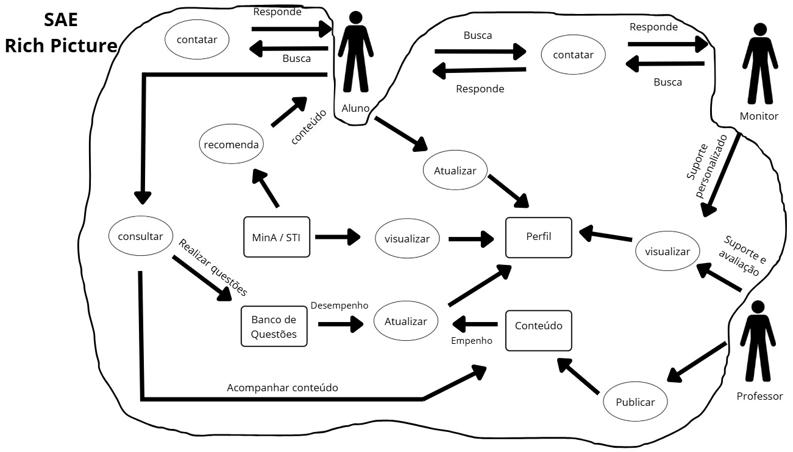

# Rich Picture

## Introdução
O Rich Picture é uma técnica visual colaborativa utilizada para explorar e comunicar a complexidade de sistemas de maneira simples e intuitiva. Na engenharia de requisitos, ele funciona como um recurso importante para representar os principais elementos de um sistema, como indivíduos, processos, fluxos de informação, armazenamento de dados, limites e possíveis problemas. Por ser uma representação informal, favorece uma visão sistêmica, estimula o diálogo entre os participantes do projeto e auxilia na identificação de requisitos e pontos críticos.

Nesse projeto, o Rich Picture foi desenvolvido com base no sistema SAE, escolhido pelo grupo pela afinidade com o uso e por ser um sistema presente na vida acadêmica de muitos estudantes da FCTE. Aqui utilizamos o Rich Picture para representar os atores, as funcionalidades, principais ações e os limites do sistema.

A elaboração do nosso Rich Picture foi feita através da ferramenta Canva. Logo abaixo, temos o Rich Picture do SAE (Figura 1), sua legenda (Figura 2) e a legenda dos principais tópicos do SAE (Figura 3).

<strong>Figura 1: Rich Picture do SAE</strong>

<strong>Autoria de <a href="https://github.com/TiagoTeixeira-2005">Tiago Lemes</a> e <a href="https://github.com/ArthurGuilher62">Arthur Guilherme</a></strong>

---

<strong>Figura 2: Legenda do Rich Picture do SAE</strong>

<strong>Autoria de <a href="https://github.com/TiagoTeixeira-2005">Tiago Lemes</a> e <a href="https://github.com/ArthurGuilher62">Arthur Guilherme</a></strong>

---

<strong>Figura 3: Legenda dos principais tópicos do SAE</strong>

<strong>Autoria de <a href="https://github.com/TiagoTeixeira-2005">Tiago Lemes</a> e <a href="https://github.com/ArthurGuilher62">Arthur Guilherme</a></strong>

---

## Referências
CTEC2402 Software Development Project, Introducing Rich Pictures

SAE, Sistema de Apoio Educacional. Disponível em: [https://sae.unb.br/ajudasae/conhecasae/conteudos/projeto.html](https://sae.unb.br/ajudasae/conhecasae/conteudos/projeto.html). Acesso em: 6 set. 2025.

## Histórico de versão

| Versão | Data | Descrição | Autor(es) | Revisor |
| ---- | ----- | ----- | ---- | ----- | 
| 1.0 | 05/09/2025 | Elaboração do Rich Picture | [Tiago Lemes](https://github.com/TiagoTeixeira-2005) e [Arthur Guilherme](https://github.com/ArthurGuilher62) | [Felipe Guimaraes](https://github.com/felipegf1) |
| 1.0 | 06/09/2025 | Criação da página de documentação | [Felipe Guimaraes](https://github.com/felipegf1) | [Vilmar José](https://github.com/VilmarFagundes) |
| 1.1 | 12/09/2025 | Correção da legenda da Rich Picture e dos principais tópicos do SAE | [Tiago Lemes](https://github.com/TiagoTeixeira-2005) | [Vilmar José](https://github.com/VilmarFagundes) |
