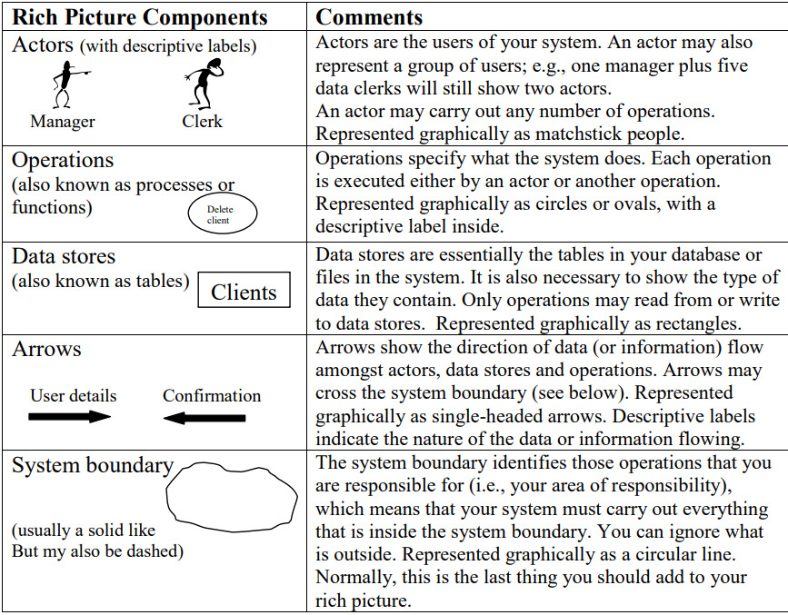

# Lista de verificação da entrega 1
Essa etapa apresenta uma lista de verificação para avaliar os artefatos produzidos na Entrega 1, tanto para o nosso grupo quanto ao grupo +1 

| ID | Item de Verificação | Autor | Referência |
| ---- | ----- | ----- | ---- | ----- | 
| 1 | **Os atores interagem com o sistema?** | [Tiago Lemes](https://github.com/TiagoTeixeira-2005) ||  
| 2 | **Os atores estão representados graficamente por stickman
(homem-palito)?** | [Tiago Lemes](https://github.com/TiagoTeixeira-2005) ||
| 3 | **Cada ator possui um rótulo descritivo?** | [Tiago Lemes](https://github.com/TiagoTeixeira-2005) ||
| 4 | **As operações representam o que o sistema faz?** | [Tiago Lemes](https://github.com/TiagoTeixeira-2005) ||
| 5 | **As operações estão representadas graficamente por círculos ovais?** | [Tiago Lemes](https://github.com/TiagoTeixeira-2005) ||
| 6 | **As operações são executadas por um ator?** | [Tiago Lemes](https://github.com/TiagoTeixeira-2005) ||
| 7 | **As operações são executadas por outras operações?** | [Tiago Lemes](https://github.com/TiagoTeixeira-2005) ||
| 8 | **Cada operação possui um rótulo descritivo em seu interior?** | [Tiago Lemes](https://github.com/TiagoTeixeira-2005) ||
| 9 | **Os data stores representam tabelas do banco de dados ou arquivos do
sistema?** | [Tiago Lemes](https://github.com/TiagoTeixeira-2005) ||
| 10 | **Os data stores estão representados graficamente por retângulos**? | [Tiago Lemes](https://github.com/TiagoTeixeira-2005) ||
| 11 | **Apenas operações leem do data store?** | [Vilmar José](https://github.com/VilmarFagundes) ||
| 12 | **Apenas operações escrevem no data store?** | [Vilmar José](https://github.com/VilmarFagundes) ||
| 13 | **As setas indicam o sentido da informação?** | [Vilmar José](https://github.com/VilmarFagundes) ||
| 14 | **As setas conectam atores, operações e data stores?** | [Vilmar José](https://github.com/VilmarFagundes) ||
| 15 | **As setas são representadas graficamente como unidirecionais?** | [Vilmar José](https://github.com/VilmarFagundes) ||
| 16 | **As fronteiras do sistema delimitam claramente o escopo da
responsabilidade?**| [Vilmar José](https://github.com/VilmarFagundes) ||
| 17 | **A fronteira do sistema está representada graficamente por uma linha
circular?** | [Vilmar José](https://github.com/VilmarFagundes) ||
| 18 | **Os elementos externos interagem apenas atravessando a fronteira, sem
estarem misturados com processos internos?** | [Vilmar José](https://github.com/VilmarFagundes) ||
| 19 | **Cada data store possui um rótulo descritivo em seu interior que
especifica o tipo de dado que será armazenado?** | [Vilmar José](https://github.com/VilmarFagundes) ||
| 20 | **O rich picture evita excesso de texto, priorizando representações
visuais?** | [Vilmar José](https://github.com/VilmarFagundes) ||
| 21 | **O rich picture conta uma história clara do funcionamento do sistema?** | [Vilmar José](https://github.com/VilmarFagundes) ||
| 22 | **Os rótulos descritivos das setas indicam a natureza dos dados ou o
fluxo das informações?** | [Vilmar José](https://github.com/VilmarFagundes) ||

**Figura 1: Componentes do Rich Picture**

## Referências

Introducing Rich Pictures - Rich Picture Drawing Guidelines. 4 p. Disponível em: https://aprender3.unb.br/pluginfile.php/3096055/mod_resource/content/2/1_5145791542719414573.pdf. Acessado em: 05 de setembro de 2025

## Histórico de versão

| Versão | Data | Descrição | Autor | Revisor |
| ---- | ----- | ----- | ---- | ----- | 
| 1.0 | 05/09/2025 | Elaboração da Lista de Verificação | [Tiago Lemes](https://github.com/TiagoTeixeira-2005) e [Vilmar José](https://github.com/VilmarFagundes) | [Arthur Vieira](https://github.com/arthurhvieira1) |
| 1.0 | 08/09/2025 | Criação da página de documentação | [Felipe Guimaraes](https://github.com/felipegf1) |  |